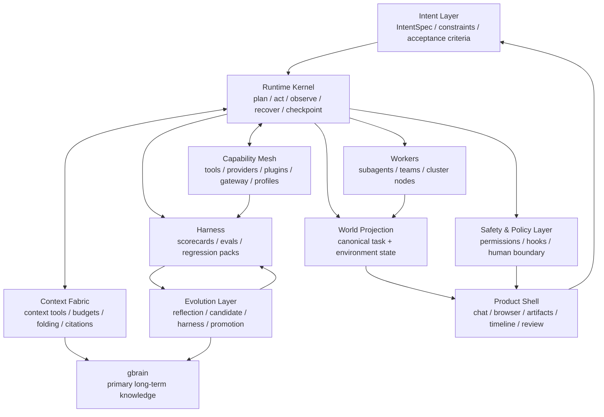
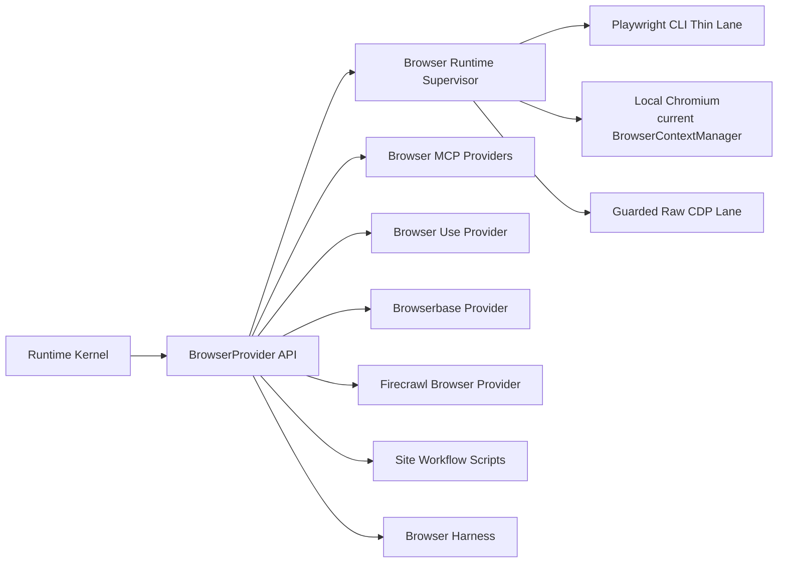
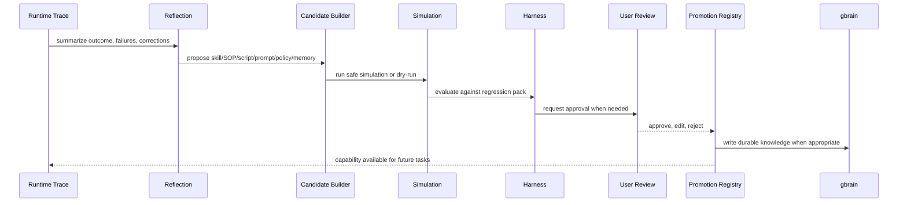
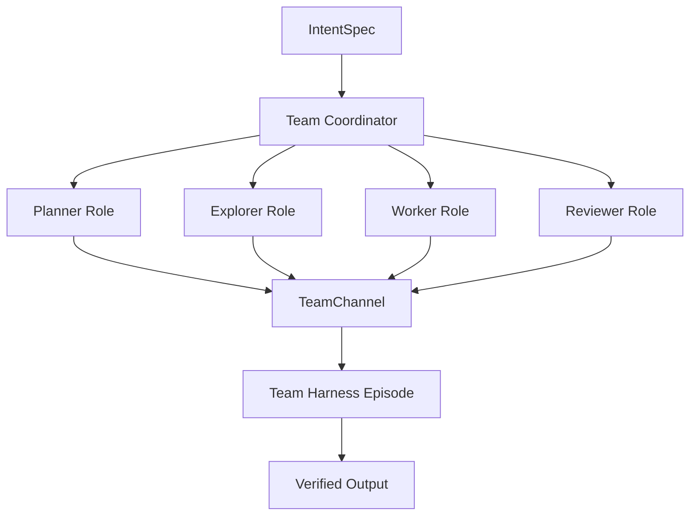

# ADR — uClaw Agent OS v2 North Star

- **Status:** Accepted as strategy baseline, upgraded to Agent OS v2
- **Date:** 2026-05-20
- **Scope:** Framework and strategy design for uClaw's agent runtime, long-running autonomy, self-evolution, plugins, browser, memory, automation, teams, and future cluster management.
- **One-line target:** Agent Operating System for Long-Running Work.
- **Related code:** `src-tauri/src/agent/`, `src-tauri/src/browser/`, `src-tauri/src/harness/`, `src-tauri/src/automation/`, `src-tauri/src/proactive/`, `src-tauri/src/mcp.rs`, `src-tauri/src/gbrain/`, `src-tauri/src/agent/teams/`
- **Related docs:** `docs/adr/2026-05-20-gbrain-primary-freeze-l2-cognitive.md`, `docs/superpowers/specs/2026-05-19-uclaw-agent-autonomy-harness-design.md`, `docs/superpowers/specs/2026-05-18-ai-browser-agent-v2-design.md`, `docs/superpowers/specs/2026-05-17-symphony-runtime-design.md`, `docs/uclaw-migration-plan.md`
- **Primary local reference:** `/Users/ryanliu/Documents/hermes-agent`
- **Additional local references:** `/Users/ryanliu/Documents/GenericAgent`, `/Users/ryanliu/Documents/hello-halo`
- **External design references:** OpenAI Codex, Claude Code, Hermes Agent plugin model, Microsoft Playwright CLI, browser-use/browser-harness, Context-as-a-Tool, Context-Folding, Agent S2, Reflexion, Voyager.

---

## 1. Executive Thesis

uClaw should not become a browser-use clone, a gbrain clone, a workflow automation app, or a loose desktop wrapper around tools.

uClaw's durable product identity is:

> **A local-first, observable, recoverable, learnable, evolvable Agent Operating System for long-running work, extensible from a single local agent to teams and distributed clusters.**

The important shift from v1 to v2 is this:

- v1 said: build a local-first agent control plane.
- v2 says: build an operating system for agentic work.

An Agent OS is not a giant agent loop. It is a runtime environment that gives agents:

- a common intent format,
- a task lifecycle,
- a context fabric,
- a capability mesh,
- a world projection,
- a safety and policy layer,
- a harness-driven evolution path,
- and eventually team/cluster scheduling.

This ADR establishes the core rule:

> **Keep the kernel small. Make context queryable. Make capabilities replaceable. Make state observable. Make learning gated. Make autonomy resumable.**

---

## 2. Why Agent OS, Not Agent App

Most failed agent products collapse for the same reason: they confuse "more capabilities" with "better autonomy."

Feature accumulation creates:

- parallel task states,
- duplicate memory systems,
- tool bloat,
- unbounded context,
- unclear permission boundaries,
- hidden side effects,
- and agents that look autonomous but cannot be debugged or trusted.

An Agent OS takes the opposite path:

- **Intent before execution:** every request becomes a typed goal with constraints and acceptance criteria.
- **Runtime before features:** every feature runs through the same task lifecycle.
- **Context as a tool:** context is retrieved on demand instead of preloaded until it explodes.
- **Capabilities as cards:** each tool/provider/plugin has cost, permissions, reliability, scope, and harness score.
- **Projection over panels:** the UI renders a unified world state, not scattered module internals.
- **Evaluation before evolution:** self-learning produces candidates, not silent production mutations.
- **Isolation by default:** long-running work, subagents, and remote workers run in bounded scopes.

The desired outcome is not "uClaw can do many things." The desired outcome is:

> uClaw can run complicated work for a long time without losing state, trust, evidence, or architectural clarity.

---

## 3. Reference Lessons

### 3.1 Hermes Agent

Hermes Agent is the strongest local implementation reference for uClaw's capability strategy.

Patterns to borrow:

- plugin sources are explicit: bundled, user, project-trusted, and external entry points;
- plugin kinds are typed: standalone, backend, exclusive, platform, model-provider;
- tools register into one canonical registry;
- provider backends are plugins, not hard-coded feature branches;
- tool overrides are explicit and auditable;
- hooks are lifecycle-level APIs, not ad hoc callbacks;
- some provider families are exclusive, especially memory;
- a managed gateway can supply external tool capabilities without pulling every vendor SDK into core;
- task-specific toolset distribution prevents the agent from seeing every installed tool at once;
- install-time configuration declares env vars, secrets, metadata, and permission surfaces.

uClaw should implement this as Rust/Tauri-native infrastructure:

- `ToolRegistry`
- `ProviderRegistry`
- `PluginRegistry`
- `HookBus`
- `CapabilityProfile`
- `ToolGateway`

Hermes gives uClaw the plugin discipline. uClaw should add stronger harness and world-projection discipline.

### 3.2 OpenAI Codex

Codex's strongest product architecture lessons are:

- each task runs in an isolated environment;
- many tasks can run in parallel;
- repository guidance such as `AGENTS.md` matters;
- reliable dev environments and tests improve agent quality;
- outputs should be verifiable through terminal logs, test results, and file citations;
- users inspect and refine results before export or merge.

uClaw should translate this beyond coding:

- every substantial task should have an isolation scope;
- every autonomous run should emit verifiable evidence;
- every diff, browser action, automation result, or memory write should be traceable;
- every long-running task should be resumable from checkpoint.

### 3.3 Claude Code

Claude Code's strongest runtime lessons are:

- subagents preserve parent context by working in fresh contexts;
- subagents should have scoped tools and focused prompts;
- MCP/tool schemas should be loaded on demand;
- hooks can inspect, block, modify, or react to lifecycle events;
- hooks live outside the model context and can short-circuit unsafe actions;
- project/user configuration files are part of the runtime contract.

uClaw should borrow the mechanics, not the exact product shape:

- subagents become `WorkerRole` or `AgentWorker` instances;
- hooks become `PolicyHook` and `LifecycleHook`;
- MCP/tool search becomes `Capability Search`;
- context loading becomes explicit `ContextTool` calls;
- project guidance becomes `ProjectRuntimeProfile`.

### 3.4 GenericAgent

GenericAgent's strongest idea is minimal self-evolution:

- start with a small loop and atomic tools;
- perform work autonomously;
- crystallize successful paths into reusable skills/SOPs;
- keep memory layered;
- use subagents for bounded map/reduce work;
- report and checkpoint after completion.

uClaw should borrow the learning posture:

- successful work produces candidate artifacts;
- candidate artifacts are reviewed and scored;
- promotion is reversible and versioned;
- repeated tasks get cheaper because the right skill/context/capability is recalled, not because prompts get longer.

### 3.5 hello-halo

hello-halo's strongest product lessons are:

- desktop shell matters;
- remote/mobile/IM control turns an agent into a 24/7 worker;
- scheduled "AI digital humans" are not separate agents, but trigger-driven uses of the same runtime;
- reusable browser scripts make common site workflows reliable;
- marketplace/plugin ambitions only work when permissions and contracts are clear.

uClaw should keep the product feel, but anchor it to a stronger runtime.

### 3.6 Research Lineage

The Agent OS v2 design incorporates these research directions:

- **Context-as-a-Tool:** long-horizon agents should actively retrieve and manipulate context, not passively append history.
- **Context-Folding:** long-running agents need structured context compression and decomposition, not generic summaries.
- **Agent S2:** computer-use agents benefit from generalist-specialist decomposition, precise grounding, and hierarchical planning.
- **Reflexion:** agents can improve through verbal feedback and reflection without updating model weights.
- **Voyager:** reusable skill libraries enable lifelong learning when successful behaviors are stored and recalled.

The uClaw-specific synthesis:

> Context, capabilities, memory, and skills must all be runtime objects with provenance, budgets, and evaluation history.

### 3.7 Playwright CLI and Browser-Harness

Playwright CLI is the preferred fast execution lane for browser automation, but
it should not become an unobserved side channel. The right lesson is:

- use Playwright CLI for bounded, low-token, fast browser actions;
- keep browser state warm behind a runtime supervisor instead of cold-starting
  the full chain for every action;
- treat MCP as the discovery and ecosystem lane, not the first execution path;
- preserve a raw CDP escape hatch for compositor-level actions, stale session
  repair, dialogs, downloads, iframes, shadow DOM, and other browser mechanics
  that do not fit cleanly through higher-level wrappers;
- learn from browser-harness's thin lane: small protected core, editable helper
  workspace, site-specific domain skills, screenshots as verification, and
  real liveness probes;
- borrow browser-harness's runtime topology: short-lived foreground command,
  long-lived browser runtime, one-request JSON-line IPC, persistent CDP
  WebSocket, event buffer, real browser liveness probe, and bounded stale
  session reattach;
- do not copy browser-harness's no-manager posture into uClaw production.
  uClaw still needs permissions, audit, redaction, TaskEvent traces, artifacts,
  and harness promotion gates.

The stable browser direction is therefore:

> **Playwright CLI first for speed, Browser Runtime Supervisor for stability,
> MCP second for capability discovery and ecosystem reach, raw CDP as a guarded
> escape hatch, and harness-gated domain skills for repeated success.**

---

## 4. Final Goal Definition

### 4.1 Self-Evolving Agent System

uClaw must support continuous self-improvement without becoming unstable.

Required properties:

- every run emits structured traces, decisions, tool outcomes, context reads, memory writes, user corrections, and final verdicts;
- every learning output is a proposal, not an automatic mutation;
- proposals include evidence, scope, policy impact, harness results, and rollback plan;
- promotion requires score improvement or explicit user approval;
- long-term factual knowledge flows to gbrain;
- executable knowledge becomes skill/SOP/browser-script/provider-policy artifacts.

Success signal:

- repeated tasks become shorter, cheaper, safer, and more reliable through recalled artifacts and capability selection.

### 4.2 Agent Autonomy

uClaw's autonomy target is not "the agent does anything silently."

It is:

- understand intent;
- plan at multiple horizons;
- act within policy;
- observe the environment;
- recover from failure;
- ask at human boundaries;
- checkpoint progress;
- resume after interruption;
- produce evidence;
- learn through gated promotion.

### 4.3 Multi-Domain Collaboration

uClaw must coordinate across:

- code,
- browser,
- files,
- local desktop,
- MCP tools,
- memory,
- communication channels,
- automations,
- teams,
- and future remote workers.

All domains must enter through the same runtime contracts. Domain details belong behind capabilities, providers, or plugins.

### 4.4 Agent Teams

Agent teams are role-scoped coordinated workers, not independent chat rooms.

Required concepts:

- `TeamSpec`: roles, capability profiles, budget, policy, output contract;
- `Coordinator`: decomposes work and assigns tasks;
- `WorkerRole`: planner, explorer, implementer, browser operator, verifier, critic;
- `TeamChannel`: typed messages, artifacts, decisions, and references;
- `ReviewGate`: a role or harness block that can stop completion or promotion.

### 4.5 Agent Cluster Management

Cluster management is a distributed extension of the same local OS.

Future goals:

- register local or remote workers;
- route work by capability, load, locality, and policy;
- preserve canonical trace across workers;
- checkpoint and fail over;
- return approvals to the controlling uClaw shell;
- keep local-first operation useful even with no remote workers.

---

## 5. Autonomy Ladder

uClaw should expose autonomy as a ladder, not a vague on/off switch.

| Level | Name | Description | Required guardrails |
|---|---|---|---|
| L0 | Chat Assist | Agent answers or proposes steps | no side effects |
| L1 | Assisted Action | Agent prepares actions, user executes or approves each step | visible plan and approval |
| L2 | Supervised Task | Agent executes bounded task with frequent checkpoints | tool policy, trace, cancel/resume |
| L3 | Delegated Task | Agent completes a task with human boundary prompts only | budget, checkpoints, harness trace |
| L4 | Scheduled Worker | Agent wakes up from trigger or schedule and runs a known workflow | automation ledger, escalation policy |
| L5 | Agent Team | Multiple roles coordinate through team channels | role ownership, reviewer gate |
| L6 | Distributed Cluster | Work routes across local/remote workers | worker policy, locality, failover |

Every task must declare its target autonomy level. The runtime may downgrade autonomy based on risk, missing credentials, low provider score, or insufficient harness coverage.

---

## 6. Agent OS Layer Model



Layer rules:

- Product Shell renders state; it does not own canonical task truth.
- Runtime Kernel coordinates lifecycle; it does not embed provider-specific logic.
- Context Fabric retrieves and folds context; it does not become another memory system.
- Capability Mesh exposes tools/providers/plugins; it does not decide product intent.
- World Projection materializes runtime truth for UI and diagnostics.
- Safety & Policy can block, downgrade, or ask; it cannot silently bypass trace.
- Evolution proposes and promotes artifacts; it does not mutate production behavior directly.

---

## 7. Core Runtime Objects

### 7.1 IntentSpec

Every user prompt, automation trigger, IM command, team assignment, or cluster job enters as `IntentSpec`.

```ts
type IntentSpec = {
  id: string
  origin: 'chat' | 'automation' | 'im' | 'team' | 'cluster' | 'system'
  userGoal: string
  acceptanceCriteria: string[]
  constraints: Constraint[]
  autonomyTarget: 'L0' | 'L1' | 'L2' | 'L3' | 'L4' | 'L5' | 'L6'
  riskClass: 'low' | 'medium' | 'high' | 'restricted'
  contextRefs: ContextRef[]
  requestedCapabilities: CapabilityQuery[]
}
```

### 7.2 TaskSpec

`TaskSpec` is the executable form of an intent.

```ts
type TaskSpec = {
  id: string
  intentId: string
  goal: string
  planRef?: string
  policy: PolicySpec
  budget: BudgetSpec
  capabilityProfile: string
  outputContract: OutputContract
  checkpointPolicy: CheckpointPolicy
}
```

### 7.3 TaskEvent

Every significant runtime action must be an event.

```ts
type TaskEvent =
  | { kind: 'intent_received'; intentId: string; ts: string }
  | { kind: 'task_started'; taskId: string; ts: string }
  | { kind: 'context_read'; taskId: string; source: string; artifactRef: string; ts: string }
  | { kind: 'plan_updated'; taskId: string; planRef: string; ts: string }
  | { kind: 'capability_selected'; taskId: string; capabilityId: string; reason: string; ts: string }
  | { kind: 'tool_call'; taskId: string; toolName: string; inputRef: string; ts: string }
  | { kind: 'tool_result'; taskId: string; toolName: string; outputRef: string; ok: boolean; ts: string }
  | { kind: 'policy_hook'; taskId: string; hookName: string; decision: string; ts: string }
  | { kind: 'boundary_event'; taskId: string; boundaryRef: string; ts: string }
  | { kind: 'checkpoint'; taskId: string; checkpointRef: string; ts: string }
  | { kind: 'memory_read' | 'memory_write'; taskId: string; target: string; artifactRef: string; ts: string }
  | { kind: 'worker_assigned'; taskId: string; workerId: string; reason: string; ts: string }
  | { kind: 'task_finished'; taskId: string; verdict: 'done' | 'failed' | 'blocked' | 'cancelled'; ts: string }
```

### 7.4 WorldProjection

WorldProjection is the UI and diagnostics view of runtime truth.

It should answer:

- What is the user trying to accomplish?
- What is the current plan?
- What has happened?
- What is the agent waiting on?
- What tools/providers/workers are active?
- What context has been read?
- What memory has been written?
- What boundaries were hit?
- What can be resumed?
- What did the harness score?

WorldProjection is not another store of record. It is a materialized view over task events, run ledgers, provider status, and memory receipts.

---

## 8. Context Fabric

Context must become a managed runtime resource.

### 8.1 Core Rule

Do not preload the world. Retrieve the right context at the right time, with provenance and budgets.

### 8.2 Context Sources

| Source | Example | Canonical owner |
|---|---|---|
| Conversation | current chat and prior turns | agent conversation tables |
| Task trace | prior TaskEvent stream | harness/run ledger |
| Codebase | files, symbols, commits, tests | filesystem/git tools |
| Browser | tabs, DOM/snapshot, screenshots, action history | BrowserProvider |
| Memory | durable knowledge and user/project facts | gbrain |
| Artifacts | outputs, diffs, reports, generated files | artifact store |
| Team | role messages and decisions | TeamChannel |
| Automation | schedules, triggers, runs | automation ledger |
| Cluster | worker state and remote traces | ClusterManager |

### 8.3 Context Tools

The model should request context through tools such as:

- `context.search`
- `context.read`
- `context.fold`
- `context.cite`
- `context.compare`
- `context.pin`
- `context.release`

This prevents the agent from dragging every document, schema, tool definition, and transcript into active context.

### 8.4 Context Folding

uClaw should use structured folding instead of generic summarization.

Fold outputs should preserve:

- facts,
- decisions,
- unresolved questions,
- evidence refs,
- failed attempts,
- active constraints,
- next actions,
- rollback points.

Any fold used for a consequential decision must cite the source events or artifacts it came from.

---

## 9. Capability Mesh

Capabilities are the OS equivalent of drivers and system services.

### 9.1 Capability Card

Every tool, provider, plugin, browser script, automation source, worker, or model should expose a card.

```yaml
id: browser.local_chromium
kind: provider
family: browser
description: Local Chromium browser provider backed by current BrowserContextManager
permissions:
  - network.browser
  - local.profile.read
  - local.profile.write
cost:
  money: local
  latency: medium
  tokenPressure: low
reliability:
  harnessScore: 0.82
  lastEvaluatedAt: 2026-05-20T00:00:00Z
failureModes:
  - captcha
  - login_required
  - site_blocks_automation
humanBoundaries:
  - credential_handoff
  - payment
  - privacy_sensitive_form
```

The planner sees cards, not implementation internals.

### 9.2 Registry Set

| Registry | Owns |
|---|---|
| `ToolRegistry` | schema, handler, toolset, check function, display metadata, result limits, override state |
| `ProviderRegistry` | provider families, active provider selection, health, config schema, harness cases |
| `PluginRegistry` | plugin discovery, manifests, enablement, hooks, install/update/remove |
| `CapabilityProfileRegistry` | named capability bundles, budgets, deny/allow rules |
| `WorkerRegistry` | local/subagent/team/remote workers, capabilities, heartbeat, load |

### 9.3 Plugin Manifest

```yaml
id: browser-use-cloud
name: Browser Use Cloud Provider
version: 0.1.0
kind: backend
category: browser
provides:
  browser_providers:
    - browser-use
capabilities:
  - browser.session
  - browser.snapshot
  - browser.action
hooks:
  - pre_gateway_dispatch
  - post_tool_call
toolsets:
  - browser_tasks
permissions:
  network: true
  secrets:
    - BROWSER_USE_API_KEY
requiresEnv:
  - name: BROWSER_USE_API_KEY
    secret: true
    description: Direct Browser Use key. Optional when managed gateway is enabled.
gateway:
  supported: true
  preferredWhenEnabled: true
harnessCases:
  - ./harness/browser-navigation.json
```

### 9.4 Capability Profiles

Agents should see task-appropriate capability bundles.

```yaml
id: browser_research_l3
autonomyMax: L3
allowedToolsets:
  - core
  - memory_recall
  - browser_tasks
  - web_search
deniedCapabilities:
  - filesystem.write
  - shell.exec
budget:
  maxToolCalls: 80
  maxBrowserActions: 40
  maxCostUsd: 3.00
requiresApproval:
  - credential_handoff
  - payment
  - destructive_action
```

Capability profiles bind together policy, tool exposure, cost, and autonomy.

---

## 10. Safety, Policy, and Hooks

Safety is not a modal dialog. It is a runtime layer.

### 10.1 Policy Hook Matrix

| Hook | Can block | Can mutate | Must emit event |
|---|---|---|---|
| `UserPromptSubmit` | yes | yes | yes |
| `IntentClassified` | yes | yes | yes |
| `PreContextRead` | yes | yes | yes |
| `PostContextRead` | no | yes | yes if changed |
| `PreToolUse` | yes | yes | yes |
| `PostToolUse` | no | yes | yes if changed |
| `PreMemoryWrite` | yes | yes | yes |
| `PreBrowserAction` | yes | yes | yes |
| `PermissionRequest` | yes | no | yes |
| `SubagentStart` | yes | yes | yes |
| `WorkerAssignment` | yes | yes | yes |
| `PrePromotion` | yes | yes | yes |
| `SessionEnd` | no | no | yes |

### 10.2 Human Boundary Policy

The agent must ask the user for:

- credentials and login handoff;
- CAPTCHA and bot challenges;
- payment or purchase;
- destructive filesystem/database actions;
- sending messages externally;
- publishing or deploying;
- private/sensitive data exposure;
- policy downgrade or autonomy escalation.

Human boundary events should appear in the normal task trace and product timeline.

### 10.3 Isolation Model

| Work type | Isolation |
|---|---|
| quick chat answer | conversation scope |
| local coding task | git worktree or explicit dirty-tree policy |
| browser task | browser session/profile scope |
| subagent exploration | fresh context, restricted tools |
| automation run | run ledger plus task checkpoint |
| team role | role context plus team channel |
| remote worker | data locality and capability policy |

Isolation is the foundation for parallelism, recovery, and trust.

---

## 11. Memory and Knowledge

gbrain remains the primary long-term knowledge layer.

### 11.1 Three Knowledge Types

| Type | Purpose | Owner |
|---|---|---|
| Factual knowledge | durable user/project/domain facts | gbrain |
| Evidential knowledge | traces, logs, outputs, receipts, scorecards | harness/run ledger |
| Executable knowledge | skills, SOPs, browser scripts, prompts, policies | Evolution Layer + registries |

This prevents memory from becoming a junk drawer.

### 11.2 Current uClaw Rule

- `gbrain`: primary durable knowledge.
- `memU`: auxiliary retrieval/embedding where useful.
- `memory_graph`: legacy/archive/internal graph state; no new EntityPage feature work unless a later ADR reverses the freeze.
- Memory OS ideas: retained only if they become gbrain concepts, runtime metadata, or harness-gated executable knowledge.

### 11.3 Memory Provider Strategy

Borrow Hermes's exclusive memory-provider model:

- only one active primary memory provider at a time;
- gbrain is the current active provider;
- alternative providers may exist as plugins, not parallel core systems;
- writes require receipts;
- consequential recalls require source references;
- memory writes from self-evolution require harness or user approval.

---

## 12. Browser and Computer Use

Browser automation is a capability family, not the agent's identity.

### 12.1 Provider Shape



### 12.2 Execution Priority

The default browser action ladder is:

1. **No-browser lane:** use HTTP, API, static fetch, or existing structured data
   when the task is read-only or does not require browser state.
2. **Playwright CLI thin lane:** run a bounded script/action against a warm
   browser context and return a structured result envelope plus artifact refs.
   Declarative actions prefer semantic Playwright addressing first, such as
   role, label, text, test id, and locator. uClaw DOM index or element id is the
   second choice when structured observation already identified the target.
   Coordinate/compositor input is a first-class fallback for cross-origin
   iframes, shadow DOM, canvas, virtualized lists, rich text editors, and pages
   where semantic locators are unstable.
3. **Playwright warm session lane:** reuse browser/page/context state through
   the Browser Runtime Supervisor for multi-step flows.
4. **Guarded raw CDP lane:** use direct CDP only for mechanics that need it:
   compositor-level coordinate actions, target/session repair, dialogs,
   downloads, uploads, iframes, shadow DOM, screenshots, and low-level events.
5. **MCP exploratory lane:** use MCP when a third-party server provides a useful
   capability, when discovery matters more than speed, or when a provider has
   a strong managed integration.
6. **Cloud/remote provider lane:** use Browser Use Cloud, Browserbase,
   Firecrawl, or another provider only when local execution cannot satisfy
   isolation, stealth, scaling, proxy, captcha, or deployment constraints.

This priority keeps the common path fast and low-token while preserving the
Agent OS rule that state, policy, and evidence flow through the same runtime.

### 12.3 Provider Strategy

- Keep current `BrowserContextManager` as `LocalChromiumProvider`.
- Keep legacy `BrowserService` only as compatibility surface with sunset note.
- Put all new browser behavior behind `BrowserProvider`.
- Add a `PlaywrightCliProvider` as the first new browser execution provider.
- Add a `BrowserRuntimeSupervisor` that owns warm sessions, profile locks,
  liveness probes, action timeouts, restart policy, and artifact capture.
- uClaw owns Playwright runtime installation and repair. Users should not need
  to install Playwright CLI, Node packages, or browser binaries manually.
  `BrowserRuntimeSupervisor` and `browser_runtime_doctor` manage pinned
  Playwright package versions, worker scripts, browser revisions, cache paths,
  one-click install/repair, first-use progress, and optional
  offline/prebundled runtime modes. Worker execution must use explicit
  uClaw-managed cache paths, for example through `PLAYWRIGHT_BROWSERS_PATH`,
  so global user caches do not become product state.
- The main app bundle should continue to use the already-bundled Bun runtime.
  Do not add a second full Node runtime directly to the primary app bundle for
  v1. Playwright runs through an optional uClaw-managed runtime pack containing
  a pinned Node runtime, pinned Playwright package, worker scripts, and the
  v1 Chromium browser binary. Firefox and WebKit remain later optional targets.
- Runtime-pack download uses a uClaw-controlled manifest. The manifest declares
  runtime pack version, pinned Node version, Playwright package version, worker
  version, Chromium revision, download URLs, artifact size, sha256, minimum
  compatible app version, rollback version, and release channel. Production
  builds download signed/hashed uClaw-managed artifacts by default and must not
  silently fall back to upstream Playwright install paths. Development builds
  may use an explicit upstream fallback for local iteration, but that fallback
  remains labeled as developer mode and outside normal product runtime state.
- Runtime-pack updates are non-disruptive by default. Security updates may
  prompt and take priority, but must remain visible. Ordinary updates should be
  deferred to idle time or the next app launch and must not replace the runtime
  while a browser task is using it. Keep the previous working pack version for
  rollback until the new version passes doctor and harness gates.
- App startup should include a polished Startup Splash / Startup Doctor surface
  that is brand-first, beautiful, elegant, and attention-grabbing before it is a
  diagnostic checklist. The first impression should feel like a strong uClaw
  launch moment: refined typography, deliberate motion, depth, excellent
  spacing, and a premium visual system tailored to the app's identity. Its
  visual language should fuse a professional, trustworthy agent workbench with
  a restrained sense of futuristic intelligence: stable and production-grade,
  but alive through motion, depth, and responsive state. Startup diagnostics
  should appear as a progressive secondary layer, not as the primary hero.
  Motion may carry a strong brand memory, but it must be bounded: first launch
  may use a fuller 1.5-2.5 second brand sequence, daily launch should stay
  short at roughly 300-800 ms, it must be interruptible/skippable, and reduced
  motion settings must fall back to a static or subtle fade-in experience. The
  default splash should not show a checklist. It should show one polished status
  line and minimal progress, then reveal detailed checks only after the time
  budget is exceeded, a failure occurs, or the user explicitly expands
  diagnostics. In v1 this surface should be the first route rendered by the
  main Tauri WebView, with an extremely early render path. A native splash may
  serve only as a very short blank-window placeholder or later optimization; it
  should not be the primary interactive Startup Doctor in v1. The WebView route
  can integrate with React state, World Projection, settings, confirmations, and
  runtime progress. Splash visuals must be fully local and bundled; the first
  impression must not depend on network access. Use local lightweight
  shader/CSS/canvas/image/video assets as needed. Generated image or video
  assets are allowed and should be prepared ahead of time into the frontend
  asset tree, such as `ui/src/assets/startup-splash/` for build-imported assets
  or `ui/public/startup-splash/` for static public assets. Generated assets must
  be optimized for startup, include source prompt/metadata and license/provenance
  notes, support reduced-motion fallback, and avoid making launch dependent on
  a remote generation service. The v1 primary visual path should use local
  static or short-loop WebP/AVIF assets plus CSS/canvas lightweight motion.
  If the desired effect can be achieved with image assets plus CSS/canvas,
  prefer that over video. Video may be an enhancement only when image/CSS cannot
  deliver the intended effect with acceptable quality or complexity; it must not
  be the only primary path and requires a static first frame and reduced-motion
  fallback. Splash asset performance is a product requirement: launch-critical
  visual assets should stay under a small startup budget, with a v1 target under
  roughly 2 MB total for first-screen critical assets; enhancement video and
  high-resolution alternates lazy-load after the first frame; the first static
  frame renders before any Runtime Doctor or browser-runtime work completes.
  Remote visual assets are allowed only for later optional themes or updates,
  never for the v1 launch-critical path. v1 does not support multiple splash
  themes or skinning; it ships one canonical uClaw brand experience. Seasonal or
  optional themes can be considered only after the canonical experience proves
  quality, performance, and reliability.
  The same surface runs launch self-checks: local
  configuration, DB/migration readiness, Bun runtime, permissions, network
  availability, Playwright runtime manifest, runtime-pack path existence, and
  last-known runtime status. Every launch should run only lightweight runtime
  checks by default. Heavy checks such as Chromium binary hashing, Playwright
  worker smoke test, and real-page probe run only on first install, version
  upgrade, previous failure, user-requested repair, or immediately before a
  browser task needs the lane. The splash may start runtime-pack installation
  automatically by default, but it must expose clear visible state and Settings
  controls for disabling automatic preparation, clearing the runtime pack,
  reinstalling, and repairing it. If the download is unusually large or the
  network appears metered, cellular, captive, restricted, or offline, the splash
  should ask for lightweight confirmation before downloading. Runtime
  preparation must not block the whole app indefinitely. After a short time
  budget, such as 5-8 seconds, uClaw should enter the main UI while browser
  runtime preparation continues in the background. Only browser automation tasks
  wait on `preparing_browser_runtime`; normal chat, project browsing, settings,
  and no-browser lanes remain usable.
- Disabling automatic preparation only disables startup/background runtime-pack
  download. It does not disable Browser automation capability. If the user later
  starts a task that needs the browser lane and the runtime pack is absent, uClaw
  should show a clear "prepare Browser runtime" confirmation with actions to
  prepare now, defer until later, or continue through no-browser lanes when
  possible. If the user defers and the task cannot proceed without browser
  automation, the task enters `paused_waiting_for_browser_runtime` with a
  checkpoint instead of failing. If a no-browser lane can satisfy the request,
  uClaw may continue in that mode with visible capability limits.
- Startup Doctor state enters World Projection and emits lightweight TaskEvents
  for launch diagnostics, support, and developer visibility, but it must not
  create a normal user-visible task or pollute the user's task list.
- Default browser automation uses a uClaw-isolated profile. Users may create a
  uClaw-managed browser identity through an explicit one-time global Settings
  authorization flow with clear consent, revocation, trace, and policy
  boundaries. Once authorized, that identity does not require per-domain or
  per-task reauthorization by default. Payment-related sensitive actions still
  trigger the agent `ask_user` confirmation banner.
- Browser identities are global user-level resources in v1. Do not add
  Space/Workspace association for browser identity grants until a concrete
  product need appears.
- Settings must show the authorized browser identity status, last-used time,
  active tasks currently using it, and a one-click revoke action.
- The Settings entry should behave like an OAuth-style authorization flow: the
  user clicks an explicit connect button, uClaw opens a dedicated in-app
  WebView/Browser authorization window or wizard, the user chooses or logs into
  the browser identity there, and uClaw stores only the authorization
  association and profile metadata needed to reconnect and audit the grant.
- The in-app authorization window must still run through the same
  `BrowserProvider`, `BrowserRuntimeSupervisor`, profile metadata, trace, and
  revocation model; it must not become an untracked second browser truth source.
- For v1, the identity created by this flow is a uClaw-managed browser identity
  rather than a binding to an external Chrome profile. External Chrome real
  profile attach remains an advanced or later mode, not the default product
  path for the authorization window.
- Revocation immediately blocks new actions for that browser identity, allows
  the current action only a short bounded drain window, then moves affected
  tasks to `paused_checkpointed`, emits a user-boundary event, and asks whether
  to switch to an isolated profile, reauthorize, or end the task.
- Browser identity authorization state and profile metadata live in uClaw
  config or DB. Local uClaw-managed browser identity should not require storing
  cookies, storage state, or long-lived attach secrets outside its managed
  profile store. System keychain is reserved for external provider credentials
  and other true secrets, read outside the per-action hot path and cached in
  memory for the active session.
- `BrowserRuntimeSupervisor` is owned by the Rust runtime. Node/Playwright is a
  managed child worker/provider, not a second control plane or canonical truth
  source.
- The initial Rust-to-Playwright worker protocol is a short-lived child process
  with stdin/stdout JSON envelopes per bounded action. The Rust supervisor keeps
  warm browser/session metadata and artifact archives, owns per-action timeout,
  kill, retry, and error classification, and may later upgrade to a long-lived
  JSON-RPC worker only after the short-command path is stable.
- The v1 worker envelope exposes declarative actions by default, such as
  `navigate`, `click`, `type`, `screenshot`, `extract`, and `wait`. Arbitrary
  Playwright script execution is an explicit policy-controlled escape hatch,
  disabled by default and limited to development or allowlisted profiles.
- This deliberately mirrors browser-harness's useful shape while moving the
  control plane into uClaw: browser-harness has a short CLI, a persistent daemon,
  JSON-line IPC, and a persistent CDP connection; uClaw's Rust supervisor plays
  the daemon role, while Node/Playwright workers remain replaceable execution
  children.
- Treat browser-use, Browserbase, Firecrawl, and Browser MCP servers as provider
  plugins behind the same profile and policy model.
- Make site-specific workflows script artifacts when repeated.
- Preserve structured observations, action results, boundary events, and
  checkpoints.
- Evaluate providers with the same browser harness cases.

### 12.4 Runtime Health and Self-Healing

Browser runtime health must be proven by real browser operations, not by a
process or socket merely existing.

Required runtime signals:

- CLI/provider version and install status;
- app-managed Playwright runtime status: package version, worker version,
  browser revision, cache path, install/repair availability, and offline mode;
- Startup Doctor phase and progress: config, DB/migration, Bun runtime,
  permissions, network, runtime manifest, runtime-pack path, last-known runtime
  status, and any deferred heavy check reason;
- runtime pack state: absent, preparing, ready, repairing, failed, offline, or
  background-installing;
- runtime download gate: auto-allowed, awaiting lightweight confirmation,
  metered network, restricted network, offline, disabled in Settings, or
  cleanup requested;
- runtime manifest trust state: channel, artifact URL, size, sha256, minimum app
  version, rollback version, signature/hash validation, and whether any
  developer-only upstream fallback is active;
- runtime update state: none, ordinary deferred, security update available,
  updating at idle, update failed, rollback available, or rollback active;
- browser process and profile status;
- profile mode: isolated uClaw profile, authorized uClaw-managed browser
  identity, advanced real-profile attach, or remote/cloud profile;
- active context/page/tab identity;
- real page operation probe, such as title, URL, target list, or screenshot;
- stale target/session detection and one bounded reattach retry;
- pending dialog, download, file picker, beforeunload, and auth-wall detection;
- active-session event buffer that filters background tab network noise;
- one-request IPC envelopes for action workers so hung calls can be timed out,
  killed, classified, and retried without poisoning the warm runtime;
- risk-based screenshot policy: capture screenshots for navigation, submit,
  upload, login/user-boundary events, cross iframe/shadow-DOM work, coordinate
  fallback, failed retry, and final state, but allow ordinary `type`, `wait`,
  and stable locator clicks to rely on action results plus DOM/state diffs;
- timeout classification: startup, connect, action, wait, network idle,
  policy block, user boundary, and provider crash;
- artifact refs for screenshots, traces, logs, action envelopes, and event tail.

The health surface should exist as both a user-visible diagnosis action and a
harness subject. A frozen or half-dead browser runtime is a recoverable
runtime state, not an opaque tool failure.

### 12.5 Domain Skills and Browser Learning

Browser learning produces candidates, not production mutation.

uClaw should adopt browser-harness's domain-skill insight but route it through
Agent OS governance:

- durable site knowledge belongs in gbrain and executable skill/script
  registries, not hidden prompt text;
- site playbooks may capture stable URL patterns, selectors, private API
  shapes, wait conditions, iframe/shadow-DOM notes, auth boundaries, and known
  traps;
- playbooks must not store secrets, task diaries, transient pixel coordinates,
  or private user data;
- generated helper or domain-skill candidates must carry evidence from the run,
  pass harness regression cases, and remain reversible through promotion state;
- repeated browser work should become cheaper because the runtime recalls the
  right provider, profile, script, and domain skill, not because the model sees
  a larger prompt.

### 12.6 Non-Goals

- Playwright CLI does not replace `BrowserProvider`; it implements one fast
  provider lane.
- Users do not manually install Playwright CLI for normal app use; global
  Playwright installs and global browser caches are developer fallbacks only.
- The primary app bundle does not need to carry a second full Node runtime for
  v1; Node belongs to the optional Playwright runtime pack.
- App launch must not be held indefinitely by Playwright runtime download or
  repair. Browser automation may wait; the rest of the app should degrade
  gracefully.
- Automatic Playwright runtime preparation should not hide user control:
  Settings must expose status, disable automatic preparation, cleanup, reinstall,
  and repair; large or metered/restricted downloads require lightweight
  confirmation.
- Disabling automatic preparation does not disable Browser automation. It only
  prevents startup/background download; task-time browser use asks for explicit
  preparation if the runtime is still absent.
- Playwright worker v1 does not expose a general shell-like script runner by
  default; arbitrary script execution is an explicit escape hatch.
- MCP does not become the canonical browser truth source; it is a provider and
  discovery surface.
- Raw CDP does not bypass policy; it is a guarded fallback capability.
- Domain skills do not self-promote into production behavior.
- Browser automation does not own credentials, payment authorization, CAPTCHA,
  or destructive external actions; those remain human boundary events.

### 12.7 Computer Use Upgrade

For GUI/computer control, borrow Agent S2's principle:

- use generalist planning for high-level task reasoning;
- use specialist grounding for coordinates, accessibility, screenshots, and UI state;
- maintain multi-scale plans: goal plan, page/app plan, next-action plan;
- treat GUI grounding uncertainty as a first-class risk signal.

### 12.8 Product Shell and UI/UX Upgrade

The current React codebase already has a capable desktop shell: `AppShell`,
`WorkspaceShell`, left/right panels, bottom dock, Settings primitives,
Kaleidoscope modules, global modals, and theme tokens. The UX risk is not lack
of UI, but fragmentation: launch state, task state, runtime health, settings,
diagnostics, placeholders, and recovery states can appear through separate
surfaces rather than one coherent product language.

Current codebase evidence:

- `ui/src/App.tsx` still renders a generic spinner and "正在初始化..." while
  the app initializes. This should become the Startup Splash / Startup Doctor
  first route.
- `ui/src/main.tsx` has a raw root error fallback with inline colors and stack
  output. This should become a branded recovery surface with developer details
  behind expansion.
- `ui/src/components/app-shell/AppShell.tsx` owns many global overlays:
  approvals, settings, dock panels, focus mode, memory capture, escalation, and
  quick capture. These should progressively consume World Projection rather
  than inventing separate visibility/state rules.
- `ui/src/components/app-shell/LeftSidebar.tsx` and
  `ui/src/components/agent/AgentView.tsx` are very large and combine layout,
  data coordination, interactions, and microcopy. Future UI work should extract
  focused shell, session-list, composer, and runtime-status subcomponents.
- `ui/src/components/settings/SettingsPanel.tsx` and settings primitives are a
  good foundation, but the new Browser Runtime / Startup Doctor / browser
  identity controls need a first-class Settings destination with deep links
  from search, runtime prompts, and failure states.
- `ui/src/styles/globals.css` provides many theme variables, while feature
  modules still contain hard-coded status colors, shadows, and raw hex values.
  New shared status, runtime, motion, and elevation tokens should reduce visual
  drift across themes.
- Several user-visible surfaces are still placeholders or debug-oriented:
  dock Connections/Alert panels, ComingSoon Kaleidoscope modules, file-browser
  placeholder, `FLASH-DEBUG` warnings, and raw system diagnostics. These should
  be either hidden behind capability flags or upgraded into branded empty,
  unavailable, and recovery states.

UI/UX upgrade principles:

- **World Projection first:** primary UI surfaces answer what is running, what
  is waiting, what needs the user, what can resume, and what is degraded. Avoid
  module-local truth for task/runtime state.
- **Brand-first launch:** replace generic initialization with the canonical
  Startup Splash. First frame renders immediately; diagnostics are progressive.
- **Settings as control tower:** Settings must expose browser runtime,
  Startup Doctor, browser identity, provider health, privacy/auth, cleanup,
  repair, rollback, and developer-mode fallback as scannable status groups.
- **Progressive disclosure:** normal users see concise status and primary
  actions; details, logs, hashes, stack traces, and raw diagnostics expand only
  when needed.
- **One product motion system:** define reusable motion tokens for launch,
  dialog, dock, sidebar, task progress, and recovery. Respect reduced motion.
- **Semantic tokens over hard-coded color:** introduce shared status tokens for
  success, warning, danger, info, running, paused, degraded, blocked, preparing,
  and developer-mode. Canvas/3D visualizations may keep domain palettes, but
  operational UI should use semantic tokens.
- **Recovery is designed:** errors, offline mode, missing runtime, revoked
  identity, failed doctor, and unavailable placeholders should show a clear
  status, one primary action, one defer/continue path, and an expandable detail
  region.
- **Accessibility by default:** every new shell/control surface needs keyboard
  reachability, focus states, readable text scale, tooltip/aria labels for icon
  controls, contrast checks across supported themes, and reduced-motion paths.
- **Performance budgets:** launch-critical UI and shell assets must not wait on
  runtime doctors, browser downloads, network calls, or heavy visualization
  bundles. Enhanced visuals and diagnostics lazy-load after the first frame.

Recommended UI/UX workstreams:

1. **Startup Experience:** replace the generic `App.tsx` loading state with the
   Startup Splash first route and branded recovery fallback.
2. **World Projection Surface:** consolidate task, runtime, provider, browser,
   identity, and startup states into a reusable projection model consumed by
   shell banners, status bars, settings, and runtime prompts.
3. **Settings Information Architecture:** add Browser Runtime / Startup Doctor
   / Browser Identity controls under a dedicated settings destination with
   deep-link support from SearchPalette and runtime prompts.
4. **Shell Navigation Simplification:** clarify the hierarchy between left
   sidebar, bottom dock, Kaleidoscope, Home Office, and placeholder panels. Hide
   or mark incomplete surfaces so the app feels intentional.
5. **Design Token Consolidation:** add semantic status, elevation, radius,
   motion, and runtime tokens; migrate operational UI away from hard-coded
   Tailwind color families where they conflict with theme support.
6. **Recovery and Empty-State System:** create branded reusable empty,
   unavailable, degraded, paused, and repair-needed states for settings,
   browser runtime, diagnostics, dock panels, and feature placeholders.
7. **UX Verification Harness:** add visual regression screenshots for launch,
   settings, shell, dark/light/special themes, reduced motion, and browser
   runtime degraded states.

---

## 13. Evolution Factory

Self-evolution is an artifact pipeline.



### 13.1 Candidate Types

- gbrain page update;
- skill or SOP;
- browser script;
- prompt patch;
- planner heuristic;
- capability profile adjustment;
- policy hook;
- failure memory;
- regression harness case.

### 13.2 Promotion Gates

Every promotion must include:

- source trace;
- proposed scope;
- safety impact;
- benchmark or harness result;
- rollback plan;
- owner or approving user;
- version id.

Forbidden direct promotions:

- silent permission widening;
- secret capture;
- prompt mutation without regression;
- memory writes without evidence;
- provider enablement without user configuration;
- autonomy escalation without policy approval.

---

## 14. Automation, Teams, and Cluster

### 14.1 Automation

Automation is scheduled or triggered agent work.

It must use:

- `IntentSpec`;
- `TaskSpec`;
- `CapabilityProfile`;
- policy hooks;
- task ledger;
- harness trace;
- memory receipts.

Automation-specific code owns triggers, schedules, subscriptions, escalation, and delivery. It does not own separate agent semantics.

### 14.2 Teams



Team rules:

- each role has a capability profile;
- each role has explicit ownership;
- team channels contain artifacts and decisions, not hidden chat sprawl;
- reviewer role can block completion;
- coordinator cannot bypass policy hooks.

### 14.3 Cluster

```ts
type WorkerNode = {
  id: string
  kind: 'local' | 'subagent' | 'worktree' | 'remote' | 'container' | 'mobile' | 'cloud'
  capabilities: CapabilityDescriptor[]
  status: 'online' | 'busy' | 'draining' | 'offline'
  load: { activeTasks: number; cpu?: number; memory?: number }
  policy: PolicySpec
  locality: DataLocalitySpec
  lastHeartbeatAt: string
}
```

Cluster rules:

- local-first remains default;
- remote workers receive only declared context refs;
- approval routes back to the controlling shell;
- worker events fold into the same harness episode;
- failover uses checkpoints, not best-effort replay from memory.

---

## 15. Compatibility With Current uClaw

This strategy is evolutionary.

Keep:

- Tauri v2 + Rust backend + React shell;
- pure Rust agent loop;
- existing `ServiceManager`;
- existing LLM provider service;
- MCP/gbrain integration;
- browser v2 work as local provider;
- automation runtime as trigger/run ledger;
- agent teams seed as future TeamRuntime.

Change:

- `AppState` should converge toward kernel and registry handles, not one field per feature;
- `tauri_commands.rs` should remain a public IPC facade, not the implementation home for all domains;
- browser work should move behind `BrowserProvider`;
- memory work should stay gbrain-primary;
- automation should create `IntentSpec`/`TaskSpec` instead of separate semantics;
- teams should use the same task protocol and capability profiles;
- self-learning should move through Evolution Factory.

---

## 16. Implementation Roadmap

### Milestone 0 — ADR Lock

Deliverables:

- this Agent OS v2 ADR;
- `CLAUDE.md` pointer to this ADR;
- rule that new strategic specs must name their intent, context, capability, projection, policy, and harness contracts.

Exit criteria:

- new work references Agent OS v2 terms instead of inventing parallel runtimes.

### Milestone 1 — Runtime Contracts

Deliverables:

- Rust types for `IntentSpec`, `TaskSpec`, `TaskEvent`, `PolicySpec`, `BudgetSpec`, `CapabilityProfile`, `CheckpointRef`;
- adapters from current agent/browser/automation events into `TaskEvent`;
- harness ingestion for unified event streams.

Exit criteria:

- one chat task, one browser task, and one automation run produce comparable traces.

### Milestone 2 — Context Fabric

Deliverables:

- `ContextRef` and `ContextArtifact` schema;
- context search/read/fold/cite tools;
- source-cited folding format;
- context budget accounting;
- UI trace for context reads.

Exit criteria:

- agent can retrieve code, memory, browser, and prior trace context without preloading all of it.

### Milestone 3 — Capability Mesh

Deliverables:

- `ToolRegistry`;
- `ProviderRegistry`;
- `PluginRegistry`;
- `CapabilityProfileRegistry`;
- plugin manifest parser;
- Hermes-style bundled/user/project plugin discovery;
- explicit override policy;
- provider health TTL.

Exit criteria:

- local browser and gbrain are registered providers;
- at least one bundled plugin is discoverable but disabled;
- one task runs with a restricted capability profile.

### Milestone 4 — World Projection

Deliverables:

- materialized task projection from TaskEvent streams;
- pending boundary projection;
- active provider/worker projection;
- browser/task/team state surfaces consume projection instead of bespoke state
  when possible;
- shared shell status model for startup, runtime, provider, identity,
  automation, memory, and browser states;
- reusable recovery and empty-state primitives for paused, degraded, blocked,
  unavailable, setup-needed, and repair-needed surfaces.

Exit criteria:

- UI can answer what the agent is doing, waiting for, using, degraded by, and
  able to resume;
- Startup Doctor status appears in World Projection without becoming a normal
  user task;
- settings, shell banners, runtime prompts, and browser panels render the same
  projection facts rather than duplicating local state.

### Milestone 5 — Policy Hooks and Isolation

Deliverables:

- HookBus with trace-visible lifecycle events;
- policy hooks for tools, memory writes, browser actions, subagent start, worker assignment, promotion;
- task isolation profiles;
- dirty-worktree/worktree policy for coding tasks.

Exit criteria:

- a hook can block an unsafe action and the rejection appears in the task trace.

### Milestone 6 — Browser Provider Strategy

Deliverables:

- `BrowserProvider` trait;
- `LocalChromiumProvider` adapter;
- `PlaywrightCliProvider` thin lane with structured result envelopes;
- `BrowserRuntimeSupervisor` for warm sessions, liveness, restart, timeouts,
  profile locks, event buffers, and artifact capture;
- app-managed Playwright runtime manager for the optional runtime pack: pinned
  Node runtime, pinned Playwright package, worker scripts, v1 Chromium binary,
  uClaw-controlled runtime manifest, signed/hashed artifacts, managed cache
  paths, non-disruptive update scheduling, one-click install/repair, cleanup,
  rollback, and optional offline bundles;
- Startup Splash / Startup Doctor surface for launch self-checks, bounded
  runtime-pack preparation, progress, graceful background continuation, and
  recoverable setup failure states, including lightweight confirmation for
  large or metered/restricted runtime downloads. The splash is a premium
  brand-first launch experience with progressive diagnostics, not a utilitarian
  status checklist;
- Browser Runtime / Startup Doctor / Browser Identity settings destination with
  visible status, last-used/last-checked metadata, active task use, install,
  repair, cleanup, revoke, rollback, and developer-mode fallback controls;
- branded recovery and unavailable states for missing runtime, failed doctor,
  offline download, revoked identity, and deferred browser preparation;
- short-lived Playwright child worker protocol with stdin/stdout JSON envelopes
  before any long-lived JSON-RPC worker optimization;
- `browser_runtime_doctor` as both user-visible diagnosis and harness subject;
- guarded raw CDP escape hatch for browser mechanics that Playwright CLI cannot
  express reliably;
- browser action ladder policy: no-browser, Playwright CLI, warm session, raw
  CDP, MCP, cloud/remote provider;
- provider-independent browser harness;
- Browser Use, Browserbase, Firecrawl provider plugin stubs;
- site workflow script and domain-skill candidate contract.

Exit criteria:

- same browser harness case can run against local provider, Playwright CLI lane,
  and a mock external provider;
- a stale session, blocked dialog, and failed browser-health probe produce
  classified recovery events instead of an opaque tool hang.

### Milestone 7 — Evolution Factory

Deliverables:

- learning artifact schema;
- reflection generator;
- candidate builder;
- harness promotion gate;
- user review surface;
- rollback/disable path.

Exit criteria:

- a completed task can propose a skill/SOP/browser script, run a gate, and wait for user approval.

### Milestone 8 — Teams v1

Deliverables:

- `TeamSpec`;
- role registry;
- coordinator;
- typed team channels;
- reviewer gate;
- team harness episode.

Exit criteria:

- a team run produces role outputs, reviewer verdict, and verified final artifact.

### Milestone 9 — Cluster v1

Deliverables:

- worker registry;
- heartbeat;
- capability routing;
- load-aware assignment;
- data locality policy;
- checkpoint/failover;
- remote event ingestion.

Exit criteria:

- a local worker and mock remote worker run comparable tasks with unified trace and recovery.

---

## 17. Risk Register

| Risk | Signal | Response |
|---|---|---|
| Product becomes a feature pile | new modules add private state, policy, and eval | require IntentSpec, TaskEvent, capability card, and harness adapter |
| Agent OS becomes too abstract | no milestone produces visible user value | every milestone must improve trace, resume, safety, or repeated-task efficiency |
| Context Fabric becomes another memory system | context tools write durable facts directly | context reads/folds are transient unless promoted to gbrain or artifact store |
| Capability Mesh becomes plugin chaos | every plugin exposes all tools globally | capability profiles and explicit enablement gate exposure |
| Hooks become invisible magic | hooks mutate behavior without trace | mutating hooks must emit TaskEvent entries |
| Self-evolution corrupts behavior | prompt/skill changes auto-promote | Evolution Factory requires harness and rollback |
| Memory splits again | new features write facts outside gbrain | ADR violation unless a later ADR changes the canonical source |
| Browser stack becomes a clone | new features land only in local chromium path | new behavior must target BrowserProvider API |
| Browser CLI becomes a hidden side channel | Playwright scripts mutate pages without TaskEvent, policy, or artifacts | CLI lanes must run through BrowserProvider, Supervisor, policy hooks, and harness-visible result envelopes |
| Browser runtime appears alive while unusable | socket/process ping passes but target/page/action calls hang | health checks must execute real browser operations and classify stale sessions, dialogs, profile locks, and timeout class |
| In-app authorization creates a second browser truth source | auth window stores private state outside BrowserProvider/Supervisor | authorization window must use the same provider, supervisor, trace, and revocation model |
| Domain skills leak private state | generated playbooks include secrets, task diaries, or pixel coordinates | promotion gate redacts and rejects non-durable or sensitive content |
| Teams duplicate runtime | team code creates its own loop/tool/policy model | teams must run TaskSpec and emit TaskEvent |
| Cluster leaks private context | remote workers receive broad local state | data locality policy and explicit context refs |
| UI becomes panel sprawl | each module renders its own truth | WorldProjection becomes the product-facing state contract |
| UI polish regresses into engineering surfaces | generic spinners, raw stack traces, debug warnings, or placeholders appear in normal flows | brand-first shell, progressive diagnostics, branded recovery states, and capability-gated incomplete surfaces |
| Theme support drifts | hard-coded status colors/shadows appear across operational UI | semantic status/elevation/motion tokens plus screenshot checks across core themes |
| Settings becomes a drawer of unrelated controls | runtime, identity, provider, memory, and diagnostics controls fragment by implementation area | settings IA treats Browser Runtime, Startup Doctor, Browser Identity, provider health, and privacy/auth as scannable status groups |

---

## 18. Design Rules for Future Specs

Every strategic uClaw spec must answer:

1. What user intent does this support?
2. What autonomy level can it run at?
3. What is the canonical truth source?
4. What TaskEvent entries does it emit?
5. What context does it read, and how is it cited?
6. What capability cards does it add or consume?
7. What policy hooks can block it?
8. What world projection does the UI render?
9. What harness cases prove it works?
10. What is the rollback or disable path?
11. What does it deliberately not own?

If a proposal cannot answer these, it is not ready for implementation.

---

## 19. Strategic Summary

uClaw should become:

- **small in the kernel**: one runtime lifecycle, one task protocol, one safety model;
- **rich in context**: queryable, cited, folded, budgeted context;
- **wide at the edge**: provider/plugin capability mesh for browser, memory, tools, models, workers, and platforms;
- **clear in state**: world projection instead of panel-level truth;
- **strict in safety**: hooks, human boundaries, and isolation;
- **measurable in autonomy**: harness scorecards before promotion;
- **useful over time**: repeated work becomes skill, SOP, memory, and capability policy;
- **ready for teams and clusters**: roles and workers extend the same OS, not separate runtimes.

The product should feel simple because the operating system underneath is disciplined.

The north star is:

> **uClaw is the Agent OS for long-running work: local-first, observable, recoverable, learnable, evolvable, and extensible from one user task to teams and clusters.**

---

## 20. Pi Framework Convergence — Agent Runtime Alignment (2026-05-26)

**Status**: Adopted as strategic imperative.

### 20.1 Why Pi

Pi (`/Users/ryanliu/Documents/pi`) is the reference TypeScript agent framework that UClaw's agent core is now explicitly converging toward. Pi represents the current state-of-the-art in agentic loop design, context management, and tool execution architecture, embodied in a clean, well-tested codebase.

UClaw's **Rust + Tauri** stack stays intact. The convergence is **design pattern adoption**, not language migration.

### 20.2 The Eight Convergence Axes

Detailed design in `docs/superpowers/specs/2026-05-26-agent-framework-pi-upgrade-design.md`.

| Axis | Pi Pattern | UClaw Target |
|------|-----------|-------------|
| Agent Loop | Dual-layer loop + `prepareNextTurn` + `shouldStopAfterTurn` | `run_agentic_loop_v2` with TurnBoundaryDelegate |
| **Interactive Dual-Queue** | `getSteeringMessages()` + `getFollowUpMessages()` | `SteeringQueue` + `FollowUpQueue` in ReasoningContext |
| Tool Registration | `AgentTool` trait + parallel execution + `onUpdate` stream | `AgentTool` Rust trait + `ToolRegistry` + `JoinSet` parallel |
| Prompt Construction | Dynamic `SystemPromptProvider` fn + Skills XML injection | `SystemPromptProvider` trait + `SkillsInjector` |
| **Iterative Compaction** | `UPDATE_SUMMARIZATION_PROMPT` + incremental delta | Rust `CompactionState` + incremental `generate_compaction_summary` |
| **Split-Turn Recovery** | `isSplitTurn` + `turnPrefix` + Active Suffix | `CompactionCutPoint::is_split_turn` + dual-summary merge |
| **FileOps Persistent Memory** | `readFiles`/`modifiedFiles` in CompactionDetails, accumulated across compressions | `SessionFileOps` as 9th axis of `StructuredFold`, appended to every compaction summary |
| **Bash Temp Logging** | `onData` stream + shell output truncation | `RollingTailBuffer` + async temp-file fallback + `~/.uclaw/temp/` cleanup service |
| Hooks System | `observe()` + `on(type, handler)` + Phantom Type results | `HookRegistry` with `ObserveHandler` + typed `AgentHookEvent` enum |
| Session Persistence | JSONL append-only tree + branch navigation | `session_tree` SQLite table + `getPathToRoot` + `CompactionEntry` |
| Multi-Model | `LlmProvider` + 10+ backends + BYOK | `LlmProvider` trait + `AnthropicProvider` + `OpenAiProvider` |
| TurnSnapshot Isolation | `createTurnState()` immutable snapshot, config changes apply next turn | `Arc<TurnSnapshot>` + `PendingConfig` + turn-boundary apply |

### 20.3 Four Non-Negotiable Pi Patterns

The following four patterns from Pi are **mandatory adoption targets** for the next sprint cycle. They address the most critical gaps in UClaw's current agent runtime.

#### P1: Interactive Dual-Queue (SteeringQueue + FollowUpQueue)

The current `SoftInterruptQueue` is semantically undifferentiated — all messages compete in one queue. Pi's dual-queue design separates real-time steering (mid-run injection at turn boundaries) from serial follow-up tasks (injected only after the agent reaches a natural stop). This is essential for reliable multi-step workflows and automation chains without session reset.

**Implementation target**: `src-tauri/src/agent/steering.rs` — `SteeringQueue` + `FollowUpQueue` structs; `src-tauri/src/agent/agentic_loop.rs` — double-loop integration.

#### P2: Iterative Compaction with Split-Turn Recovery

UClaw's current compaction re-summarizes the entire history on every trigger, causing O(N) token growth per compaction event. Pi's `UPDATE_SUMMARIZATION_PROMPT` pattern sends only the delta (new messages since last compaction) plus the previous summary, keeping summarization cost O(1) regardless of session length. Split-Turn recovery prevents compaction from failing or corrupting context when a ToolUse/ToolResult pair straddles the cut point.

**Implementation target**: `src-tauri/src/agent/compaction.rs` — `CompactionState`, `generate_compaction_summary`, `find_compaction_cut_point`, `compress_with_iterative_summary`.

#### P3: FileOps Persistent Memory (9th StructuredFold axis)

After deep compaction, the model loses track of which files it has read and modified. Pi's `CompactionDetails` carries `readFiles`/`modifiedFiles` lists that accumulate across multiple compaction cycles. UClaw extends `StructuredFold` with a 9th axis (`SessionFileOps`) that is automatically populated from every tool call and appended to every compaction summary.

**Implementation target**: `src-tauri/src/agent/skeleton.rs` — extend `StructuredFold`; `src-tauri/src/agent/file_ops.rs` — `SessionFileOps` + tool-call tracker.

#### P4: Bash Temp Logging (RollingTailBuffer + temp fallback)

Large bash output (build logs, test suites, `cat` of big files) can block the Tauri IPC channel and explode the LLM context. UClaw introduces a `RollingTailBuffer` that caps what goes back to the LLM at 32KB, while spilling everything else to `~/.uclaw/temp/<id>.log`. The model is told the path and can `read_file` it if needed — capability is preserved, IPC is protected.

**Implementation target**: `src-tauri/src/agent/tools/bash.rs` — `BashExecutor` with `RollingTailBuffer`; `src-tauri/src/services/temp_cleanup.rs` — 24h retention cleanup service.

### 20.4 Pi Patterns That UClaw Does NOT Adopt

UClaw retains its own designs for these areas because the Tauri desktop context demands them and Pi (a headless/server framework) has no equivalent:

| UClaw feature | Why Pi has no equivalent |
|--------------|--------------------------|
| Heartbeat + FlightRecorder | Desktop crash recovery; Pi is always-on |
| Unclean-shutdown recovery | OS process lifecycle; irrelevant for server |
| Anti-fake-progress guard | Desktop trust UX; no Pi equivalent |
| B2 cache optimization strategy | Pi doesn't target Anthropic cache specifically |
| SafetyMode / approval flow | Permission UI; Pi delegates this to the host app |
| Tauri IPC / system tray / native notifications | Platform capability; Pi is Node.js |

### 20.5 Design Rules Added for Pi-Aligned Work

When implementing any Pi-convergence feature, specs must additionally answer:

12. Which Pi pattern does this implement or adapt? Reference the Pi source file.
13. What is the Rust idiom used? (trait, Arc, tokio channel, etc.)
14. Does this affect `agentic_loop.rs`? If yes, document which phase changes.
15. Does this affect `ReasoningContext`? If yes, list added fields and their thread-safety model.
16. Does this affect the compaction path? If yes, verify Split-Turn correctness.

### 20.6 Primary Design Reference

- **Pi source**: `/Users/ryanliu/Documents/pi` (TypeScript, packages/agent/, packages/ai/)
- **UClaw spec**: `docs/superpowers/specs/2026-05-26-agent-framework-pi-upgrade-design.md`
- **Key Pi files**:
  - `packages/agent/src/agent-loop.ts` — dual-layer loop
  - `packages/agent/src/harness/compaction/compaction.ts` — iterative compaction + split-turn
  - `packages/agent/src/harness/compaction/utils.ts` — FileOps extraction
  - `packages/agent/src/types.ts` — AgentLoopConfig, QueueMode
  - `packages/agent/src/harness/agent-harness.ts` — TurnSnapshot, Hooks
