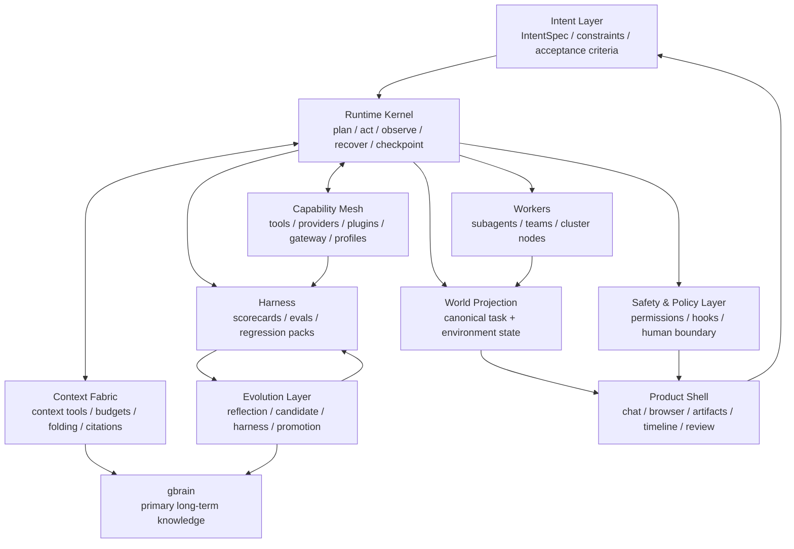
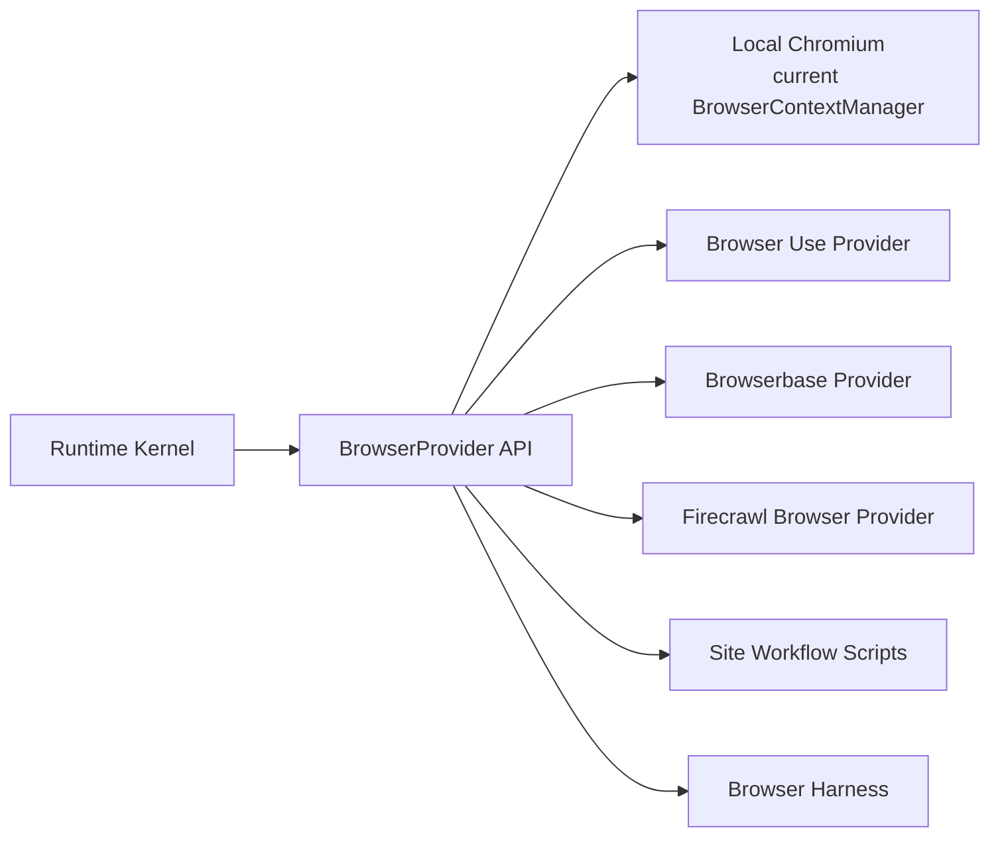
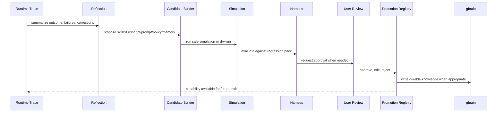
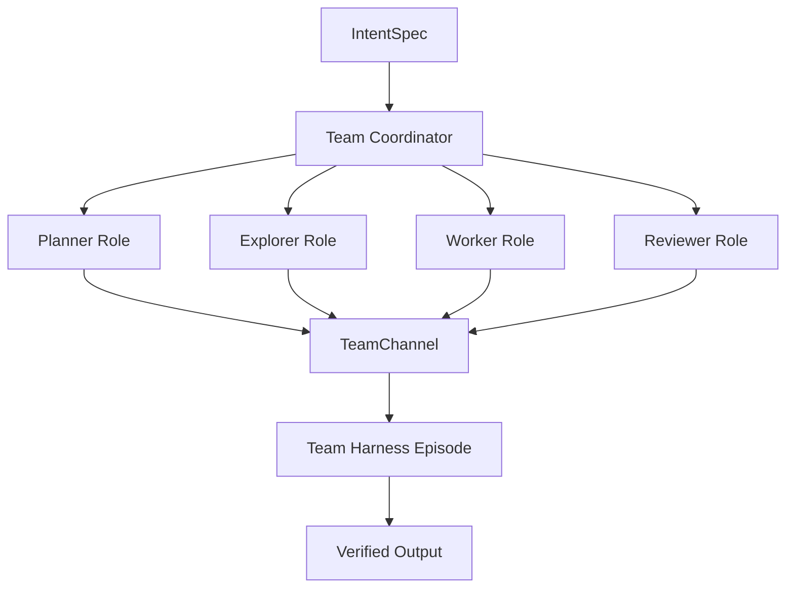

# ADR — uClaw Agent OS v2 North Star

- **Status:** Accepted as strategy baseline, upgraded to Agent OS v2
- **Date:** 2026-05-20
- **Scope:** Framework and strategy design for uClaw's agent runtime, long-running autonomy, self-evolution, plugins, browser, memory, automation, teams, and future cluster management.
- **One-line target:** Agent Operating System for Long-Running Work.
- **Related code:** `src-tauri/src/agent/`, `src-tauri/src/browser/`, `src-tauri/src/harness/`, `src-tauri/src/automation/`, `src-tauri/src/proactive/`, `src-tauri/src/mcp.rs`, `src-tauri/src/gbrain/`, `src-tauri/src/agent/teams/`
- **Related docs:** `docs/adr/2026-05-20-gbrain-primary-freeze-l2-cognitive.md`, `docs/superpowers/specs/2026-05-19-uclaw-agent-autonomy-harness-design.md`, `docs/superpowers/specs/2026-05-18-ai-browser-agent-v2-design.md`, `docs/superpowers/specs/2026-05-17-symphony-runtime-design.md`, `docs/uclaw-migration-plan.md`
- **Primary local reference:** `/Users/ryanliu/Documents/hermes-agent`
- **Additional local references:** `/Users/ryanliu/Documents/GenericAgent`, `/Users/ryanliu/Documents/hello-halo`
- **External design references:** OpenAI Codex, Claude Code, Hermes Agent plugin model, Context-as-a-Tool, Context-Folding, Agent S2, Reflexion, Voyager.

---

## 1. Executive Thesis

uClaw should not become a browser-use clone, a gbrain clone, a workflow automation app, or a loose desktop wrapper around tools.

uClaw's durable product identity is:

> **A local-first, observable, recoverable, learnable, evolvable Agent Operating System for long-running work, extensible from a single local agent to teams and distributed clusters.**

The important shift from v1 to v2 is this:

- v1 said: build a local-first agent control plane.
- v2 says: build an operating system for agentic work.

An Agent OS is not a giant agent loop. It is a runtime environment that gives agents:

- a common intent format,
- a task lifecycle,
- a context fabric,
- a capability mesh,
- a world projection,
- a safety and policy layer,
- a harness-driven evolution path,
- and eventually team/cluster scheduling.

This ADR establishes the core rule:

> **Keep the kernel small. Make context queryable. Make capabilities replaceable. Make state observable. Make learning gated. Make autonomy resumable.**

---

## 2. Why Agent OS, Not Agent App

Most failed agent products collapse for the same reason: they confuse "more capabilities" with "better autonomy."

Feature accumulation creates:

- parallel task states,
- duplicate memory systems,
- tool bloat,
- unbounded context,
- unclear permission boundaries,
- hidden side effects,
- and agents that look autonomous but cannot be debugged or trusted.

An Agent OS takes the opposite path:

- **Intent before execution:** every request becomes a typed goal with constraints and acceptance criteria.
- **Runtime before features:** every feature runs through the same task lifecycle.
- **Context as a tool:** context is retrieved on demand instead of preloaded until it explodes.
- **Capabilities as cards:** each tool/provider/plugin has cost, permissions, reliability, scope, and harness score.
- **Projection over panels:** the UI renders a unified world state, not scattered module internals.
- **Evaluation before evolution:** self-learning produces candidates, not silent production mutations.
- **Isolation by default:** long-running work, subagents, and remote workers run in bounded scopes.

The desired outcome is not "uClaw can do many things." The desired outcome is:

> uClaw can run complicated work for a long time without losing state, trust, evidence, or architectural clarity.

---

## 3. Reference Lessons

### 3.1 Hermes Agent

Hermes Agent is the strongest local implementation reference for uClaw's capability strategy.

Patterns to borrow:

- plugin sources are explicit: bundled, user, project-trusted, and external entry points;
- plugin kinds are typed: standalone, backend, exclusive, platform, model-provider;
- tools register into one canonical registry;
- provider backends are plugins, not hard-coded feature branches;
- tool overrides are explicit and auditable;
- hooks are lifecycle-level APIs, not ad hoc callbacks;
- some provider families are exclusive, especially memory;
- a managed gateway can supply external tool capabilities without pulling every vendor SDK into core;
- task-specific toolset distribution prevents the agent from seeing every installed tool at once;
- install-time configuration declares env vars, secrets, metadata, and permission surfaces.

uClaw should implement this as Rust/Tauri-native infrastructure:

- `ToolRegistry`
- `ProviderRegistry`
- `PluginRegistry`
- `HookBus`
- `CapabilityProfile`
- `ToolGateway`

Hermes gives uClaw the plugin discipline. uClaw should add stronger harness and world-projection discipline.

### 3.2 OpenAI Codex

Codex's strongest product architecture lessons are:

- each task runs in an isolated environment;
- many tasks can run in parallel;
- repository guidance such as `AGENTS.md` matters;
- reliable dev environments and tests improve agent quality;
- outputs should be verifiable through terminal logs, test results, and file citations;
- users inspect and refine results before export or merge.

uClaw should translate this beyond coding:

- every substantial task should have an isolation scope;
- every autonomous run should emit verifiable evidence;
- every diff, browser action, automation result, or memory write should be traceable;
- every long-running task should be resumable from checkpoint.

### 3.3 Claude Code

Claude Code's strongest runtime lessons are:

- subagents preserve parent context by working in fresh contexts;
- subagents should have scoped tools and focused prompts;
- MCP/tool schemas should be loaded on demand;
- hooks can inspect, block, modify, or react to lifecycle events;
- hooks live outside the model context and can short-circuit unsafe actions;
- project/user configuration files are part of the runtime contract.

uClaw should borrow the mechanics, not the exact product shape:

- subagents become `WorkerRole` or `AgentWorker` instances;
- hooks become `PolicyHook` and `LifecycleHook`;
- MCP/tool search becomes `Capability Search`;
- context loading becomes explicit `ContextTool` calls;
- project guidance becomes `ProjectRuntimeProfile`.

### 3.4 GenericAgent

GenericAgent's strongest idea is minimal self-evolution:

- start with a small loop and atomic tools;
- perform work autonomously;
- crystallize successful paths into reusable skills/SOPs;
- keep memory layered;
- use subagents for bounded map/reduce work;
- report and checkpoint after completion.

uClaw should borrow the learning posture:

- successful work produces candidate artifacts;
- candidate artifacts are reviewed and scored;
- promotion is reversible and versioned;
- repeated tasks get cheaper because the right skill/context/capability is recalled, not because prompts get longer.

### 3.5 hello-halo

hello-halo's strongest product lessons are:

- desktop shell matters;
- remote/mobile/IM control turns an agent into a 24/7 worker;
- scheduled "AI digital humans" are not separate agents, but trigger-driven uses of the same runtime;
- reusable browser scripts make common site workflows reliable;
- marketplace/plugin ambitions only work when permissions and contracts are clear.

uClaw should keep the product feel, but anchor it to a stronger runtime.

### 3.6 Research Lineage

The Agent OS v2 design incorporates these research directions:

- **Context-as-a-Tool:** long-horizon agents should actively retrieve and manipulate context, not passively append history.
- **Context-Folding:** long-running agents need structured context compression and decomposition, not generic summaries.
- **Agent S2:** computer-use agents benefit from generalist-specialist decomposition, precise grounding, and hierarchical planning.
- **Reflexion:** agents can improve through verbal feedback and reflection without updating model weights.
- **Voyager:** reusable skill libraries enable lifelong learning when successful behaviors are stored and recalled.

The uClaw-specific synthesis:

> Context, capabilities, memory, and skills must all be runtime objects with provenance, budgets, and evaluation history.

---

## 4. Final Goal Definition

### 4.1 Self-Evolving Agent System

uClaw must support continuous self-improvement without becoming unstable.

Required properties:

- every run emits structured traces, decisions, tool outcomes, context reads, memory writes, user corrections, and final verdicts;
- every learning output is a proposal, not an automatic mutation;
- proposals include evidence, scope, policy impact, harness results, and rollback plan;
- promotion requires score improvement or explicit user approval;
- long-term factual knowledge flows to gbrain;
- executable knowledge becomes skill/SOP/browser-script/provider-policy artifacts.

Success signal:

- repeated tasks become shorter, cheaper, safer, and more reliable through recalled artifacts and capability selection.

### 4.2 Agent Autonomy

uClaw's autonomy target is not "the agent does anything silently."

It is:

- understand intent;
- plan at multiple horizons;
- act within policy;
- observe the environment;
- recover from failure;
- ask at human boundaries;
- checkpoint progress;
- resume after interruption;
- produce evidence;
- learn through gated promotion.

### 4.3 Multi-Domain Collaboration

uClaw must coordinate across:

- code,
- browser,
- files,
- local desktop,
- MCP tools,
- memory,
- communication channels,
- automations,
- teams,
- and future remote workers.

All domains must enter through the same runtime contracts. Domain details belong behind capabilities, providers, or plugins.

### 4.4 Agent Teams

Agent teams are role-scoped coordinated workers, not independent chat rooms.

Required concepts:

- `TeamSpec`: roles, capability profiles, budget, policy, output contract;
- `Coordinator`: decomposes work and assigns tasks;
- `WorkerRole`: planner, explorer, implementer, browser operator, verifier, critic;
- `TeamChannel`: typed messages, artifacts, decisions, and references;
- `ReviewGate`: a role or harness block that can stop completion or promotion.

### 4.5 Agent Cluster Management

Cluster management is a distributed extension of the same local OS.

Future goals:

- register local or remote workers;
- route work by capability, load, locality, and policy;
- preserve canonical trace across workers;
- checkpoint and fail over;
- return approvals to the controlling uClaw shell;
- keep local-first operation useful even with no remote workers.

---

## 5. Autonomy Ladder

uClaw should expose autonomy as a ladder, not a vague on/off switch.

| Level | Name | Description | Required guardrails |
|---|---|---|---|
| L0 | Chat Assist | Agent answers or proposes steps | no side effects |
| L1 | Assisted Action | Agent prepares actions, user executes or approves each step | visible plan and approval |
| L2 | Supervised Task | Agent executes bounded task with frequent checkpoints | tool policy, trace, cancel/resume |
| L3 | Delegated Task | Agent completes a task with human boundary prompts only | budget, checkpoints, harness trace |
| L4 | Scheduled Worker | Agent wakes up from trigger or schedule and runs a known workflow | automation ledger, escalation policy |
| L5 | Agent Team | Multiple roles coordinate through team channels | role ownership, reviewer gate |
| L6 | Distributed Cluster | Work routes across local/remote workers | worker policy, locality, failover |

Every task must declare its target autonomy level. The runtime may downgrade autonomy based on risk, missing credentials, low provider score, or insufficient harness coverage.

---

## 6. Agent OS Layer Model



Layer rules:

- Product Shell renders state; it does not own canonical task truth.
- Runtime Kernel coordinates lifecycle; it does not embed provider-specific logic.
- Context Fabric retrieves and folds context; it does not become another memory system.
- Capability Mesh exposes tools/providers/plugins; it does not decide product intent.
- World Projection materializes runtime truth for UI and diagnostics.
- Safety & Policy can block, downgrade, or ask; it cannot silently bypass trace.
- Evolution proposes and promotes artifacts; it does not mutate production behavior directly.

---

## 7. Core Runtime Objects

### 7.1 IntentSpec

Every user prompt, automation trigger, IM command, team assignment, or cluster job enters as `IntentSpec`.

```ts
type IntentSpec = {
  id: string
  origin: 'chat' | 'automation' | 'im' | 'team' | 'cluster' | 'system'
  userGoal: string
  acceptanceCriteria: string[]
  constraints: Constraint[]
  autonomyTarget: 'L0' | 'L1' | 'L2' | 'L3' | 'L4' | 'L5' | 'L6'
  riskClass: 'low' | 'medium' | 'high' | 'restricted'
  contextRefs: ContextRef[]
  requestedCapabilities: CapabilityQuery[]
}
```

### 7.2 TaskSpec

`TaskSpec` is the executable form of an intent.

```ts
type TaskSpec = {
  id: string
  intentId: string
  goal: string
  planRef?: string
  policy: PolicySpec
  budget: BudgetSpec
  capabilityProfile: string
  outputContract: OutputContract
  checkpointPolicy: CheckpointPolicy
}
```

### 7.3 TaskEvent

Every significant runtime action must be an event.

```ts
type TaskEvent =
  | { kind: 'intent_received'; intentId: string; ts: string }
  | { kind: 'task_started'; taskId: string; ts: string }
  | { kind: 'context_read'; taskId: string; source: string; artifactRef: string; ts: string }
  | { kind: 'plan_updated'; taskId: string; planRef: string; ts: string }
  | { kind: 'capability_selected'; taskId: string; capabilityId: string; reason: string; ts: string }
  | { kind: 'tool_call'; taskId: string; toolName: string; inputRef: string; ts: string }
  | { kind: 'tool_result'; taskId: string; toolName: string; outputRef: string; ok: boolean; ts: string }
  | { kind: 'policy_hook'; taskId: string; hookName: string; decision: string; ts: string }
  | { kind: 'boundary_event'; taskId: string; boundaryRef: string; ts: string }
  | { kind: 'checkpoint'; taskId: string; checkpointRef: string; ts: string }
  | { kind: 'memory_read' | 'memory_write'; taskId: string; target: string; artifactRef: string; ts: string }
  | { kind: 'worker_assigned'; taskId: string; workerId: string; reason: string; ts: string }
  | { kind: 'task_finished'; taskId: string; verdict: 'done' | 'failed' | 'blocked' | 'cancelled'; ts: string }
```

### 7.4 WorldProjection

WorldProjection is the UI and diagnostics view of runtime truth.

It should answer:

- What is the user trying to accomplish?
- What is the current plan?
- What has happened?
- What is the agent waiting on?
- What tools/providers/workers are active?
- What context has been read?
- What memory has been written?
- What boundaries were hit?
- What can be resumed?
- What did the harness score?

WorldProjection is not another store of record. It is a materialized view over task events, run ledgers, provider status, and memory receipts.

---

## 8. Context Fabric

Context must become a managed runtime resource.

### 8.1 Core Rule

Do not preload the world. Retrieve the right context at the right time, with provenance and budgets.

### 8.2 Context Sources

| Source | Example | Canonical owner |
|---|---|---|
| Conversation | current chat and prior turns | agent conversation tables |
| Task trace | prior TaskEvent stream | harness/run ledger |
| Codebase | files, symbols, commits, tests | filesystem/git tools |
| Browser | tabs, DOM/snapshot, screenshots, action history | BrowserProvider |
| Memory | durable knowledge and user/project facts | gbrain |
| Artifacts | outputs, diffs, reports, generated files | artifact store |
| Team | role messages and decisions | TeamChannel |
| Automation | schedules, triggers, runs | automation ledger |
| Cluster | worker state and remote traces | ClusterManager |

### 8.3 Context Tools

The model should request context through tools such as:

- `context.search`
- `context.read`
- `context.fold`
- `context.cite`
- `context.compare`
- `context.pin`
- `context.release`

This prevents the agent from dragging every document, schema, tool definition, and transcript into active context.

### 8.4 Context Folding

uClaw should use structured folding instead of generic summarization.

Fold outputs should preserve:

- facts,
- decisions,
- unresolved questions,
- evidence refs,
- failed attempts,
- active constraints,
- next actions,
- rollback points.

Any fold used for a consequential decision must cite the source events or artifacts it came from.

---

## 9. Capability Mesh

Capabilities are the OS equivalent of drivers and system services.

### 9.1 Capability Card

Every tool, provider, plugin, browser script, automation source, worker, or model should expose a card.

```yaml
id: browser.local_chromium
kind: provider
family: browser
description: Local Chromium browser provider backed by current BrowserContextManager
permissions:
  - network.browser
  - local.profile.read
  - local.profile.write
cost:
  money: local
  latency: medium
  tokenPressure: low
reliability:
  harnessScore: 0.82
  lastEvaluatedAt: 2026-05-20T00:00:00Z
failureModes:
  - captcha
  - login_required
  - site_blocks_automation
humanBoundaries:
  - credential_handoff
  - payment
  - privacy_sensitive_form
```

The planner sees cards, not implementation internals.

### 9.2 Registry Set

| Registry | Owns |
|---|---|
| `ToolRegistry` | schema, handler, toolset, check function, display metadata, result limits, override state |
| `ProviderRegistry` | provider families, active provider selection, health, config schema, harness cases |
| `PluginRegistry` | plugin discovery, manifests, enablement, hooks, install/update/remove |
| `CapabilityProfileRegistry` | named capability bundles, budgets, deny/allow rules |
| `WorkerRegistry` | local/subagent/team/remote workers, capabilities, heartbeat, load |

### 9.3 Plugin Manifest

```yaml
id: browser-use-cloud
name: Browser Use Cloud Provider
version: 0.1.0
kind: backend
category: browser
provides:
  browser_providers:
    - browser-use
capabilities:
  - browser.session
  - browser.snapshot
  - browser.action
hooks:
  - pre_gateway_dispatch
  - post_tool_call
toolsets:
  - browser_tasks
permissions:
  network: true
  secrets:
    - BROWSER_USE_API_KEY
requiresEnv:
  - name: BROWSER_USE_API_KEY
    secret: true
    description: Direct Browser Use key. Optional when managed gateway is enabled.
gateway:
  supported: true
  preferredWhenEnabled: true
harnessCases:
  - ./harness/browser-navigation.json
```

### 9.4 Capability Profiles

Agents should see task-appropriate capability bundles.

```yaml
id: browser_research_l3
autonomyMax: L3
allowedToolsets:
  - core
  - memory_recall
  - browser_tasks
  - web_search
deniedCapabilities:
  - filesystem.write
  - shell.exec
budget:
  maxToolCalls: 80
  maxBrowserActions: 40
  maxCostUsd: 3.00
requiresApproval:
  - credential_handoff
  - payment
  - destructive_action
```

Capability profiles bind together policy, tool exposure, cost, and autonomy.

---

## 10. Safety, Policy, and Hooks

Safety is not a modal dialog. It is a runtime layer.

### 10.1 Policy Hook Matrix

| Hook | Can block | Can mutate | Must emit event |
|---|---|---|---|
| `UserPromptSubmit` | yes | yes | yes |
| `IntentClassified` | yes | yes | yes |
| `PreContextRead` | yes | yes | yes |
| `PostContextRead` | no | yes | yes if changed |
| `PreToolUse` | yes | yes | yes |
| `PostToolUse` | no | yes | yes if changed |
| `PreMemoryWrite` | yes | yes | yes |
| `PreBrowserAction` | yes | yes | yes |
| `PermissionRequest` | yes | no | yes |
| `SubagentStart` | yes | yes | yes |
| `WorkerAssignment` | yes | yes | yes |
| `PrePromotion` | yes | yes | yes |
| `SessionEnd` | no | no | yes |

### 10.2 Human Boundary Policy

The agent must ask the user for:

- credentials and login handoff;
- CAPTCHA and bot challenges;
- payment or purchase;
- destructive filesystem/database actions;
- sending messages externally;
- publishing or deploying;
- private/sensitive data exposure;
- policy downgrade or autonomy escalation.

Human boundary events should appear in the normal task trace and product timeline.

### 10.3 Isolation Model

| Work type | Isolation |
|---|---|
| quick chat answer | conversation scope |
| local coding task | git worktree or explicit dirty-tree policy |
| browser task | browser session/profile scope |
| subagent exploration | fresh context, restricted tools |
| automation run | run ledger plus task checkpoint |
| team role | role context plus team channel |
| remote worker | data locality and capability policy |

Isolation is the foundation for parallelism, recovery, and trust.

---

## 11. Memory and Knowledge

gbrain remains the primary long-term knowledge layer.

### 11.1 Three Knowledge Types

| Type | Purpose | Owner |
|---|---|---|
| Factual knowledge | durable user/project/domain facts | gbrain |
| Evidential knowledge | traces, logs, outputs, receipts, scorecards | harness/run ledger |
| Executable knowledge | skills, SOPs, browser scripts, prompts, policies | Evolution Layer + registries |

This prevents memory from becoming a junk drawer.

### 11.2 Current uClaw Rule

- `gbrain`: primary durable knowledge.
- `memU`: auxiliary retrieval/embedding where useful.
- `memory_graph`: legacy/archive/internal graph state; no new EntityPage feature work unless a later ADR reverses the freeze.
- Memory OS ideas: retained only if they become gbrain concepts, runtime metadata, or harness-gated executable knowledge.

### 11.3 Memory Provider Strategy

Borrow Hermes's exclusive memory-provider model:

- only one active primary memory provider at a time;
- gbrain is the current active provider;
- alternative providers may exist as plugins, not parallel core systems;
- writes require receipts;
- consequential recalls require source references;
- memory writes from self-evolution require harness or user approval.

---

## 12. Browser and Computer Use

Browser automation is a capability family, not the agent's identity.

### 12.1 Provider Shape



### 12.2 Strategy

- Keep current `BrowserContextManager` as `LocalChromiumProvider`.
- Keep legacy `BrowserService` only as compatibility surface with sunset note.
- Put all new browser behavior behind `BrowserProvider`.
- Treat browser-use, Browserbase, and Firecrawl as provider plugins.
- Make site-specific workflows script artifacts when repeated.
- Preserve structured observations, action results, boundary events, and checkpoints.
- Evaluate providers with the same browser harness cases.

### 12.3 Computer Use Upgrade

For GUI/computer control, borrow Agent S2's principle:

- use generalist planning for high-level task reasoning;
- use specialist grounding for coordinates, accessibility, screenshots, and UI state;
- maintain multi-scale plans: goal plan, page/app plan, next-action plan;
- treat GUI grounding uncertainty as a first-class risk signal.

---

## 13. Evolution Factory

Self-evolution is an artifact pipeline.



### 13.1 Candidate Types

- gbrain page update;
- skill or SOP;
- browser script;
- prompt patch;
- planner heuristic;
- capability profile adjustment;
- policy hook;
- failure memory;
- regression harness case.

### 13.2 Promotion Gates

Every promotion must include:

- source trace;
- proposed scope;
- safety impact;
- benchmark or harness result;
- rollback plan;
- owner or approving user;
- version id.

Forbidden direct promotions:

- silent permission widening;
- secret capture;
- prompt mutation without regression;
- memory writes without evidence;
- provider enablement without user configuration;
- autonomy escalation without policy approval.

---

## 14. Automation, Teams, and Cluster

### 14.1 Automation

Automation is scheduled or triggered agent work.

It must use:

- `IntentSpec`;
- `TaskSpec`;
- `CapabilityProfile`;
- policy hooks;
- task ledger;
- harness trace;
- memory receipts.

Automation-specific code owns triggers, schedules, subscriptions, escalation, and delivery. It does not own separate agent semantics.

### 14.2 Teams



Team rules:

- each role has a capability profile;
- each role has explicit ownership;
- team channels contain artifacts and decisions, not hidden chat sprawl;
- reviewer role can block completion;
- coordinator cannot bypass policy hooks.

### 14.3 Cluster

```ts
type WorkerNode = {
  id: string
  kind: 'local' | 'subagent' | 'worktree' | 'remote' | 'container' | 'mobile' | 'cloud'
  capabilities: CapabilityDescriptor[]
  status: 'online' | 'busy' | 'draining' | 'offline'
  load: { activeTasks: number; cpu?: number; memory?: number }
  policy: PolicySpec
  locality: DataLocalitySpec
  lastHeartbeatAt: string
}
```

Cluster rules:

- local-first remains default;
- remote workers receive only declared context refs;
- approval routes back to the controlling shell;
- worker events fold into the same harness episode;
- failover uses checkpoints, not best-effort replay from memory.

---

## 15. Compatibility With Current uClaw

This strategy is evolutionary.

Keep:

- Tauri v2 + Rust backend + React shell;
- pure Rust agent loop;
- existing `ServiceManager`;
- existing LLM provider service;
- MCP/gbrain integration;
- browser v2 work as local provider;
- automation runtime as trigger/run ledger;
- agent teams seed as future TeamRuntime.

Change:

- `AppState` should converge toward kernel and registry handles, not one field per feature;
- `tauri_commands.rs` should remain a public IPC facade, not the implementation home for all domains;
- browser work should move behind `BrowserProvider`;
- memory work should stay gbrain-primary;
- automation should create `IntentSpec`/`TaskSpec` instead of separate semantics;
- teams should use the same task protocol and capability profiles;
- self-learning should move through Evolution Factory.

---

## 16. Implementation Roadmap

### Milestone 0 — ADR Lock

Deliverables:

- this Agent OS v2 ADR;
- `CLAUDE.md` pointer to this ADR;
- rule that new strategic specs must name their intent, context, capability, projection, policy, and harness contracts.

Exit criteria:

- new work references Agent OS v2 terms instead of inventing parallel runtimes.

### Milestone 1 — Runtime Contracts

Deliverables:

- Rust types for `IntentSpec`, `TaskSpec`, `TaskEvent`, `PolicySpec`, `BudgetSpec`, `CapabilityProfile`, `CheckpointRef`;
- adapters from current agent/browser/automation events into `TaskEvent`;
- harness ingestion for unified event streams.

Exit criteria:

- one chat task, one browser task, and one automation run produce comparable traces.

### Milestone 2 — Context Fabric

Deliverables:

- `ContextRef` and `ContextArtifact` schema;
- context search/read/fold/cite tools;
- source-cited folding format;
- context budget accounting;
- UI trace for context reads.

Exit criteria:

- agent can retrieve code, memory, browser, and prior trace context without preloading all of it.

### Milestone 3 — Capability Mesh

Deliverables:

- `ToolRegistry`;
- `ProviderRegistry`;
- `PluginRegistry`;
- `CapabilityProfileRegistry`;
- plugin manifest parser;
- Hermes-style bundled/user/project plugin discovery;
- explicit override policy;
- provider health TTL.

Exit criteria:

- local browser and gbrain are registered providers;
- at least one bundled plugin is discoverable but disabled;
- one task runs with a restricted capability profile.

### Milestone 4 — World Projection

Deliverables:

- materialized task projection from TaskEvent streams;
- pending boundary projection;
- active provider/worker projection;
- browser/task/team state surfaces consume projection instead of bespoke state when possible.

Exit criteria:

- UI can answer what the agent is doing, waiting for, using, and able to resume.

### Milestone 5 — Policy Hooks and Isolation

Deliverables:

- HookBus with trace-visible lifecycle events;
- policy hooks for tools, memory writes, browser actions, subagent start, worker assignment, promotion;
- task isolation profiles;
- dirty-worktree/worktree policy for coding tasks.

Exit criteria:

- a hook can block an unsafe action and the rejection appears in the task trace.

### Milestone 6 — Browser Provider Strategy

Deliverables:

- `BrowserProvider` trait;
- `LocalChromiumProvider` adapter;
- provider-independent browser harness;
- Browser Use, Browserbase, Firecrawl provider plugin stubs;
- site workflow script contract.

Exit criteria:

- same browser harness case can run against local provider and a mock external provider.

### Milestone 7 — Evolution Factory

Deliverables:

- learning artifact schema;
- reflection generator;
- candidate builder;
- harness promotion gate;
- user review surface;
- rollback/disable path.

Exit criteria:

- a completed task can propose a skill/SOP/browser script, run a gate, and wait for user approval.

### Milestone 8 — Teams v1

Deliverables:

- `TeamSpec`;
- role registry;
- coordinator;
- typed team channels;
- reviewer gate;
- team harness episode.

Exit criteria:

- a team run produces role outputs, reviewer verdict, and verified final artifact.

### Milestone 9 — Cluster v1

Deliverables:

- worker registry;
- heartbeat;
- capability routing;
- load-aware assignment;
- data locality policy;
- checkpoint/failover;
- remote event ingestion.

Exit criteria:

- a local worker and mock remote worker run comparable tasks with unified trace and recovery.

---

## 17. Risk Register

| Risk | Signal | Response |
|---|---|---|
| Product becomes a feature pile | new modules add private state, policy, and eval | require IntentSpec, TaskEvent, capability card, and harness adapter |
| Agent OS becomes too abstract | no milestone produces visible user value | every milestone must improve trace, resume, safety, or repeated-task efficiency |
| Context Fabric becomes another memory system | context tools write durable facts directly | context reads/folds are transient unless promoted to gbrain or artifact store |
| Capability Mesh becomes plugin chaos | every plugin exposes all tools globally | capability profiles and explicit enablement gate exposure |
| Hooks become invisible magic | hooks mutate behavior without trace | mutating hooks must emit TaskEvent entries |
| Self-evolution corrupts behavior | prompt/skill changes auto-promote | Evolution Factory requires harness and rollback |
| Memory splits again | new features write facts outside gbrain | ADR violation unless a later ADR changes the canonical source |
| Browser stack becomes a clone | new features land only in local chromium path | new behavior must target BrowserProvider API |
| Teams duplicate runtime | team code creates its own loop/tool/policy model | teams must run TaskSpec and emit TaskEvent |
| Cluster leaks private context | remote workers receive broad local state | data locality policy and explicit context refs |
| UI becomes panel sprawl | each module renders its own truth | WorldProjection becomes the product-facing state contract |

---

## 18. Design Rules for Future Specs

Every strategic uClaw spec must answer:

1. What user intent does this support?
2. What autonomy level can it run at?
3. What is the canonical truth source?
4. What TaskEvent entries does it emit?
5. What context does it read, and how is it cited?
6. What capability cards does it add or consume?
7. What policy hooks can block it?
8. What world projection does the UI render?
9. What harness cases prove it works?
10. What is the rollback or disable path?
11. What does it deliberately not own?

If a proposal cannot answer these, it is not ready for implementation.

---

## 19. Strategic Summary

uClaw should become:

- **small in the kernel**: one runtime lifecycle, one task protocol, one safety model;
- **rich in context**: queryable, cited, folded, budgeted context;
- **wide at the edge**: provider/plugin capability mesh for browser, memory, tools, models, workers, and platforms;
- **clear in state**: world projection instead of panel-level truth;
- **strict in safety**: hooks, human boundaries, and isolation;
- **measurable in autonomy**: harness scorecards before promotion;
- **useful over time**: repeated work becomes skill, SOP, memory, and capability policy;
- **ready for teams and clusters**: roles and workers extend the same OS, not separate runtimes.

The product should feel simple because the operating system underneath is disciplined.

The north star is:

> **uClaw is the Agent OS for long-running work: local-first, observable, recoverable, learnable, evolvable, and extensible from one user task to teams and clusters.**
