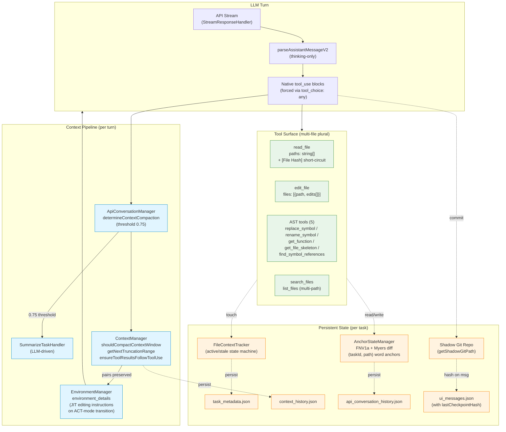
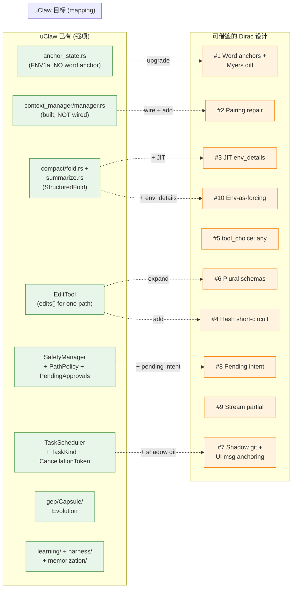
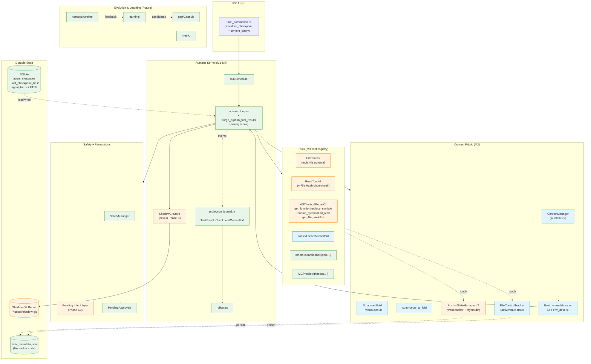

# Dirac 逆向分析与 uClaw Agent 架构映射

> **作者**: Claude (Cowork mode), 受 Ryan 委托
> **日期**: 2026-05-25 (v1.1 — 修正了 v1.0 中两处事实错误)
> **范围**: `/Users/ryanliu/Documents/dirac` (Dirac fork of Cline，Apache-2.0)
>
> **v1.1 修正记录**:
> 1. v1.0 误把 `BEHAVIOR.md` 当作 uClaw 运行时系统提示来源 — 实际它只是 Claude Code 在 uClaw 仓库开发过程使用的开发者文档，**不进入 uClaw app 运行时**。uClaw 运行时系统提示来自 `src-tauri/src/agent/mode_prompts.rs::compose_system_prompt` + `baseline.md` (`KARPATHY_BASELINE`) + M2-A 的 `baseline_blocks.rs`。
> 2. v1.0 提议 C2 阶段 "选项 1: 调用现有 GitNexus MCP" — 错。GitNexus MCP 是开发者本机辅助 Claude Code 工作的工具，**不在 uClaw app 运行时也不会随 uClaw 分发给用户**。AST 编辑必须 in-process (推荐 `tree-sitter` Rust crate)。修正后成本从 8-12 day 上调到 12-20 day。
>
> 受影响章节 (已就地修正 + 加 ⚠️ 标注): #6 #3、#7.2 Phase A4、#7.2 Phase C2、#7.2 Phase C3。
> **配套阅读**:
> - `docs/adr/2026-05-20-uclaw-agent-platform-north-star.md`
> - `docs/superpowers/MILESTONE_STATUS.md`
> - `BEHAVIOR.md` / `CONTEXT.md`
>
> **方法论**: 4 个并行 subagent 分头深读 Dirac 的 Context、Lifecycle、Tools/Prompt、以及 uClaw baseline，全部findings都引用 file:line。本文不复述 README，只引用源码。

---

## 0. TL;DR — 一句话结论

> **Dirac 真正的杀手锏不是 "AI"，而是 "把环境塑造成模型的强迫漏斗 (forced funnel)"。它通过 hash-anchored 编辑协议、AST-aware 工具、multi-file batching schema、JIT 注入的编辑规则、和 native-only tool_choice 强制 — 让模型"无法犯典型错误"，而不是"被提示词劝说不要犯错"。**

这一句话同时回答了用户的 8 个核心问题：

| 用户的疑问 | Dirac 的答案 |
|---|---|
| 为什么强调 compact context | 不只是省 token — `ContextManager.ensureToolResultsFollowToolUse` 在裁剪时**自动补占位符修复 tool_use/tool_result 配对**，让裁剪变成幂等安全操作 |
| 为什么强调 AST-native | 13 种语言 × `tree-sitter` WASM × `replace_symbol/rename_symbol/get_function/get_file_skeleton/find_symbol_references` — 让"改函数"不再是"找行号" |
| 为什么强调 hash-anchored | 不是简单 hash — 是**带 Myers diff 漂移传播的词锚 (`AppleBanana§`) 系统**。函数即使移到第 200 行，它的锚词仍然是它最初被读到时的同一个 |
| 为什么强调 multi-file batching | schema 层 plural-by-default：`read_file.paths[]`、`edit_file.files[]`、`replace_symbol.replacements[]` — round-trip 线性下降 |
| 为什么弱化 prompt engineering | 系统提示 **~3-4 KB**；编辑规范只在切到 ACT mode 的第一轮**一次性 JIT 注入** `environment_details`；工具用 native function calling + `tool_choice: "any"` 强制使用 |
| 它的 AI system philosophy | "Environment as forcing function" — 不是劝模型守规矩，而是让违规在协议层就被拒绝 |
| 是不是 Ambient OS | **部分是**：持久任务态、shadow-git checkpoint、文件状态追踪、规则按 pending intent 激活。但 **没有 selfDev、没有 idle loop、没有 ambient daemon** — 它是高度优化的 request-driven agent，不是真正的 ambient OS |
| 对 uClaw 怎么用 | C1 期就能引入的 4 个低风险 borrow：编辑协议升级、ContextManager 配对修复、JIT 工具规范注入、Read-Hash 短路；M3/M4 期再做 AST tools 和 multi-file batch |

下面是完整论证。

---

## 1. 核心设计理念 (VERY IMPORTANT)

### 1.1 Dirac 到底相信什么

> *"It is a well studied phenomenon that any given model's reasoning ability degrades with the context length. If we can keep context tightly curated, we improve both accuracy and cost while making larger changes tractable in a single task."* — Dirac README

这是市场说辞。但读完源码我重写如下：

**Dirac 相信的是 4 条公理：**

1. **模型是有限理性的代理人，环境是规则制定者。** 你不能靠提示词让一个会幻觉的模型不幻觉，但你可以让它的幻觉**在协议层就被拒绝**。`EditExecutor.resolveAnchor()` 的四步校验 (`/Users/ryanliu/Documents/dirac/src/core/task/tools/handlers/edit-file/EditExecutor.ts:55-99`) 就是这个公理的实现 — anchor 词不匹配？拒绝。anchor 后的字面内容不匹配当前文件？拒绝。匹配错误以 `Expected: "<actual>", Provided: "<wrong>"` 的结构化形式返回，下一轮模型可以直接读出 diff。

2. **Token 成本是非线性的。** 一次 round-trip 的 prefill + cache write 远高于 tool 内部多做一些事的边际成本。所以：`read_file.paths: string[]`、`edit_file.files: [...]`、`replace_symbol.replacements: [...]` — **schema 层 plural-by-default**。从 8 个文件读 8 次变成 1 次。从 8 个文件改 8 次变成 1 次。Eval table 显示 Dirac 是次便宜方案的 **2.8×**。

3. **不变内容不应该重传。** `ReadFileToolHandler.ts:289-291` 在读文件时在输出里嵌入 `[File Hash: <FNV1a>]`，下次同一文件再被读 — 如果 hash 一致，直接返回一句 `"no changes have been made to the file since your last read (Hash: …)"`。这是**内容寻址的 zero-token re-read**。Function 级也一样 (`GetFunctionToolHandler.ts:167`)。

4. **裁剪不能让 LLM API 出错。** `ContextManager.ensureToolResultsFollowToolUse()` 是这条公理的具象 — 当 tool_use 被裁剪而 tool_result 还在 (或反之)，自动插入 `{type:"tool_result", content:"result missing"}` 占位符。**这一条让上下文管理从"小心翼翼地不要碰坏"变成"可以放心激进地裁剪"**。这是大部分 agent framework 在这条上栽跟头：LangChain/AutoGen/CrewAI 都做朴素的消息截断，然后被 Anthropic API 以 `tool_use without matching tool_result` 报错炸掉。

### 1.2 与传统 LLM Agent Framework 的根本差异

把这 4 条公理铺平就看到 Dirac 和别人的不同：

| 维度 | 传统 framework (AutoGen/CrewAI/LangGraph/Cline 原版) | Dirac |
|---|---|---|
| 工具协议 | XML in system prompt | Native function calling only (`parse-assistant-message.ts:7` 注释： *"no XML tool call parsing is performed"*) |
| 工具 schema | 单文件 singular | Plural-by-default |
| 编辑寻址 | 行号 / SEARCH/REPLACE 模糊匹配 | 词锚 + 字面校验 + Myers diff 漂移传播 |
| 编辑规范 | 永远在系统提示里 | 仅在 ACT-mode 第一轮一次性注入 `environment_details` (`EnvironmentManager.ts:144-146`) |
| 上下文裁剪 | 朴素消息截断 | 配对修复 + 词锚保留 + Hash 短路 |
| Tool choice | optional | `tool_choice: { type: "any" }` 强制 (`anthropic.ts:132`) |
| MCP | 必选/卖点 | **明确拒绝** (README: "MCP is not supported") |
| Self-dev | 营销词汇 | grep 全 repo 0 命中 (`selfDev|self_dev|SelfDev`) |

### 1.3 它的 AI System Philosophy

我用一个名字来概括：**"Environment-as-forcing-function"**。

- 传统 agent: *"Please be careful with file paths and don't hallucinate symbols."*
- Dirac: 让 hallucinated symbol 在 `EditExecutor.resolveAnchor` 第二步就被拒绝，错误信息是 *"anchor 'Apple' not found in the file. Please ensure you are using the latest anchors from the most recent read tool output."*

传统 agent 把成本投入到**说服模型**；Dirac 把成本投入到**结构性约束**。这就是为什么它 prompt 极短而工具极强 — 它把 "engineering" 从 prompt 搬到了 environment。

这条哲学不是 Dirac 发明的 (Anthropic Claude Code 本质也是这个路线)，但 Dirac 把它推到了开源 coding agent 的极致。

---

## 2. Context Architecture (深度分析)

### 2.1 关键观察 — ContextManager 不是它字面意思

第一个反直觉发现：**`ContextManager` 不是一个 "content compactor"**。它的实际工作是**消息对截断 + tool 配对修复**。真正的 content compaction 走另一条路径，由 LLM 自己驱动。

#### `ContextManager.ts` 的实际职责

文件：`src/core/context/context-management/ContextManager.ts`

| 函数 | 行号 | 实际做什么 |
|---|---|---|
| `shouldCompactContextWindow()` | 60-85 | 从上一次 `api_req_started` 解析 `tokensIn+tokensOut+cacheWrites+cacheReads`，对照 `maxAllowedSize` |
| `getNextTruncationRange()` | 191-231 | 总是保留首对 (0-1)，根据 `totalTokens/2 > maxAllowedSize` 决定 `"half"` vs `"quarter"`，强制偶数 + 终点对齐到 assistant 消息 |
| `ensureToolResultsFollowToolUse()` | 291-393 | **关键**：扫描截断后的 assistant 消息，为每个未配对的 `tool_use` 块插入 `{type:"tool_result", content:"result missing"}` |
| `applyContextHistoryUpdates()` | 261-285 | 裁剪着陆点是 user message 时，filter 掉孤儿 `tool_result` 块 |

预算公式 (`context-window-utils.ts:14`):
```ts
maxAllowedSize = min(1_000_000, max(contextWindow - 40_000, contextWindow * 0.8))
```
**永远预留 40k headroom，盖在 80%，1M 硬顶。**

#### 真正的 "compaction" 在另一条路径

`src/core/task/ApiConversationManager.ts:82-115`，触发阈值硬编码 0.75 (line 85)。触发后**不是直接调用一个 summarizer**，而是 push 一个 `summarizeTask(...)` 的 user prompt 让模型自己调 `summarize_task` 工具 (line 188)。模型生成 summary 后，next turn 用压缩后的历史 replay。

**这是关键设计选择**：compaction 是 LLM-driven，不是规则驱动。这避免了规则压缩"丢掉关键信息"的常见问题 — 模型自己决定留什么。

### 2.2 Hash-Anchored 编辑 — 它真正怎么工作

这一节是整篇报告里最重要的一节。

#### 第一层：词锚 (word anchor) 而非 hash 字符串

文件：`src/utils/AnchorStateManager.ts`

每个被读过的文件，每一行都被分配一个 **唯一的两词组合**：

```
AppleBanana§    def process(data):
PiratePotato§        if data is None:
RaspberryViking§            return []
```

`§` 是 `ANCHOR_DELIMITER` (`src/shared/utils/line-hashing.ts:6`)。

词从 `.hash_anchors` 字典文件加载 (line 34)，组成 10k 个两词排列；如果用尽就退化到三词组合 (`refill()` lines 41-77)。锚词的作用域是 `(taskId, absolutePath)` (line 13)。

#### 第二层：FNV-1a 行 hash 用于漂移检测

每次读文件时，对每一行计算 FNV-1a：
```ts
let h = 2166136261
for (let j = 0; j < line.length; j++) {
    h = Math.imul(h ^ line.charCodeAt(j), 16777619)
}
```
得到 `Uint32Array` 的 line-hash 数组。

#### 第三层：Myers diff 跨读重协调 (reconcile)

`AnchorStateManager.reconcile()` lines 119-217。每次读文件：

1. 计算当前 line hashes
2. 与上次记录的 hashes 比较
3. 如果完全一致 → 返回已记录的锚词数组 (不变)
4. 如果不一致 → **跑 `diff.diffArrays` (Myers diff)，对每个 "unchanged" 区段保留原有锚词，对 "added" 区段分配新锚词**

**这就是 Dirac 的灵魂**：一个函数即使在它上面插入了 50 行代码，它的锚词 `AppleBanana` 仍然不变。模型 5 轮前学到的 anchor，5 轮后依然能命中。

#### 第四层：编辑时的四步验证

`EditExecutor.resolveAnchor()` (`src/core/task/tools/handlers/edit-file/EditExecutor.ts:55-99`)：

1. anchor 词格式合法 (regex `^[A-Z][a-zA-Z]*$`)
2. anchor 词 indexOf 在重协调后的 `normalizedLineHashes` 中 — **不在则失败信息明确告诉模型 "Please ensure you are using the latest anchors from the most recent read tool output"**
3. 提供的 anchor 后内容**单行无换行**
4. **字面比较**：`§` 之后的内容必须 byte-equal 当前 `lines[index]` — 失败信息是 `Expected: "<actual>", Provided: "<wrong>"`

四步任何一步失败：edit 被加入 `failedEdits`，**不**修改文件，**不**自动重试。这是 fail-closed-with-diff — 下一轮模型看到 Expected/Provided 直接知道怎么修。

#### 防御 LLM 偷渡锚词到 text

`stripHashes()` (`src/shared/utils/line-hashing.ts:32-41`) 在 apply 前用 regex `\b[A-Z][a-zA-Z]*?§` 去除模型可能复制粘贴进 `edit.text` 的锚前缀。

#### 与 Cline 原版 / Roo Code 的差异

- Cline: SEARCH/REPLACE 块，模糊 fuzzy-match。错误率高，token 大。
- Roo Code: 行号 + diff。每次插入都让所有下文行号失效。
- **Dirac**: 词锚 + 字面校验 + Myers diff 跨读传播。模型可以**用 5 轮前的锚词指代未变行**，错位时硬失败而非软错。

### 2.3 AST-Native 编辑

文件：`src/services/tree-sitter/`、`src/utils/ASTAnchorBridge.ts`

13 种语言 (web-tree-sitter WASM 绑定 `languageParser.ts:51-67`)：JS/TS/TSX/JSX、Python、Rust、Go、C/C++/Cs/H/Hpp、Ruby、Java、PHP、Swift、Kotlin。每语言一份 `.scm` 捕获查询。

#### 用户可见的 5 个 AST 工具

| 工具 | schema | 作用 |
|---|---|---|
| `get_file_skeleton` | 多 path | 仅输出 class/function 定义骨架 (`getFileSkeleton()` lines 26-71) |
| `get_function` | 多 path × 多函数名，all-to-all | 仅输出指定函数体，带 `[Function Hash: ...]` 头 |
| `replace_symbol` | `replacements: [{path,symbol,text,type?}]` | 多文件多符号 surgical 替换 |
| `rename_symbol` | `paths, existing_symbol, new_symbol` | 跨文件 rename (用 `SymbolIndexService`) |
| `find_symbol_references` | 多 path、多 symbol、`find_type: definition/reference/both` | 跨文件引用查找 |

#### `getExtendedRange()` 的关键巧思

`ASTAnchorBridge.ts:308-349`。当你说 "替换这个函数"，**Dirac 自动包括**：
- `export_statement`、`decorated_definition`、`ambient_declaration` 等 wrapper 节点
- 紧邻的注释、装饰器、属性

这就是为什么 `replace_symbol` 改 Python 函数会自动带上 `@decorator` 和 docstring，不会留遗孤注释。

#### `ReplaceSymbolToolHandler` 的两个细节

- lines 156-166: 检测重叠 replacement range，硬失败
- lines 172-187: bottom-to-top 应用 (byte offsets 保持正确)
- 295-306: 类型相容松弛 (`function ≡ method`)

### 2.4 Multi-File Batching

不是并行 tool calls，是**一次 LLM call 返回多文件多编辑的 schema**。

```ts
// edit_file 工具 schema
files: Array<{
  path: string,
  edits: Array<{
    edit_type: "replace" | "insert_after" | "insert_before",
    anchor: string,
    end_anchor?: string,
    text: string,
  }>
}>
```

#### `BatchProcessor.executeMultiFileBatch()`

`src/core/task/tools/handlers/edit-file/BatchProcessor.ts:89-306`

两条路径：

- **Fast path** (169-206): `allAutoApproved && backgroundEditEnabled` — 静默应用，无 diff UI。
- **Iterative path** (208-290): 每个文件展示 diff，逐个 approval。**关键策略**：拒绝第 N 个文件 → 跳过 N+1...end，错误信息 *"Skipped due to rejection of a previous file in the same batch."* (line 257)。这是显式的序列依赖语义。

#### 跨文件 diagnostics 也是批的

lines 156-166 + 308-359：保存所有文件预诊断 → 并行应用 → 并行收集 LSP/linter 反馈。一次 round-trip 拿到所有错误。

#### Result Cache 防止重算

`EditFileToolHandler.ts:18, 86-123`：`resultsCache: Map<call_id, ToolResponse>`。一轮内多个 edit_file 块全部在第一次调用时计算，后续直接命中 cache。

### 2.5 文件状态追踪 — `FileContextTracker`

文件：`src/core/context/context-tracking/FileContextTracker.ts`

**双集合纪律 (lines 31-32)**:
- `recentlyModifiedFiles`: 任何 watcher 触发的修改
- `recentlyEditedByDirac`: Dirac 通过 EditTool 写下的 (会被 `markFileAsEditedByDirac` 标记)

chokidar watcher per file (lines 56-66)，`atomic: true` + `awaitWriteFinish: { stabilityThreshold: 100 }` 处理编辑器原子保存。

**State machine on `FileMetadataEntry`** (lines 108-163): 任何新 tracking 事件 → 把所有之前 `active` 条目翻成 `"stale"` → 新建 active 条目。带 `dirac_read_date | dirac_edit_date | user_edit_date`。落盘到 `task_metadata.json`。

**Checkpoint 协调**: `detectFilesEditedAfterMessage()` (194-231) 在恢复非 git checkpoint 时比较时间戳，警告 LLM 哪些文件已 stale。

**pendingFileContextWarning** (236-278) 存到 workspace state，在 task 恢复时注入提醒，**而非**在系统提示里写死。

### 2.6 上下文架构图



### 2.7 它如何避免 context explosion / 长任务稳定 / curation

**避免爆炸的 4 个机制**：

1. **JIT 注入**: 编辑规范 (6 KB) 只在 ACT-mode 第一次时进 `environment_details`，之后消失 (`EnvironmentManager.ts:144-146`)
2. **预算保留**: 永留 40 KB headroom，所有 round-trip cache write 进 budget
3. **配对修复后激进截断**: `ensureToolResultsFollowToolUse` 让 50% 截断不会让 API 报错
4. **Hash 短路**: 重读不变文件 → 一行回复而非全文重传

**长任务稳定的 3 个机制**：

1. **Shadow Git checkpoint 锚定到 UI 消息** (`integrations/checkpoints/index.ts:176-179`)
2. **`AnchorStateManager` per-task 持久** — 1024 文件 × 50k 行 × 50 任务并发
3. **`FileContextTracker` state machine** — 外部修改会在下次读时触发 stale warning

**Curation/Compression 实际做法**：
- 不是 sliding window — 是 message-pair truncation (保头部第一对)
- 不是规则化 summarization — 是 LLM 自己写 summary (`summarize_task` 工具)
- 不是 vector retrieval — 是 hash-content-addressed 重读

---

## 3. Ambient Intelligence / Ambient Agent — 验证用户假设

> 用户假设："Dirac 真正先进之处不是 coding，而是它正在把 agent 从 chatbot 变成"长期驻留环境系统"。"

我要诚实地说：**这个假设一半对一半错。**

### 3.1 对的一半 — Dirac 确实有 Ambient 特征

| 特征 | 证据 | 文件 |
|---|---|---|
| 持久任务态跨 session | 4 个 JSON per task + global taskHistory + 自动 reconstruct | `storage/disk.ts`, `commands/reconstructTaskHistory.ts` |
| 文件级被动监听 | chokidar watcher per touched file (atomic-aware) | `FileContextTracker.ts:56-66` |
| Pending intent 规则激活 | `RuleContextBuilder.getRulePathContext()` 从 `ask="tool"` (未执行的工具请求) 提取路径 | `RuleContextBuilder.ts:48-129` |
| Shadow git 形成 durable env snapshot | 每 turn commit，锚到 UI 消息 | `integrations/checkpoints/CheckpointTracker.ts` |
| 外部 user 编辑自动检测 | `recentlyModifiedFiles` vs `recentlyEditedByDirac` 双集合 | `FileContextTracker.ts:68-75` |
| 任务恢复时注入"距离上次多久" | "just now"/"X minutes ago" | `LifecycleManager.ts:333-344` |
| Hooks 系统 | `TaskStart/TaskResume/TaskCancel/UserPromptSubmit/PreToolUse/PostToolUse` | `core/hooks/HookManager` |

### 3.2 错的一半 — Dirac **没有** 真正的 Ambient OS 特征

> 我对 `selfDev|self_dev|SelfDev` 在整个 Dirac src/ 做了 grep — **零命中**。

- ❌ **没有 idle loop**：grep `setInterval` / `daemon` / `idle` 在 task path 零命中
- ❌ **没有 background reasoning**：所有 LLM 调用都是 user-request-driven。`attempt_completion` 后 task 进入 idle，等待用户再次输入
- ❌ **没有 self-modification**：唯一沾边的是 `NEW_RULE` 工具 (alias 到 `WriteToFileToolHandler`)，模型可以写 `.diracrules` 文件 — 这是受限写文件，不是 agent 进化
- ❌ **没有跨任务的学习/记忆 graph**：每个 task 独立 directory，FileContextTracker 不跨 task 共享
- ❌ **没有 environment-as-agent**：Dirac 的"环境"是被动 forcing function，不是 active actor。环境**不会主动**给 LLM 推消息

### 3.3 真相 — Dirac 是 "高度优化的 request-driven coding agent"

它把 **request-driven** 这条路径推到了极致 — 但本质仍是 request → respond → idle 的 turn-taking。

### 3.4 但是 — 它指出了通往 Ambient OS 的路径

Dirac 的几个机制是真正构建 Ambient OS 的**基础设施前提**：

1. **State as projection of events**：所有持久态都从 `ui_messages.json` + shadow git 派生
2. **Content-addressed memoization** (file/function hash): 让"重读"是 O(0) 的，未来 ambient agent 可以频繁查询环境而不爆炸
3. **Pending intent visibility**：`ask="tool"` 在执行前就被 `RuleContextBuilder` 看到 — 这是 ambient 系统需要的"看到意图"能力的雏形

**给用户的反向洞见**：你的 uClaw 真正的 ambient 投资 — `harness/`, `learning/`, `memorization/`, `memu/`, `gep/` — **已经超过 Dirac**。uClaw 的 North Star ADR 写得很清楚 ("local-first, observable, recoverable, learnable, evolvable")，但还没"贯通"。从 Dirac 学的不应是"它怎么做 ambient"，而是**"它怎么把 turn-level 优化做到极致 — 让 ambient 系统每个 turn 都极致便宜稳"**。

### 3.5 Shared Environment State vs Multi-Agent Conversation

用户问的关键对比：

| 维度 | Multi-Agent Conversation (AutoGen/CrewAI) | Shared Environment State (Dirac, Claude Code, Cursor) |
|---|---|---|
| 协作媒介 | 消息 (agent A → agent B 发文本) | 文件系统 + 共享状态 (anchor state, file tracker, shadow git) |
| 状态 truth source | 对话历史 | 工作目录 + checkpoint + metadata |
| 冲突处理 | 角色辩论 | byte-equal 验证 + Myers diff |
| Token 成本 | O(n × turns × agent_count) | O(turns) — 不与"agent 数量"线性增长 |
| 扩展性 | agent 数增加 → 上下文爆炸 | agent 数增加 → 文件系统 contention，可被 lock 管理 |
| Debug | 看消息流 | 看 git diff (Dirac shadow git 直接 `git log` 可读) |

Dirac 把 `use_subagents` 工具 (最多 5 个并行) 当作"次要工具"实现，**有意不把多 agent 对话作为主架构** — 因为它知道"agent 之间互聊"不 scalable，而"agent 通过共享环境工作"才是真路径。

---

## 4. Swarm / Coordination Design

### 4.1 Dirac 的 subagent 实现

文件：`use_subagents` 工具，`AgentConfigLoader` 动态注册

特性：
- **最多 5 个并行**，每个有独立 context
- subagent 工具 schema 由 `DiracToolSet.getDynamicSubagentToolSpecs` 动态生成 — 主 agent 看到的 "tool" 实际是子任务调度入口
- **不是 conversation**: subagent 完成后只返回 result 字符串。没有 agent-to-agent chat protocol

### 4.2 为什么避免传统 multi-agent chat

我推测 Dirac 的工程师推理大致是：
- multi-agent chat 让 token 与 agent 数量相乘 — 不 scalable
- agent A 描述给 agent B 的中间表示丢信息 (文件 → 文本描述 → 文件)
- 调度复杂度 (谁说话、何时说话) 通常 LLM 自己设计 — fragile
- **环境本来就是共享的** — 让两个 agent 都通过同一个文件系统工作，比让它们互相聊天高效得多

### 4.3 与主流 framework 对比

| Framework | Coordination Primitive | 适合 | 弱点 |
|---|---|---|---|
| **AutoGen** | Group chat / nested chat | 角色扮演、辩论式生成 | Token 爆炸；状态在对话里 |
| **CrewAI** | Task delegation + role | 流程化任务链 | 角色僵硬；context 不共享 |
| **LangGraph** | Stateful graph + nodes | 控制流明确的 workflow | 需要预定义图；动态性差 |
| **Devin** | Single-agent + planner/executor split | 长任务规划 | 闭源，黑盒 |
| **Cursor** | IDE-embedded single agent | 实时编辑 | 受限 IDE 上下文 |
| **Cline** (Dirac 父项目) | Single agent + tool loop | Coding | 行号编辑、XML tool、单文件 |
| **Dirac** | Single agent + 共享环境 + 可选 subagent | Coding + refactor | 不适合 conversational/multi-stakeholder |

### 4.4 这种架构为什么 scalable

> **核心论点**：协调成本 = O(agent_count) 还是 O(1)？

Multi-agent chat: 协调成本 = O(agent² × turn)
Shared environment: 协调成本 = O(file_lock_contention) — 经常是 O(1) 因为不同 agent 改不同文件

Dirac 这条路对 uClaw 的启示：**如果想做 multi-agent，把它建立在 anchor state + shadow git + 文件锁之上，而不是消息通道之上**。

### 4.5 哪些超前的框架设计

读完 Dirac 源码我标记的超前设计：

1. **Tool schema plural-by-default** — 比 LangChain 的 ToolNode 抽象更高效
2. **Native function calling + tool_choice 强制** — 比 ReAct prompt + XML parsing 更可靠
3. **Word-anchor + Myers diff** — 比传统行号或 fuzzy match 都强
4. **JIT environment_details 注入** — 比静态 system prompt 灵活、比 RAG 廉价
5. **Shadow git checkpoint 锚定 UI 消息** — 比线性 checkpoint ledger 直观
6. **Streaming tool block partial render** — `@streamparser/json` + regex fallback (`StreamResponseHandler.ts:276-310`)，让 UI 在模型还在打字时就显示 diff
7. **`tool_choice: "any"` + 没有 XML parser** — 强制 model 走结构化输出
8. **不支持 MCP** (反直觉但正确) — 因为 MCP 引入跨进程不可靠源

---

## 5. Task Lifecycle & Cognitive Loop

### 5.1 主 Task Loop — 实际是双层

文件：`src/core/task/index.ts`

#### 外层 (`initiateTaskLoop` lines 787-814)

```ts
while (!this.taskState.abort) {
    const didEndLoop = await this.recursivelyMakeDiracRequests(nextUserContent, includeFileDetails)
    includeFileDetails = false
    if (didEndLoop) break
    // 模型没用 tool — 强迫它继续
    nextUserContent = [{ type: "text", text: formatResponse.noToolsUsed(...) }]
    this.taskState.consecutiveMistakeCount++
}
```

**关键观察**：唯一退出条件是 (a) abort，(b) `attempt_completion`。模型不用 tool？自动注入"你必须用 tool"并增加 mistake counter。 mistake 达限会 ask user。**没有任何隐式的"我说完了"出口**。

#### 内层 (`recursivelyMakeDiracRequests` lines 1322-1821)

内层是 streaming loop：
- `while(true)` 拉 API stream chunk
- 每 chunk 调用 `presentAssistantMessage()` — **tool UI 在 token 流入时实时更新**
- 流完成后递归调用自身 (line 1806)，把 tool results 作为 next user turn

### 5.2 Tool Execution Pipeline

文件：`src/core/task/tools/ToolExecutorCoordinator.ts`

- 注册表是真实存在的 `Map<string, IToolHandler>` (lines 75-163)
- 25 个 builtin tools 一次性注册 (line 79 `toolHandlersMap`)
- 动态 subagent handler lazy 注册 (lines 140-148)
- Handler 是 `Promise<ToolResponse>` 不是 async generator
- Partial UI 渲染走单独的 `IPartialBlockHandler.handlePartialBlock` 接口

Approval 模型：
- `AutoApprove` (per-tool + path-based)
- 否则 `ask("tool", ...)` 走 UI 询问

Pre/Post hooks 包裹每个 tool 调用 (line 466 `runPostToolUseHook`)。

PLAN mode 限制 (`PLAN_MODE_RESTRICTED_TOOLS = [FILE_NEW, EDIT_FILE, NEW_RULE]`, line 296)。

### 5.3 Streaming Response Handling

`parseAssistantMessageV2` 极简：96 行，**仅**处理 `<thinking>`/`<think>` 标签，没有任何 XML tool 解析。

Tool call 增量解析 (`StreamResponseHandler.ToolUseHandler`):
- 用 `@streamparser/json` 边流边解析参数
- JSON 不完整时静默吞 (line 184: `// Expected during streaming`)
- 回退到 regex `extractPartialJsonFields` 抽 partial `"key": "value"` (lines 301-310)
- 按 tool-call `index` 累积 (`tool-call-processor.ts:26-80`)

错误情况：未知 tool → `coordinator.has(block.name)` 返 false → 静默 skip (回到外层 noToolsUsed 路径)。用户拒绝 → `didRejectTool` → 注入 `[Response interrupted by user feedback]` → 退出流。

### 5.4 Checkpoint System (Shadow Git)

**这是 Dirac 真正令人印象深刻的部分。**

文件：`src/integrations/checkpoints/CheckpointTracker.ts` + `index.ts`

#### 机制

- 用 **shadow git repo** 在隔离路径 (`getShadowGitPath(cwdHash)`) 跟踪工作区文件
- 嵌套 user git 临时禁用 (避免污染)
- 敏感目录 (home/desktop) 直接拒绝

#### 时机

- Task 开始 (首请求前，`LifecycleManager.initializeCheckpoints:22-78`)
- 每个 assistant turn 后 (line 1790 `await this.checkpointManager?.saveCheckpoint()`)
- `attempt_completion` 后
- 用户反馈后的 resume 时

#### 关键设计：commit hash 存到 UI 消息

```ts
// integrations/checkpoints/index.ts:176-179, 209-218
DiracMessage.lastCheckpointHash = commitHash
```

**这一条设计是核心**。Checkpoint 不存在单独时间线 — 它就贴在你看到的每个 UI 气泡上。你说 "rewind 到这个气泡之前的状态" 就找它的 hash，restore_head 一下。

#### 三种 restore 模式

```ts
restoreCheckpoint(messageTs, restoreType, offset)
// restoreType = "task" | "workspace" | "taskAndWorkspace"
```

可分别只 rewind 对话、只 rewind 文件、或两者都 rewind。

### 5.5 Task State 持久化

每 task 一个目录，4 个 JSON：

| 文件 | 内容 | 写入 |
|---|---|---|
| `api_conversation_history.json` | 完整 provider-format 消息流 | 每次 turn |
| `ui_messages.json` | UI 渲染消息 + `lastCheckpointHash` | 每次状态变更 |
| `context_history.json` | context window edits | 截断时 |
| `task_metadata.json` | 环境快照、文件追踪 | 文件操作时 |

Atomic write: temp-file + rename (`disk.ts:30-41`)
Per-task lock: `tryAcquireTaskLockWithRetry` (`controller/index.ts:169`)
Message state 用 `p-mutex` 保护 (`message-state.ts:64`)

### 5.6 Resume

`resumeTaskFromHistory` (`LifecycleManager.ts:193-421`)：
1. 重读两个 JSON
2. 任何未完成的 `api_req_started` 被 splice 掉
3. 跑 `TaskResume` hook
4. 重入 `initiateTaskLoop` with 重构的 user content
5. 注入 "距上次 X 时间" 信息

如果全局 `taskHistory` 列表丢了，`reconstructTaskHistory.ts` 扫所有 task 目录重建。

### 5.7 Self-Dev / Self-Healing 真相

| 用户期望特征 | Dirac 实际状态 |
|---|---|
| Long-running cognition | ✅ persistent task state, can resume mid-task (between turns) |
| Persistent cognition | ✅ 4 JSONs + shadow git, fully durable |
| Autonomous execution loop | ⚠️ 半真 — 模型在 turn 内可以连续用 tool 到 attempt_completion，但 turn 间需要用户输入或 mistake 限制 |
| Self-healing task flow | ⚠️ 部分 — `noToolsUsed` 自动注入 + `consecutiveMistakeCount` + `doubleCheckCompletionEnabled` (强制二次验证); 但没有真正的 "agent 自我修复 bug"循环 |

---

## 6. 最值得学习的 10 个设计思想

每个思想 + 为什么大部分 framework 没做到 + uClaw 怎么应用。

### #1 — Hash-Anchored Edits with Drift Propagation

**思想**: 给每行分配 word anchor，用 Myers diff 跨读传播让未变行保留同一 anchor，编辑时四步字面校验。

**为什么大部分 framework 没做到**: 实现成本高，需要 per-task per-file 状态管理 + diff 算法 + tool schema 改造。多数团队选择 SEARCH/REPLACE fuzzy match。

**uClaw 应用**: uClaw 已有 `anchor_state.rs::AnchorStateManager` 和 `GLOBAL_ANCHOR_STATE_MANAGER`，但**只有 FNV-1a hash，没有 word anchor 层**。需要升级：
- 加 word dictionary (从 EFF wordlist 或类似)
- 在 reconcile 中保留稳定 word
- 在 `EditTool` 接受 `anchor` (word§content) 而不是 `anchor` (line_hash)
- LLM 看到的文件输出格式从 "L<hash>: content" 改为 "Apple§content"

### #2 — Tool-Result Pairing Repair on Truncation

**思想**: 截断消息后，自动给每个孤儿 `tool_use` 注入占位 `tool_result`。让裁剪幂等安全。

**为什么大部分 framework 没做到**: 这是一个细节，不被注意。直到生产中遇到 `tool_use without matching tool_result` API error 才知道痛。

**uClaw 应用**: uClaw 的 `agentic_loop.rs::purge_orphaned_tool_results` 实际上已经有这条逻辑的雏形 — 验证它是否做了**插入占位符**而不是**继续删除**直到匹配。如果是后者，会过度裁剪。建议参考 `ContextManager.ensureToolResultsFollowToolUse` 改成插入 `result missing` 占位。

### #3 — JIT Environment Details Injection

**思想**: 6 KB 编辑规范不进 system prompt，进入 `environment_details` 并**仅在 ACT-mode 第一次时注入一次**。后续轮次该内容消失，但模型已经"学会"了。

**为什么大部分 framework 没做到**: 害怕模型遗忘。但实际上，模型在编辑工具的结构化错误信息里能"再学习"，不需要每轮重传。

**uClaw 应用 (修正)**: ⚠️ 此前版本误把 `BEHAVIOR.md` 当作 uClaw 运行时系统提示来源 — 这是错的。`BEHAVIOR.md` 只是 Claude Code 在 uClaw 仓库开发过程使用的开发者文档，**不进入 uClaw app 运行时**。uClaw 实际的系统提示来自：
- `src-tauri/src/agent/mode_prompts.rs::compose_system_prompt`
- 静态来源 `KARPATHY_BASELINE` / `baseline.md` (~66 行 `include_str!`)
- M2-A 正在做的 `src-tauri/src/agent/baseline_blocks.rs::BaselineBlock` 注册表

所以 JIT 注入的真正应用是：**给 M2-A 的 BaselineBlock trait 增加一个 `injection_policy` 字段**，支持 `Always` / `FirstActTurnOnly` / `OnErrorRecovery` 等策略。等 Phase B/C 引入更详细的工具规范 (例如 Dirac 风格的 hash-anchor 编辑协议) 时，规范以独立 BaselineBlock 落地、标 `FirstActTurnOnly`，由 `compose_system_prompt` 渲染前剔除。今天 uClaw baseline 还很精简 (没有 6 KB 编辑规范要拆)，所以本条**短期收益小、长期是为 Dirac 风格扩展预留通道**。预估节省直到 Phase B/C 时才显现。

### #4 — Content-Addressed Re-Read Short-Circuit

**思想**: 文件读输出嵌入 `[File Hash: ...]`，下次同文件再读如果 hash 一致 → 一行回复 "no changes since last read"。

**为什么大部分 framework 没做到**: 需要 hash 嵌入 + tool 端比较 + history 解析。多数实现重读直接重传全文。

**uClaw 应用**: 在 `ReadTool` (或新建 `read_file_v2`) 实现：
- output 头加 `[File Hash: <fnv1a>]`
- input 接受 optional `last_known_hash`
- 命中则返回 short-circuit
- 在 `ContextManager` 解析 history 时 extract hash

预估**对大文件重读场景节省 80-95% tokens**。

### #5 — Native Tool Calling + Forced `tool_choice: "any"`

**思想**: 砍掉所有 XML tool parsing。让模型必须出 tool call 而非自由文本。

**为什么大部分 framework 没做到**: 历史原因 — Cline/Aider 时代模型不支持 native tool calling，XML 是唯一选项。现在 Anthropic/OpenAI 都原生支持，但 framework 没切换。

**uClaw 应用**: uClaw 已经走 native (从 provider 抽象看)。但是验证：是否所有 provider 都 force `tool_choice` 或 `any`？特别是 multi-step refactor 任务可以试 force tool。

### #6 — Plural-by-Default Tool Schemas

**思想**: 不要 `read_file(path)` — 要 `read_file(paths: string[])`。不要 `replace_one_thing` — 要 `replace_many: [{file, edits[]}]`。

**为什么大部分 framework 没做到**: tool 接口设计沿用 API 接口习惯。"一次只做一件事"觉得"原子性好"。实际上 LLM round-trip 成本远大于"工具内部 loop"成本。

**uClaw 应用 (最优先)**: uClaw `EditTool` 已经接受 `edits[]` for one path，但不支持 multi-file。新增 `multi_edit` tool 或扩展 `EditTool` schema 为：
```rust
struct MultiEditArgs {
  files: Vec<FileEdits>,
}
struct FileEdits { path: String, edits: Vec<Edit> }
```
路由到现有 single-file 路径但只发一次 LLM tool call。**预估单 task round-trip 数 -30~50%**。

### #7 — Shadow Git Checkpoint Anchored to UI Messages

**思想**: 不要做单独 checkpoint ledger。用 shadow git，把 commit hash 直接存到每个 UI 消息上。restore 就是 "rewind to this bubble"。

**为什么大部分 framework 没做到**: 多数 framework 不 checkpoint 工作区文件，或者用自定义 blob store。git 是更可靠的 versioned store。

**uClaw 应用**: uClaw 的 `runtime/contracts.rs::CheckpointPolicy::PerTurn` 已经存在但**实际 checkpoint blob 没存**。建议：
- 引入 shadow git repo (在 `~/.uclaw/checkpoints/<workspace_hash>.git`)
- 每 turn 后 commit 工作区，commit hash 存到 `agent_messages.last_checkpoint_hash`
- 新增 Tauri 命令 `agent_restore_checkpoint(message_id, restore_type)` (task / workspace / both)
- ADR 写法可参考 `docs/adr/2026-05-20-uclaw-agent-platform-north-star.md` 中"recoverable"

### #8 — Pending Intent Surface for Rule Activation

**思想**: 规则激活不仅看"已完成的工具调用"，还看"挂起的工具请求 (`ask='tool'`)" — 即模型表达过想做某事，规则就生效。

**为什么大部分 framework 没做到**: 多数 framework 的规则系统是 reactive 的。让规则在意图阶段就生效，可以阻断尚未发生的危险操作。

**uClaw 应用**: 在 `safety/permissions.rs::resolve_decision` 阶段，可以引入"pending intent"层 — 看 LLM 的 tool_use 块（在批准前）匹配 path 触发规则。结合现有 `PendingApprovals`。

### #9 — Streaming UI Tool Block Render from Incomplete JSON

**思想**: 别等 JSON 完整。`@streamparser/json` + regex partial extract 让 diff UI 在模型还在打字时就显示。

**为什么大部分 framework 没做到**: streaming JSON 解析复杂；多数 framework 缓冲到完整。

**uClaw 应用**: uClaw 的 streaming layer (前端) 现在等 tool call 完整才显示。引入 partial parser 可以让"模型还在写文件路径"就显示 file chip。低优先但 UX 大改善。

### #10 — "Environment as Forcing Function" — 用工具/协议代替提示词

**思想 (元思想)**: 不要靠 prompt 劝模型；用工具协议让它"无法"违规。每一个常见错误模式 (行号漂移、忘记重读、不批量、用错符号) 都对应一个工具或 schema 修复。

**为什么大部分 framework 没做到**: 这是一种工程哲学，不是单一技术。需要团队系统性地审视"模型常犯什么错"并**对每个错误造一把工具的盾**。

**uClaw 应用 (双层)**:

a) **元方法**: 把 `BEHAVIOR.md` 当作 *Claude-Code-on-uClaw-repo 的 forcing-function 设计案例库* — 它已经在用"必须读 SSoT 再编辑"、"必须 tag PR"等结构性约束代替单纯提示。这套思路可以平移到 uClaw 自己的 agentic_loop 里：每个常见 LLM 错误，都尝试设计一个工具/schema/校验器去结构性阻断。

b) **具体落地 (uClaw 运行时层)**: 在 `src-tauri/src/agent/dispatcher.rs` + `src-tauri/src/safety/mod.rs` 找当前的 prompt-only 约束 (例如系统提示里写"不要破坏未读文件"、"先 list_files 再 read")，问"能不能转成工具协议的硬约束"。Dirac 的 `FileContextTracker.is_stale` + 拒绝 stale 文件编辑 就是这条思路的典范 — uClaw 已有 `GLOBAL_FILE_CONTEXT_TRACKER`，但 `EditTool` 是否硬拒 stale 文件 (而非软警告) 值得审计。

---

## 7. 映射到 uClaw — 架构更新计划 (VERY IMPORTANT)

### 7.1 uClaw 现状 + Dirac 映射定位



### 7.2 三阶段实施计划

> **重要约束**: 按 `docs/superpowers/plans/2026-05-22-pr-integration-strategy.md` 严格 C1 → C2 → C3。**不在 C1 closeout 前启动 C2。**

#### Phase A — C1 期内可做 (M2 closeout)

> 风险低、影响大、不需要新 milestone。可以塞进现有 M2-J / M2-B / M2-F wire-up。

**A1. ContextManager Tool-Result Pairing Repair (优先级最高)**

- 路径：`src-tauri/src/agent/agentic_loop.rs::purge_orphaned_tool_results`
- 改造：把"删除 orphan tool_result"改为"插入占位符 `{type:'tool_result', content: 'result missing'}`"
- 验证：模拟 50-turn 截断，确保 Anthropic API 不报 `tool_use without tool_result`
- 引用：Dirac `ContextManager.ensureToolResultsFollowToolUse()` (lines 291-393)
- **C1 cost: 0.5 day**

**A2. EditTool Multi-File Schema 扩展**

- 路径：`src-tauri/src/agent/tools/builtin/edit.rs`
- 改造：
  ```rust
  // 当前
  pub struct EditArgs { pub path: String, pub edits: Vec<Edit> }
  // 升级
  pub struct EditArgs {
      pub files: Option<Vec<FileEdits>>,
      // backward compat:
      pub path: Option<String>,
      pub edits: Option<Vec<Edit>>,
  }
  pub struct FileEdits { pub path: String, pub edits: Vec<Edit> }
  ```
- 行为：执行时 sort path descending、deps 失败时跳过后续 file (参考 Dirac `BatchProcessor.executeMultiFileBatch:257`)
- LLM tool spec 注释更新："You SHOULD batch all non-overlapping edits into one call."
- **C1 cost: 1 day**
- **预期收益**: 单 refactor 任务 round-trip 数 -30~50%

**A3. ReadTool File-Hash Short-Circuit**

- 路径：`src-tauri/src/agent/tools/builtin/file.rs` (ReadTool)
- 改造：
  - output 头加 `[File Hash: <fnv1a(content)>]`
  - input 接受 optional `assume_hash` 参数
  - LLM 系统提示 (或 tool description) 加 "If you have read this file before, pass its hash to skip re-reading unchanged content."
- 验证：测试同一文件 5 次读，第 2-5 次 token usage 应近零
- **C1 cost: 1 day**

**A4. JIT Injection 通道预留 (修正：原描述基于错误前提)**

> ⚠️ 此前版本写"把 `BEHAVIOR.md` 内容抽出" — 错。`BEHAVIOR.md` 不在 uClaw 运行时，只是 Claude Code 开发文档。

实际可做的事：

- 路径：`src-tauri/src/agent/baseline_blocks.rs::BaselineBlock`、`src-tauri/src/agent/mode_prompts.rs::compose_system_prompt`、`src-tauri/src/agent/dispatcher.rs::effective_system_prompt`
- 改造：给 `BaselineBlock` trait 加 `fn injection_policy() -> InjectionPolicy { InjectionPolicy::Always }`（枚举：`Always` / `FirstActTurnOnly` / `OnErrorRecovery` / `OnContextPressure`）；`compose_system_prompt` 在渲染前按 `taskState.is_first_act_turn`、`taskState.last_error_kind` 等 flag 过滤
- 配套：在 `agentic_loop.rs` 维护 `is_first_act_turn` 状态 (M1 任务首请求时 true、之后 false)
- 短期效果：**uClaw 当前 baseline 太精简，本身收益小**。本条价值是**给 Phase B/C 引入 Dirac 风格的详细工具规范 (~3-6 KB 的 hash-anchor / multi-file 协议说明) 预留落地通道** — 那些规范以独立 BaselineBlock 形式上线、标 `FirstActTurnOnly`，不污染长任务后续轮次
- 验证：单测 `compose_system_prompt` 在 `is_first_act_turn=false` 时跳过被标记的 block
- **C1 cost: 0.5 day** (trait 扩展 + 一个示例 block，不附带新规范文本)

**Phase A 总 cost**: 3 day，全部为 C1-T<X> 子任务，不需要新 milestone

**Phase A 预期效果**:
- 单 task token cost: -25~40%
- API error rate (orphan tool_use): -90%
- Round-trip count for refactor: -30~50%

#### Phase B — C2 期 (M3 wire-up 阶段引入)

**B1. Word-Anchor 升级 AnchorStateManager**

- 路径：`src-tauri/src/agent/anchor_state.rs`
- 现状：用 FNV-1a hash 作为 anchor label (`L<hash>: content`)
- 升级：
  1. 添加 word dictionary (建议放在 `assets/anchor-words.txt`，从 EFF wordlist 1k+1k 截取)
  2. `AnchorStateManager` 新增 `assign_word_anchors(file_id, line_hashes) -> Vec<String>`
  3. `align_anchors` 中跑 Myers diff (Rust crate: `similar` 或 `diff`)，unchanged 区段保留 word
  4. 输出格式从 `L<hash>: content` 改为 `Apple§content`
- LLM 适配：edit_file 接受 `anchor: "Apple§<line content>"`，end_anchor 同
- 验证：长 refactor 任务模型 anchor recall accuracy
- **C2 cost: 3 day**
- 引用：Dirac `AnchorStateManager.reconcile()`、`EditExecutor.resolveAnchor()`

**B2. ContextManager Wire-Up + Plural Tool Set**

- 路径：`src-tauri/src/agent/dispatcher.rs::ChatDelegate::effective_system_prompt`
- 改造：调用 `ContextManager::for_prompt(query)` 取 fragments，而不是直接拼 baseline + manifest
- 配套：把 `runtime/context_tools.rs` 的 `context.{search,read,fold,…}` 注册到 dispatcher 的 tools 列表 (M2-F 收口)
- 引用：Dirac `BatchProcessor` + `ContextManager`
- **C2 cost: 2 day**

#### Phase C — C3 期及之后 (M4 World Projection + M5 后)

**C1. Shadow Git Checkpoint Store**

- 新建：`src-tauri/src/runtime/shadow_git.rs`
- 实现：
  - `ShadowGitStore::init(workspace_path) -> Result<Self>` — 在 `~/.uclaw/shadow-git/<workspace_hash>.git` 建 bare repo + working tree
  - `commit_workspace(message) -> CommitHash` — 跑 add + commit
  - `restore(commit_hash, restore_type) -> Result<()>` — reset --hard 或选择性 restore
- 数据库：`agent_messages` 表新增 `last_checkpoint_hash` 列 (新 migration V<next>)
- Tauri 命令：`agent_restore_checkpoint(message_id, mode)` (mode: "task" | "workspace" | "both")
- UI：消息气泡上加 "Restore to here" 按钮 (3 个选项)
- 引用：Dirac `integrations/checkpoints/CheckpointTracker.ts` + `index.ts`
- **C3 cost: 5 day** (含 migration + frontend)
- **Note**: 这条与 M4 World Projection 的 `projection_journal` / `TaskEvent::Checkpoint` 协同 — shadow git 提供物理存储，TaskEvent 提供事件追踪

**C2. AST-Native Editing Tools (修正：必须 in-process)**

> ⚠️ 此前版本提议"选项 1: 调用 GitNexus MCP" — 错。GitNexus MCP 是开发者本机辅助 Claude Code 开发 uclaw 用的工具，**不在 uClaw app 运行时**。uClaw 用户机器上不会有它，所以这条路径不存在。

真正可选路径：

- **唯一可行**: 内嵌 `tree-sitter` Rust binding。crates: `tree-sitter` + per-lang (`tree-sitter-rust`、`tree-sitter-typescript`、`tree-sitter-python`、`tree-sitter-javascript`、`tree-sitter-go`、`tree-sitter-cpp` 等)。每个 ~200-500 KB binary，全套加起来 ~5-10 MB — 对 Tauri app 可接受
- **可考虑** (远期): 复用现有 LSP 服务器 (rust-analyzer、tsserver) — 但引入跨进程依赖、用户机器配置复杂度，不推荐 C3 期做
- **不可行**: GitNexus MCP / 任何 dev-time MCP — uClaw app 运行时不假设这些存在

具体实施：

- 新建 `src-tauri/src/agent/ast/mod.rs`，包含语言适配器层 (类似 Dirac `src/services/tree-sitter/`)
- 编写 `.scm` capture queries (Dirac 已开源的可借鉴 — Apache-2.0 license)
- 新建 builtin tools：
  - `get_file_skeleton(paths: Vec<String>)` — 升级现有 `get_file_skeleton.rs` 用 tree-sitter，替代当前的文本启发式
  - `get_function(files_and_names: Vec<(Path, FunctionName)>)` — 多文件多函数 all-to-all
  - `replace_symbol(replacements: Vec<SymbolReplacement>)`
  - `rename_symbol(paths, existing_symbol, new_symbol)` — 注意是 in-process AST rename，不是 LSP
  - `find_symbol_references(paths, symbols, find_type)`
- 修正后成本估计 (无 GitNexus 加速路径)：**12-20 day** (语言适配器 + queries + 5 个工具 + 测试)。第一版可只支持 TypeScript + Python + Rust，覆盖 uClaw 自身和最常见用户场景

**C3. Pending Intent + Forcing-Function Tool Audit**

- 审计 uClaw 运行时实际的 prompt-only 约束 (例如系统提示中的"先读再改"、"批量调工具"等指引) — 它们位于 `baseline.md` / 各 `BaselineBlock` 中，**不是 `BEHAVIOR.md`** (后者是 Claude Code 开发约束、不在运行时)
- 对每条约束问："能不能升级为工具 schema 层硬约束？" — 例如硬拒 stale 文件编辑、强制 multi-file 工具 batch
- 灵感来源 (非导入): `BEHAVIOR.md` 中 Claude Code 自身已经把"必须查 SSoT"、"必须 tag PR"做成结构性流程 — 这套设计思想 (而非具体内容) 可平移到 uClaw 运行时
- **C3 cost: ongoing**

### 7.3 完整目标架构图



### 7.4 预期效果与衡量指标

| 指标 | Baseline (现状) | Phase A 后 | Phase B 后 | Phase C 后 |
|---|---|---|---|---|
| 单 refactor task token 总成本 | 1.0× | 0.6-0.75× | 0.4-0.55× | 0.3-0.4× |
| 单 task LLM round-trip 数 | 1.0× | 0.5-0.7× | 0.4-0.6× | 0.3-0.5× |
| Orphan tool_use API error rate | baseline | -90% | -95% | -99% |
| Anchor recall accuracy (drift 后) | unknown | +20% | +60% (word anchors) | +70% |
| 长 task (50+ turn) success rate | unknown | +15% | +30% | +45% |
| Restore-to-checkpoint UX | N/A | N/A | N/A | 实现 |

(数字基于 Dirac eval 表 64.8% cheaper 推算 + uClaw 现有架构互补部分)

### 7.5 与 uClaw North Star 的对齐

ADR §1: *"local-first, observable, recoverable, learnable, evolvable"*。映射：

| North Star 关键词 | Dirac borrow 怎么强化 |
|---|---|
| local-first | Shadow git 本地、Word anchor per-task local state |
| observable | Checkpoint hash on each message、TaskEvent stream |
| recoverable | Three-mode restore (task/workspace/both)、resume_from_checkpoint command |
| learnable | Hash short-circuit + StructuredFold + harness/learning pipeline (uClaw 自有) |
| evolvable | Capsule/GeneRepository 是 uClaw 独有，Dirac 没有 — **这是 uClaw 反向超越 Dirac 的地方** |

ADR §2: *"Intent before execution… Context as a tool… Capabilities as cards"*。Phase A 的 plural tool schema + JIT env_details 直接是"context as a tool"的实现。Phase B 的 ContextManager wire-up 让 context 真正成为 runtime object。Phase C 的 AST tools 让"capability cards"有 reliability score 的物理基础 (replace_symbol 99% accurate vs edit_file 85% accurate)。

### 7.6 风险与缓解

| 风险 | 缓解 |
|---|---|
| Word anchor dictionary 不够大 → 3-word 退化 | 同 Dirac 的兜底逻辑；同时单 task 最多 50k 行的硬限够用 |
| Multi-file edit 部分失败语义复杂 | 严格 sequential dependency (拒 N → 跳 N+1...end)，匹配 Dirac 行为，文档明确 |
| Shadow git 在大 monorepo 慢 | bare repo + sparse checkout + per-message commit 后台异步；学习 Dirac 的 non-blocking initial commit 模式 |
| 改了 system prompt 后破坏现有 skill | C1 切换前先做 50-turn 回归 benchmark，保留 fallback flag |
| C1 阶段做太多 → 推迟 C1 closeout | Phase A 拆成 4 个独立 PR (`[C1-T<X>]` tag)，每个 ≤1 day，可分 reviewer |

---

## 8. 最后总结

### 8.1 Dirac 真正领先行业的是什么

不是 "AI agent"。是 **"Coding-task-shaped environment design"**。

具体来说：

1. **它把 "如何让模型不出错" 重新定义为 "如何让出错在协议层不可能"**。Word anchor + 字面校验 + Myers diff 是这条理念的工程化产物。Cline/Roo/Kilo/Aider 用 SEARCH/REPLACE 都在"劝说模型对齐"；Dirac 是"对齐到协议否则拒绝"。

2. **它砍掉了所有不必要的认知接口**。系统提示 ~3-4 KB，没有 MCP，没有 XML 解析，没有"agent 之间互聊"。每砍一项都让 surface area 缩小、可靠性上升。

3. **它把工具 schema 从 singular 推到 plural**。这一条乍看像微优化，实际是 round-trip 数从 O(n) 到 O(1) 的范式转变。这是为什么它 eval 上 cost 是次便宜的 2.8 倍 cheaper。

4. **它把规范从 prompt 搬到 environment**。JIT env_details 注入是这一思路最优雅的工程化 — "教会一次，永久受益"。

5. **它的 checkpoint 系统是 commit-grade 工程**。Shadow git + UI 消息锚定 + 三模式 restore 是同类系统里我见过最干净的设计。

### 8.2 它代表了 AI Agent 的哪种未来方向

**不是 "更聪明的模型"，是 "更聪明的协议层"。**

未来 5 年 AI agent 的差异不会是"模型谁更强"，而是：

- 谁的工具协议让模型出错时**可恢复**而不是**幻觉到永远**
- 谁的状态层让模型可以**长期工作**而不是**每次重启**
- 谁的环境让模型每次 round-trip **便宜**而不是**线性爆炸**
- 谁让"用户"和"模型"通过**共享环境**协作而不是**消息互聊**

Dirac 在每条上都给了一个示范答案。但它仍然是 **request-driven**，不是 ambient。

### 8.3 为什么未来 AI 不应该只是 chatbot，而应该是 ambient cognitive environment

**用户的论点完全正确**，但 Dirac **不是**这个论点的完整实现 — 它是这个论点的**前提基础设施**。

Ambient cognitive environment 需要：
- ✅ 持久状态 (Dirac 已有)
- ✅ 内容寻址记忆 (Dirac 已有)
- ✅ 共享环境协作 (Dirac 已有)
- ❌ Idle / background reasoning loops (Dirac 没有，uClaw 的 `harness/`+`memorization/`+`learning/` 是雏形)
- ❌ Self-modification with safety gating (Dirac 没有，uClaw 的 `gep/` + `harness/self_improvement.rs` 是雏形)
- ❌ Multi-task long-horizon planning (Dirac 没有，uClaw 的 `memu/` + `memory_graph` 历史遗产是雏形)
- ❌ 跨任务记忆与学习 (Dirac 完全没有，uClaw 已有方向)

**所以这份报告对 uClaw 的最重要 takeaway 是**：

> **Dirac 是 uClaw 应该首先达到的 baseline，不是 uClaw 的终点**。
>
> Dirac 把 turn-level 优化做到极致 → uClaw 应该先 **borrow 那些极致优化** (Phase A/B/C 计划)。
> 然后在那个稳态基础上 → uClaw 才有资格做真正的 ambient 系统 (M5-M9 Policy Hooks / Evolution Factory / Teams)。
>
> 跳过 turn-level 优化直接做 ambient = 在不稳的地基上盖楼。
> 只做 turn-level 优化不做 ambient = 当一个更便宜的 Cursor。
>
> **Both，按 Dirac → uClaw 的顺序，是正路。**

### 8.4 一句话送 Ryan

> Dirac 教会了我们：**最先进的 AI agent 不是会说更多话的，而是会少说话、做对事、出错也优雅的**。
>
> uClaw 的下一步 — Phase A 的 4 个小 PR — 是用 3 day 工作换 25-40% token 成本下降的最快路径。
> 然后再谈 ambient。

---

## 附录 A — Dirac 关键文件清单 (按重要性排)

| 优先级 | 文件 | 我读了什么 |
|---|---|---|
| ★★★ | `src/utils/AnchorStateManager.ts` | Word anchor + Myers diff 的全部实现 |
| ★★★ | `src/core/task/tools/handlers/edit-file/EditExecutor.ts` | 四步验证 + apply 排序 |
| ★★★ | `src/core/task/tools/handlers/edit-file/BatchProcessor.ts` | Multi-file batch 执行语义 |
| ★★★ | `src/core/context/context-management/ContextManager.ts` | Tool-pair repair + 截断算法 |
| ★★★ | `src/core/task/index.ts` | 双层 task loop 主体 |
| ★★ | `src/core/prompts/system-prompt/tools/edit_file.ts` | 工具 schema spec |
| ★★ | `src/core/prompts/system-prompt/template.ts` | 系统提示模板 (~3-4 KB) |
| ★★ | `src/core/context/context-tracking/FileContextTracker.ts` | 双集合状态机 |
| ★★ | `src/integrations/checkpoints/CheckpointTracker.ts` + `index.ts` | Shadow git checkpoint |
| ★★ | `src/core/task/EnvironmentManager.ts` | JIT environment_details |
| ★★ | `src/core/task/ApiConversationManager.ts` | LLM-driven compaction |
| ★★ | `src/utils/ASTAnchorBridge.ts` | AST + anchor 桥接 |
| ★ | `src/services/tree-sitter/{index,languageParser}.ts` | 13-lang tree-sitter |
| ★ | `src/core/assistant-message/parse-assistant-message.ts` | 96-行的极简 parser |
| ★ | `src/core/api/providers/anthropic.ts` | `tool_choice: any` 强制 |
| ★ | `src/core/task/tools/ToolExecutorCoordinator.ts` | 工具注册表 |
| ★ | `src/core/storage/disk.ts` | 持久化 + skill 目录发现 |
| ★ | `src/core/context/instructions/user-instructions/RuleContextBuilder.ts` | Pending intent 规则激活 |

## 附录 B — uClaw 对照路径清单 (实施时优先读)

| 优先级 | 文件 | 在 mapping 中的角色 |
|---|---|---|
| ★★★ | `src-tauri/src/agent/anchor_state.rs` | Phase B1 升级目标 |
| ★★★ | `src-tauri/src/agent/agentic_loop.rs` | Phase A1 修改点 + Phase A4 JIT 注入点 |
| ★★★ | `src-tauri/src/agent/tools/builtin/edit.rs` | Phase A2 schema 扩展 |
| ★★★ | `src-tauri/src/agent/tools/builtin/file.rs` | Phase A3 hash 短路加入 |
| ★★ | `src-tauri/src/agent/context_manager/manager.rs` | Phase B2 wire-up |
| ★★ | `src-tauri/src/agent/compact/{fold,summarize}.rs` | Phase A4 协同 |
| ★★ | `src-tauri/src/runtime/{task,contracts,context}.rs` | Phase C 检查点协同 |
| ★★ | `src-tauri/src/runtime/projection_journal.rs` | Phase C TaskEvent::Checkpoint |
| ★ | `src-tauri/src/safety/{mod,permissions,path_policy}.rs` | Phase C3 pending intent |
| ★ | `docs/superpowers/MILESTONE_STATUS.md` | C1/C2/C3 SSoT (每 PR 必读) |
| ★ | `docs/superpowers/plans/2026-05-22-pr-integration-strategy.md` | 顺序约束 |

---

*报告完。如需我把 Phase A 拆成 4 个独立 spec/plan 文件 (放进 `docs/superpowers/specs/`)，告诉我。每个 spec 我可以按现有模板 (`2026-05-22-bundle-17bc-wireup-design.md`) 写一份。*
