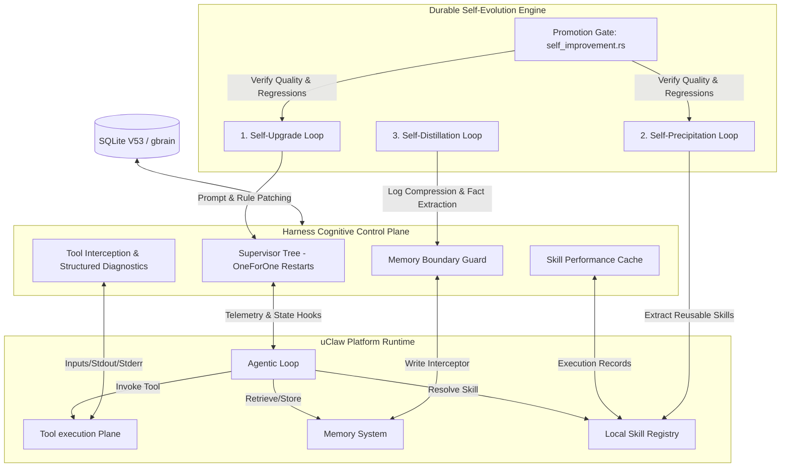

# uClaw Global Agent Autonomy Harness Specification — Cognitive Control Plane & Self-Evolution Engine (ZeptoBeam Reinforced)

## 1. Executive Summary: The Global Harness Engineering Paradigm

The core thesis of **Harness Engineering** states that in an agent-first software development ecosystem, the primary role of the engineer is to **build, refine, and upgrade the harness**, rather than write raw application code.

A harness is not just an offline testing script. It is the **cognitive scaffolding, real-time feedback loops, safety boundaries, and self-healing gates** that allow autonomous agents to operate safely and effectively. When an agent introduces a regression or fails a task, the solution is not to manually patch the code; it is to **engineer the harness**—permanently upgrading the linter checks, architectural boundaries, or prompts so that the failure mode can never occur again.

This specification elevates the **uClaw Autonomy Harness** from a localized testing utility into a **global, repository-wide Cognitive Control Plane**. It wraps the entire agent loop, all tool invocations, local skill caches, and memory layers. It provides the core cognitive infrastructure required for autonomous task resolution, enabling uClaw agents to achieve **Self-Upgrade (自我升级)**, **Self-Precipitation (自我沉淀)**, and **Self-Distillation (自我蒸馏)**. To guarantee bulletproof runtime robustness, the Cognitive Control Plane incorporates **ZeptoBeam's OTP-inspired supervision trees and fault-tolerant actors**, establishing an industrial-grade self-healing execution substrate.

---

## 2. Core Architecture: Unified Cognitive Infrastructure

The Global Autonomy Harness acts as a real-time runtime supervisor. It wraps around all key uClaw subsystems to govern executing sessions, intercept errors, and drive self-evolution.



---

## 3. Unified Global Adaptations

The Harness is no longer restricted to specific isolated sandboxes; it is globally adapted and integrated across all of uClaw's primary components.

### 3.1 Fault-Tolerant Agent Loop Hooks (`agentic_loop.rs` & `supervision.rs` Integration)
The Harness hooks directly into `agentic_loop.rs` and `dispatcher.rs` to supervise and regulate execution using ZeptoBeam's elite actor architecture:
- **Supervisor Tree Panic Insulation**: Active subagents and workspace command threads are registered as supervised children (`ChildSpec`). The executor is wrapped inside a Rust `catch_unwind` block. If a tool call or compiler process causes a panic or unexpected thread collapse, the supervisor intercepts the crash, logs the trace, and prevents it from propagating to the main thread.
- **OneForOne Self-Healing & Exponential Backoff**: On child process exit, the supervisor invokes a `OneForOne` restart strategy with exponential retry delays:
  $$\text{Delay}_{\text{ms}} = \min\left( \text{base\_ms} \cdot \text{multiplier}^{\text{attempt}}, \text{max\_ms} \right)$$
  This allows subagents to seamlessly heal from transient issues such as lock resource contention, network drops, or LLM rate-limiting peaks (e.g. step-backing: 1s -> 2s -> 4s -> 8s -> 16s) without failing the overarching issue run.
- **Low-Overhead State Checkpoints**: Automatically takes snapshot logs and file status diffs before executing high-risk commands. If a command causes a non-recoverable error, the Harness uses SQLite checkpoint states to revert the workspace to a known safe state.
- **Context Telemetry & Heartbeats**: Continuously tracks cumulative tokens, execution latency, error counts, and financial cost. If an agent loops repeatedly (e.g., executing the same command with the same error three times) or a subagent stalls (detected via missing heartbeat signals), the Harness supervisor interrupts the loop and triggers a correction mode.

### 3.2 Tool Use Interception & Structured Diagnostics
The Harness acts as a middleman for all tool invocations. It validates parameters before execution and translates unstructured CLI outputs into structured, actionable JSON payloads.

#### Raw Compiler/Linter Output (Unstructured CLI)
```text
error[E0425]: cannot find value `config_param` in this scope
  --> src-tauri/src/agent/agentic_loop.rs:88:9
   |
88 |     if config_param.is_enabled {
   |        ^^^^^^^^^^^^ not found in this scope
```

#### Harness Structured Diagnostics (Structured Context)
The Harness intercepts this stdout/stderr and packages it as an actionable JSON frame, which is fed back into the agent's prompt context:
```json
{
  "status": "compile_failed",
  "compiler": "rustc",
  "error_code": "E0425",
  "file": "src-tauri/src/agent/agentic_loop.rs",
  "line": 88,
  "column": 9,
  "message": "cannot find value `config_param` in this scope",
  "context_snippet": "88 |     if config_param.is_enabled {",
  "actionable_suggestion": "The variable `config_param` is not defined in this scope. Check imports or check if it should be retrieved from `settings` or `self`."
}
```
This structured feedback drastically improves the agent's compile self-correction pass-rate, reducing blind retry attempts.

### 3.3 Skill Use & Performance Cache (`skills.rs` Integration)
The Harness monitors skill execution and handles performance caching:
- **Execution Audits**: Keeps a run record of every skill invoked (duration, cost, outcome, files modified). This allows the system to identify underperforming or outdated skills.
- **Recursion Guard**: Automatically detects if a skill triggers a sequence of nested subagents or sub-skills that loop infinitely, halting execution before budgets are depleted.
- **Skill Activation Cache**: Caches compiled AST matches for active skills, speeding up selection times in `skill_selection`.

### 3.4 Memory System Guardians (`gbrain` & `memory_graph` Integration)
The Harness manages state-aware data flow and memory writes:
- **Durable gbrain Writes**: Directs all new long-term facts, lessons learned, and execution telemetry to `gbrain` as durable key-value objects.
- **Frozen memory_graph Guard**: Actively blocks and intercepts any attempts to write to the frozen `memory_graph`, adhering strictly to repository policy (ADR §11.2). If an agent attempts to call a legacy memory-write tool, the Harness intercepts the call, redirects the fact to `gbrain`, and returns a safe warning message.

---

## 4. The Three Durable Self-Evolution Cycles

The core objective of the global Harness is to enable uClaw to "get smarter with use" through three fully automated loops.

```
                  ┌──────────────────────────────┐
                  │      Agent Task Run          │
                  └──────────────┬───────────────┘
                                 │
                 ┌───────────────┴───────────────┐
                 ▼                               ▼
         [Task Succeeded]                 [Task Failed / Stalled]
                 │                               │
        ┌────────┴────────┐             ┌────────┴────────┐
        ▼                 ▼             ▼                 ▼
┌───────────────┐ ┌───────────────┐   ┌───────────────────────────┐
│Skill Precip.  │ │Log Distill.   │   │     Self-Upgrade Loop     │
│(自我沉淀)      │ │(自我蒸馏)      │   │     (自我升级)            │
└───────┬───────┘ └───────┬───────┘   └─────────────┬─────────────┘
        │                 │                         │
        │  ┌──────────────┴───────────┐             │
        ▼  ▼                           ▼             ▼
┌───────────────┐             ┌───────────────────────────┐
│Local Skills   │             │ Prompt / rule Patches     │
│& Helpers      │             │ (.claud_rules / specs)    │
└───────┬───────┘             └─────────────┬─────────────┘
        │                                   │
        └───────────────┬───────────────────┘
                        ▼
         ┌──────────────────────────────┐
         │  self_improvement.rs Gate    │
         │  (Verify against baselines)  │
         └──────────────┬───────────────┘
                        │
                        ▼
         ┌──────────────────────────────┐
         │ Promote to Production System │
         └──────────────────────────────┘
```

### 4.1 Self-Upgrade (自我升级)
When a task fails or repeatedly stalls, the Harness triggers an offline post-mortem cycle to patch the system's operational parameters.

1. **Failure Diagnosis**: The post-mortem actor analyzes the execution trace, intercepted tool errors, and conversational context to locate prompt or rule gaps.
2. **Rule Candidate Generation**: It drafts a precise rule modification or prompt patch. For example, if an agent failed because it kept modifying a frozen lockfile, the self-upgrade loop generates a custom workspace rule inside `.claud_rules`:
   ```markdown
   - NEVER modify `Cargo.lock` manually. Always run `cargo build` to let the compiler update the dependencies.
   ```
3. **Automated Verification**: The Harness feeds the proposed patch to `self_improvement.rs`. It evaluates the candidate against baseline test suites to guarantee the new rule does not introduce regressions or degrade overall agent performance.
4. **Promotion**: If the candidate passes the baseline suite, the gate upgrades the active ruleset.

### 4.2 Self-Precipitation (自我沉淀)
When a task is successfully resolved, the Harness analyzes the workflow to extract and preserve innovative implementation patterns.

1. **Utility Extraction**: The Harness scans the execution log for custom helper scripts, dynamic HTML/shadow-DOM selectors, database script blocks, or unique shell command sequences written during the run.
2. **Skill Compilation**: It packages the successful pattern as a formal local skill inside uClaw's skill registry:
   ```text
   ~/.uclaw/skills/generated_skill_<id>/
   ├── SKILL.md                  # Detailed prompt, usage guide, inputs/outputs
   └── scripts/
       └── custom_utility.js     # Extracted helper script
   ```
3. **Registry Enrollment**: The generated skill is registered in `skills_manifest.rs` and the global index, transforming a temporary solution into a permanent, reusable capability.

### 4.3 Self-Distillation (自我蒸馏)
To prevent token bloat and context drift over long multi-session conversations, the Harness operates a background distillation compressor.

1. **Trace Cleanup**: The compressor parses the session's raw log streams, separating high-frequency "noise" (command typos, redundant directory list calls, connection retries) from high-density "knowledge signals" (successful API routes, core architectural boundaries, business logic).
2. **Cognitive Compression**: It summarizes the core insights into a dense declarative format:
   ```markdown
   # Distilled Knowledge: Symphony Database Schema
   - Symphony V53 schema has dropped `symphony_nodes` in favor of topological `symphony_run_steps`.
   - Cascade delete constraints are active on `symphony_runs`.
   ```
3. **Durable gbrain Ingestion**: The distilled facts are stored in `gbrain` as permanent semantic vectors or key-value entries. The raw conversational history is then safely truncated, keeping the active reasoning window clean, fast, and highly accurate.

---

## 5. Analysis of Existing Harness Gaps & Remediation

This global specification addresses the following critical deficiencies in uClaw's current harness implementation:

| Current Deficiency | Harness Uplift Solution | Impact on Task Success Rate |
| :--- | :--- | :--- |
| **Passive Sandbox**: The harness only executes tests inside isolated test files, ignoring the agent's real-time workspace actions. | **Global Interception & Supervision Tree**: Continuous runtime monitoring of the active agent loop and tool execution plane backed by `supervision.rs` retry and backoff policies. | **High**: Catches and intercepts loops, isolates panics, safely retries flaky rate-limits, and corrects mistakes early. |
| **Crude Error Logs**: raw compiler and test runner output is dumped back to the agent context as giant text blobs, causing context bloat and confusion. | **Structured JSON Diagnostics**: Intercepts CLI streams and outputs high-density JSON snippets highlighting exact line numbers and error types. | **High**: Drastically reduces compilation/linting iterations (target: < 3 iterations). |
| **No Automated Skill Capture**: Successful scripts, utility locators, and tool steps are lost when the run workspace is cleaned up. | **Automated Self-Precipitation**: Reusable code and selectors are packaged as local skills and registered globally in `skills.rs`. | **Medium**: Future tasks in the same codebase reuse prior successful workflows, avoiding repetition. |
| **Context Bloat & Memory Decay**: Long multi-session runs cause chat histories to grow massive, leading to token exhaustion and reasoning drift. | **Self-Distillation**: Log compressor regularly purges noise, Summarizes core facts, and writes them to durable `gbrain` storage. | **High**: Reduces token costs, keeps the active reasoning window highly focused and precise. |

---

## 6. Implementation Metrics & Verification

We measure the performance of our global Autonomy Harness using clear, quantitative success indicators:

### 6.1 Quantitative Verification Metrics
- **Compilation/Linting Self-Correction Pass Rate**: Percentage of compile errors successfully fixed by the agent within 3 iterations (Target: > 92%).
- **Task Success Rate (uClaw Baseline)**: Percentage of issues resolved (verified by passing test suite) without human intervention (Target: > 85% on standard bench).
- **Skill Reuse Frequency**: Number of times an automatically precipitated local skill is successfully reused by subsequent agents (Target: > 1.5x reuse factor).
- **Context Token Reduction**: Average token size reduction achieved by the Self-Distillation background loop during long tasks (Target: > 40% reduction in long-term conversation states).

### 6.2 Manual Verification Plan
- **Verification of Supervisor Tree Resilience**: Simulate a mock API rate limit (HTTP 429) during a tool call. Verify the supervisor intercepts the rate limit error, applies exponential backoff delays, retries the worker, and successfully completes the step without failing the execution run.
- **Verification of Self-Upgrade**: Introduce a deliberate, repeated workspace build error (e.g., trying to write to a locked resource). Verify the self-upgrade loop triggers, updates `.claud_rules` to avoid the resource, passes the `self_improvement.rs` baseline gate, and successfully completes the run on retry.
- **Verification of Self-Precipitation**: Complete a complex issue that requires extracting custom coordinates from a web page using a helper script. Verify that upon task completion, a new, reusable skill folder is created in the local registry with a valid `SKILL.md` and helper script.
- **Verification of Self-Distillation**: Execute a long 50-turn agent session. Trigger the distillation background task and verify that the session's active chat context is truncated, and the core factual learnings are correctly recorded as durable facts in `gbrain`.
