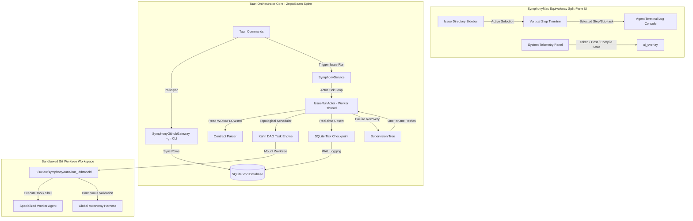
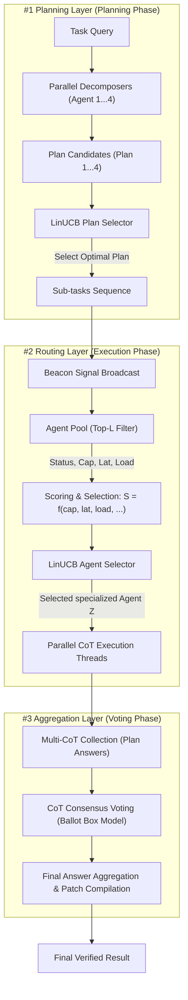
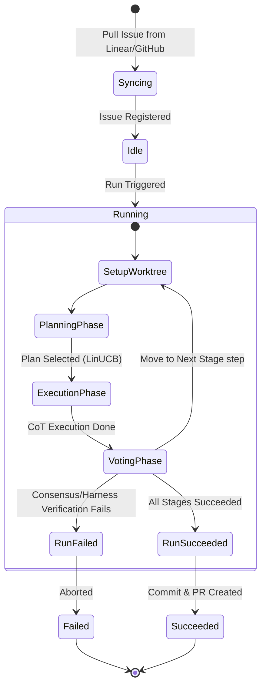

# uClaw Symphony System Reconstruction Design — Desktop Native Issue Orchestrator & Fault-Tolerant Runtime (ZeptoBeam & SymphonyMac Fusion)

Symphony shifts the engineering paradigm from **managing AI coding agents** to **managing actual work that needs to get done**. This specification outlines the complete reconstruction of uClaw's Symphony system, **100% replicating the native desktop design of SymphonyMac** while fusing it with the **high-concurrency, fault-tolerant Actor spine of ZeptoBeam**. All previous visual node canvases, draggable card grids, and state-aware wires are completely discarded.

The rebuilt system integrates OpenAI's Symphony concept directly into uClaw as a professional, issue-centric vertical execution pipeline powered by an advanced **Three-Stage Cognitive Process**. It schedules tasks dynamically via a **Topological Kahn DAG Task Engine**, executes them inside isolated **Git worktree sandboxes**, safeguards executions via **Supervision Trees and USD Financial Firewalls**, and streams progress through a sleek, macOS-inspired multi-pane split interface.

---

## 1. Core Architecture: SymphonyMac & ZeptoBeam Fusion

Rather than using complex, free-form node grids and visual connection wires which are counterproductive to issue-based development, the rebuilt Symphony system is structured entirely around the **Issue Workspace Lifecycle** driven by a highly robust actor runtime.



### 1.1 Complete Removal of Custom Node Canvases
- **No Draggable Grids**: All draggable canvas containers, arbitrary coordinate-based layouts (`x`/`y` positioning), and Zoom/Pan operations are completely removed from the frontend.
- **No Connection Wires**: Draggable connection lines, state-aware wires, and visual dependency links are deleted. All execution flow is derived sequentially from a declarative, repository-controlled contract file (`WORKFLOW.md`).

### 1.2 The Four Primary Panels of the SymphonyMac Interface
1. **Left Panel: Issue Directory Sidebar**: A real-time synchronized directory of issues associated with the active Workspace. Displays critical metadata: Issue Key (e.g., `UCL-101` or manual `MAN-204`), Title, Priority, Creation Date, Assignee, and Status (Pending, Syncing, Running, Blocked, Succeeded, Failed). Features interactive controls for creating **New Local Issues** offline and triggering a **Pull/Sync** action.
2. **Middle Panel: Sequential Stage Timeline**: A vertical progress tracker mapping parsed stages from `WORKFLOW.md` in chronological order. Crucially, the timeline visualizes the active progress of our **Three-Stage Cognitive Process** (Planning, Execution/Routing, and Voting) within each stage. Each stage features:
   - An inline status badge (Idle, Active, Done, Stalled, Failed, Skipped).
   - Real-time metrics: elapsed duration (seconds), cost accumulator (USD), tokens consumed, and files changed.
   - Collapsible sub-sections showing planning decompositions, beacon routing signals, specialized agent metrics (latency, load), and Chain-of-Thought (CoT) voting tables.
3. **Right Panel: Agent Terminal Log Console**: A high-efficiency terminal console (styled to match uClaw's dark/warm-paper IDE aesthetics) that streams the active agent loop's reasoning, tool invocations, compiler logs, and linter diagnostics. It features integrated visual cards for Human-in-the-Loop permission requests and approval prompts.
4. **Bottom Panel: System Telemetry & Cost Gauges**: Running metrics indicating accumulated session and daily dollar costs against workflow caps, the current active Git branch, compile health indicators, and active agent execution states.

### 1.3 Workspace Issue Lifecycle & Sync Engine (Local + GitHub Integration)

Following a comprehensive deep-scan of the `SymphonyMac` codebase (specifically `/Users/ryanliu/Documents/SymphonyMac/src-tauri/src/github.rs` and `/Users/ryanliu/Documents/SymphonyMac/src-tauri/src/orchestrator.rs`), the issue ingestion core has been refactored to align with SymphonyMac's robust local integration while enabling decentralized manual task workflows.

#### 1.3.1 SymphonyMac Gateway Codebase Analysis Findings (Confirmed GitHub-Centric)
Based on our deep-scan of the reference codebase, we confirm the following architectural facts regarding SymphonyMac's issue-tracking design:
1. **Purely GitHub CLI (`gh`) Integration**: SymphonyMac accesses issues, repositories, and PR state-tracking purely by spawning asynchronous child processes wrapping the local **GitHub CLI (`gh` command)** via the `GitHubGateway` Rust trait and its `GhCliGateway` implementation.
2. **No Native Linear Support**: Despite some historical context references, SymphonyMac contains **no out-of-the-box API client or direct integration for Linear**. It is entirely GitHub-focused, resolving repos, issues, and pull request states natively through the local shell command-line runner using standard JSON output parsing (e.g. `gh issue list --json number,title,body,state,labels`).
3. **No Auth Token Friction**: By wrapping the developer's local `gh` binary, the application completely avoids high-friction OAuth browser redirection flows, credential storage overhead, or custom personal access token configuration. It leverages the developer's existing system-wide CLI authentication credentials out of the box.

#### 1.3.2 Porting Strategy to uClaw
We will fully clone and port SymphonyMac's `gh` CLI gateway design into uClaw as `SymphonyGithubGateway`. This service wraps standard child-process calls via Tauri command dispatch:
- **`list_repos`**: Executes `gh repo list --json nameWithOwner,name,owner,description,url,defaultBranchRef,isPrivate` to identify accessible repositories.
- **`list_issues`**: Executes `gh issue list -R <repo> --state open --json number,title,body,state,labels,assignees,url,createdAt,updatedAt`.
- **`get_issue_detail`**: Executes `gh issue view <number> -R <repo> --json ...` to retrieve a single issue's details and parse dependencies.

#### 1.3.3 Hybrid Issue Lifecycle & Subsequent Execution Loops

To maximize developer autonomy and support both local-first offline development and remote GitHub workflows under selected Workspace projects, uClaw supports a unified hybrid lifecycle:

```mermaid
sequenceDiagram
    autonumber
    actor Developer
    participant UI as Left Panel Sidebar (UCLAW APP)
    participant DB as SQLite V53 DB (symphony_issues)
    participant Gateway as SymphonyGithubGateway (gh CLI)
    participant Actor as IssueRunActor (Symphony Engine)
    participant Sandbox as Git Worktree Sandbox

    alt Workflow A: Manual Local Issue Creation
        Developer->>UI: Click "New Local Issue" (offline)
        Developer->>UI: Specify target Workspace Project, Title, Description, Priority
        UI->>DB: Insert Manual Issue (provider='manual', id='MAN-xxxx', external_id=NULL)
    else Workflow B: Remote GitHub Issue Sync
        Developer->>UI: Create standard Issue on GitHub Repository
        Developer->>UI: Click "Pull / Sync GitHub" in Left Sidebar
        UI->>Gateway: Trigger list_issues() for mapped Workspace projects
        Gateway->>Gateway: Spawn child process "gh issue list -R owner/repo"
        Gateway->>UI: Stream parsed GitHub Issue objects
        UI->>DB: Upsert issues (provider='github', id='GH-xxxx', external_id='owner/repo/issues/xxxx')
    end

    Developer->>UI: Click "Trigger Issue Run"
    UI->>Actor: Spawn execution thread for selected Issue (MAN- or GH-)
    Actor->>DB: Create execution entry in symphony_runs
    Actor->>Sandbox: Mount isolated Git Worktree checkout at ~/.uclaw/symphony/runs/run_id/

    Note over Actor, Sandbox: Run Three-Stage Cognitive Process (Planning -> Execution -> Voting)

    loop Subsequent Loops & Continuous Syncing
        Developer->>UI: Perform further code changes or updates
        Developer->>UI: Click "Pull / Sync GitHub" (re-syncs states)
        Gateway->>Gateway: Execute "gh issue view" to fetch current remote state
        Gateway->>DB: Update status, label tags, or blockers
        Actor->>Sandbox: Re-check/continue the execution loop, evaluate steps, compile and test patches
    end
```

- **Manual Local Issues ( `provider = 'manual'` )**:
  - Developers can click the "New Local Issue" button in the Left Panel Sidebar. A premium native macOS-style modal prompts them to input the target Workspace project, title, body, priority, and assignees.
  - This registers the issue immediately in the local SQLite database (`symphony_issues`), prefixing the unique primary key with `MAN-` and setting `provider = 'manual'` and `external_id = NULL`. This enables seamless offline issue tracking, prompt debugging, and script execution without any external network dependency.
- **Remote GitHub Issues ( `provider = 'github'` )**:
  - Developers can create standard tickets on their project's GitHub repository.
  - Clicking the **Pull / Sync GitHub** button in the Left Panel Sidebar invokes the ported `SymphonyGithubGateway`, which lists issues across all repositories mapped under the active uClaw Workspace. The retrieved issues are upserted into `symphony_issues` as `provider = 'github'`.
- **Decoupled Sandbox Execution**:
  - Regardless of whether an issue was created manually/locally (`MAN-`) or synced from GitHub (`GH-`), they are fed identically into the orchestration loop. The `IssueRunActor` mounts an isolated Git worktree sandbox, parses the repository's local `WORKFLOW.md` contract, and executes the 3-Stage Cognitive Pipeline (Planning, Routing, and Voting), maintaining strict separation from the developer's working directory.
- **Subsequent Syncing & Loop Iterations**:
  - Subsequent sync operations will re-check GitHub issue statuses and merge PR states (`is_pr_merged_for_issue` via the gateway).
  - If a run is interrupted or paused for approval, clicking "Pull / Sync" and triggering the issue run again resumes the state machine from the last checkpoint within the sandboxed Git worktree, allowing subsequent loop iterations to build on previous execution attempts.

---

## 2. Advanced Fault-Tolerant Actor Spine (ZeptoBeam Core)

Symphony fuses the vertical timeline layout of SymphonyMac with ZeptoBeam's enterprise actor spine, introducing bulletproof resilience, real-time budgets, and topological scheduling.

### 2.1 Durable SQLite Tick Checkpointing
Symphony rejects state-saving only on stage transitions. Following ZeptoBeam's checkpointing model, the `IssueRunActor` performs a **fine-grained state checkpoint to SQLite on every micro-scheduling Tick**:
- **Binary JSON Payload**: The entire runtime DAG, current execution context, token counters, accumulated cost, and LLM payloads are serialized into binary JSON and upserted into the SQLite database.
- **Atomic Upsert Preservation**: To ensure correct historical tracing and resume operations, the database executes an atomic `INSERT OR REPLACE` query that explicitly preserves the original `created_at` timestamp:
  ```sql
  INSERT OR REPLACE INTO symphony_run_checkpoints (key, data, created_at, updated_at)
  VALUES (?1, ?2, COALESCE((SELECT created_at FROM symphony_run_checkpoints WHERE key = ?1), ?3), ?3)
  ```
- **Zero Token Loss Self-Heals**: If the Tauri app unexpectedly crashes, is force-closed, or loses internet connectivity, restarting uClaw instantly reads the `symphony_run_checkpoints` table. Clicking "Resume" reloads the exact state of the task graph, allowing execution to continue from the last micro-step without re-running previous expensive LLM calls.

### 2.2 Topological DAG Task Engine (Kahn's Cycle-Detection)
Instead of executing a rigid linear array, the task list defined in the `WORKFLOW.md` contract or compiled by the Planning Phase is represented as a **Directed Acyclic Graph (DAG)** of dependent task nodes.
- **Cycle-Detection Safeguard**: When tasks are added or updated, the system executes **Kahn's Topological Sorting Algorithm** in-memory. If the sorted node count is less than the total task count, a cyclic dependency exists. The transaction is instantly rolled back, protecting the engine from infinite routing loops.
- **Downstream BFS Fail-Cascading (`fail_dependents`)**: If a critical task fails (and `failure_mode` is set to `abort`), the engine does not just panic. It runs a **Breadth-First Search (BFS) traverser** downstream from the failed node, recursively setting all dependent tasks to `Skipped` or `Failed`:
  ```text
  BFS Queue: [Failed Node ID]
  While Queue is not empty:
    Pop Current Node
    For each Downstream Dependent Node of Current:
      Set Status = Skipped
      Add Downstream Node to Queue
  ```
  This immediately aborts downstream paths, halting execution and saving up to 90% of wasted LLM API tokens.
- **Ready-Task Polls**: The scheduler polls for executable tasks on every loop iteration using `ready_tasks()`, which selects all nodes currently in `Ready` state (meaning all of their parent dependencies are `Completed`).

### 2.3 Circuit-Breaker Supervision Trees
All worker agents and tools run under a robust **Supervision Tree** mapping Erlang OTP philosophies:
- **Panic Insulation**: Each executor thread is wrapped in a Rust `catch_unwind` block. If an agent crashes or panics during a tool call, the supervisor catches the thread failure, preventing the crash from propagating and taking down the main uClaw Tauri backend.
- **OneForOne Self-Healing**: The default restart strategy is `OneForOne` (if a worker dies, only that worker is restarted).
- **Exponential Backoff Retries**: Transient failures (such as rate limits, timeouts, or linter locks) trigger an exponential backoff policy:
  $$\text{Delay}_{\text{ms}} = \min\left( \text{base\_ms} \cdot \text{multiplier}^{\text{attempt}}, \text{max\_ms} \right)$$
  For example, with a base of 1,000ms and 2.0x multiplier, retry intervals step gracefully: 1s -> 2s -> 4s -> 8s (clamped at a maximum of 60s), ensuring the agent safely bypasses transient API rate-limiting peaks.
- **Restart Intensity Limits**: If a worker exceeds `max_restarts` (e.g., 3 failures) within `max_seconds` (e.g., 60s), the supervisor escalates the state to `Failed`, triggering the BFS cascade.

### 2.4 USD Financial Firewalls (Real-time Budgeting)
- **Granular Token Auditing**: The system tracks the input/output token count of every single LLM call and maps it against model-specific pricing tables (e.g., Claude 3.5 Sonnet, GPT-4o) registered dynamically.
- **Real-Time Cost Accumulator**: After every API response, the exact USD cost is computed and atomically added to the `symphony_runs` total cost.
- **Budget Exceeded Circuit Breaker**: If `total_cost_usd` crosses the pre-configured `cost_cap_usd` in `WORKFLOW.md` (or the global $10 limit), a **hard-stop circuit breaker is immediately tripped**. All active workers are killed, and a descriptive budget exhaustion log is written to the terminal console, protecting the developer's wallet from runaway API loops.

### 2.5 Rust Implementation Blueprint for uClaw Symphony Core

To guarantee an flawless migration, we port the exact core Rust primitives from ZeptoBeam's modular runtime directly into `uclaw::symphony_core`. These schemas are registered in the Tauri backend and exported directly to our 4-panel React UI:

#### 2.5.1 Topological Task Graph & Cycle Detection (`task_graph.rs`)
```rust
use std::collections::{HashMap, HashSet, VecDeque};
use serde::{Serialize, Deserialize};

#[derive(Debug, Clone, PartialEq, Eq, Serialize, Deserialize)]
pub enum TaskStatus {
    Pending,
    Ready,
    AwaitingApproval,
    Running,
    Completed,
    Failed,
    Skipped,
}

#[derive(Debug, Serialize, Deserialize)]
pub struct TaskNode {
    pub task: serde_json::Value,
    pub depends_on: Vec<String>,
    pub status: TaskStatus,
}

pub struct TaskGraph {
    pub tasks: HashMap<String, TaskNode>,
    pub insertion_order: Vec<String>,
}

impl TaskGraph {
    pub fn new() -> Self {
        Self {
            tasks: HashMap::new(),
            insertion_order: Vec::new(),
        }
    }

    /// Kahn's Topological Sorting Algorithm for cycle detection.
    /// Returns true if a cyclic dependency exists in the task graph.
    pub fn detect_cycle(&self) -> bool {
        let mut in_degree: HashMap<String, usize> = HashMap::new();
        for id in self.tasks.keys() {
            in_degree.insert(id.clone(), 0);
        }

        for node in self.tasks.values() {
            for dep in &node.depends_on {
                if self.tasks.contains_key(dep) {
                    let count = node.depends_on.iter().filter(|d| self.tasks.contains_key(*d)).count();
                    in_degree.insert(dep.clone(), count);
                }
            }
        }

        // Re-evaluate in-degree properly matching dependency counts
        let mut in_degree: HashMap<String, usize> = HashMap::new();
        for (id, node) in &self.tasks {
            let count = node.depends_on.iter().filter(|dep| self.tasks.contains_key(*dep)).count();
            in_degree.insert(id.clone(), count);
        }

        let mut queue: VecDeque<String> = in_degree.iter()
            .filter(|(_, &degree)| degree == 0)
            .map(|(id, _)| id.clone())
            .collect();

        let mut processed = 0;
        let mut dependents: HashMap<String, Vec<String>> = HashMap::new();
        for (id, node) in &self.tasks {
            for dep in &node.depends_on {
                dependents.entry(dep.clone()).or_default().push(id.clone());
            }
        }

        while let Some(current) = queue.pop_front() {
            processed += 1;
            if let Some(deps) = dependents.get(&current) {
                for dependent in deps {
                    if let Some(degree) = in_degree.get_mut(dependent) {
                        *degree -= 1;
                        if *degree == 0 {
                            queue.push_back(dependent.clone());
                        }
                    }
                }
            }
        }

        processed < self.tasks.len()
    }

    /// Transitive BFS failure cascading.
    /// Recursively marks all downstream dependent tasks as Skipped on parent task failure.
    pub fn fail_dependents(&mut self, task_id: &str) {
        let mut reverse_deps: HashMap<String, Vec<String>> = HashMap::new();
        for (id, node) in &self.tasks {
            for dep in &node.depends_on {
                reverse_deps.entry(dep.clone()).or_default().push(id.clone());
            }
        }

        let mut visited = HashSet::new();
        let mut queue = VecDeque::new();
        queue.push_back(task_id.to_string());

        while let Some(current) = queue.pop_front() {
            if visited.contains(&current) {
                continue;
            }
            visited.insert(current.clone());

            if let Some(downstream) = reverse_deps.get(&current) {
                for child in downstream {
                    if let Some(node) = self.tasks.get_mut(child) {
                        node.status = TaskStatus::Skipped;
                    }
                    queue.push_back(child.clone());
                }
            }
        }
    }
}
```

#### 2.5.2 Fault-Tolerant OTP Supervision Trees (`supervision.rs`)
```rust
use std::collections::HashMap;
use std::time::Instant;

#[derive(Debug, Clone, Copy, PartialEq, Eq)]
pub enum RestartStrategy {
    OneForOne,
    OneForAll,
    RestForOne,
}

#[derive(Debug, Clone, Copy, PartialEq, Eq)]
pub enum ChildRestart {
    Permanent, // Always restart the agent actor on exit/crash
    Transient, // Restart only if exited with an error state
    Temporary, // Never restart
}

#[derive(Debug, Clone)]
pub enum BackoffStrategy {
    None,
    Fixed { delay_ms: u64 },
    Exponential { base_ms: u64, max_ms: u64, multiplier: f64 },
}

impl BackoffStrategy {
    pub fn delay_for_attempt(&self, attempt: u32) -> u64 {
        match self {
            BackoffStrategy::None => 0,
            BackoffStrategy::Fixed { delay_ms } => *delay_ms,
            BackoffStrategy::Exponential { base_ms, max_ms, multiplier } => {
                let delay = (*base_ms as f64) * multiplier.powi(attempt as i32);
                let clamped = delay.min(*max_ms as f64) as u64;
                clamped.min(*max_ms)
            }
        }
    }
}

pub struct Supervisor {
    pub strategy: RestartStrategy,
    pub max_restarts: u32,
    pub max_seconds: u32,
    pub restart_timestamps: Vec<Instant>,
    pub backoff: BackoffStrategy,
    pub restart_counts: HashMap<String, u32>,
    pub is_shutdown: bool,
}

impl Supervisor {
    pub fn check_intensity_exceeded(&mut self) -> bool {
        let now = Instant::now();
        self.restart_timestamps.push(now);
        let window = std::time::Duration::from_secs(self.max_seconds as u64);
        self.restart_timestamps.retain(|&t| now.duration_since(t) <= window);
        self.restart_timestamps.len() as u32 > self.max_restarts
    }
}
```

#### 2.5.3 Real-time Financial Firewalls & Token Budgets (`resource_budget.rs`)
```rust
use std::collections::HashMap;
use serde::{Serialize, Deserialize};

#[derive(Debug, Clone, Serialize, Deserialize)]
pub struct ModelPrice {
    pub input_per_1k: f64,
    pub output_per_1k: f64,
}

#[derive(Debug, Clone, Default, Serialize, Deserialize)]
pub struct TokenPricing {
    pub model_prices: HashMap<String, ModelPrice>,
}

#[derive(Debug, Clone, Serialize, Deserialize)]
pub struct ResourceBudget {
    pub max_tokens: Option<u64>,
    pub max_cost_usd: Option<f64>,
    pub tokens_used: u64,
    pub cost_usd: f64,
    pub pricing: TokenPricing,
}

#[derive(Debug, Clone)]
pub struct UsageReport {
    pub input_tokens: u64,
    pub output_tokens: u64,
    pub model: Option<String>,
}

impl ResourceBudget {
    pub fn record_usage(&mut self, usage: &UsageReport) -> bool {
        let total_tokens = usage.input_tokens.saturating_add(usage.output_tokens);
        self.tokens_used = self.tokens_used.saturating_add(total_tokens);

        if let Some(ref model) = usage.model {
            if let Some(prices) = self.pricing.model_prices.get(model) {
                let input_cost = (usage.input_tokens as f64) / 1000.0 * prices.input_per_1k;
                let output_cost = (usage.output_tokens as f64) / 1000.0 * prices.output_per_1k;
                self.cost_usd += input_cost + output_cost;
            }
        }
        self.is_exhausted()
    }

    pub fn is_exhausted(&self) -> bool {
        let tokens_exhausted = self.max_tokens.map(|max| self.tokens_used >= max).unwrap_or(false);
        let cost_exhausted = self.max_cost_usd.map(|max| self.cost_usd >= max).unwrap_or(false);
        tokens_exhausted || cost_exhausted
    }
}
```

#### 2.5.4 Fine-Grained WAL SQLite Checkpoint Store (`checkpoint_sqlite.rs`)
```rust
use std::sync::Mutex;
use rusqlite::{Connection, OptionalExtension};

pub struct SqliteCheckpointStore {
    conn: Mutex<Connection>,
}

impl SqliteCheckpointStore {
    pub fn open(path: &str) -> Result<Self, String> {
        let conn = Connection::open(path).map_err(|e| e.to_string())?;
        conn.execute_batch("PRAGMA journal_mode=WAL; PRAGMA busy_timeout=5000;").map_err(|e| e.to_string())?;
        conn.execute(
            "CREATE TABLE IF NOT EXISTS checkpoints (
                key TEXT PRIMARY KEY,
                data BLOB NOT NULL,
                created_at INTEGER NOT NULL,
                updated_at INTEGER NOT NULL
            )",
            [],
        ).map_err(|e| e.to_string())?;
        Ok(Self { conn: Mutex::new(conn) })
    }

    pub fn save(&self, key: &str, checkpoint: &serde_json::Value) -> Result<(), String> {
        let data = serde_json::to_vec(checkpoint).map_err(|e| e.to_string())?;
        let now = std::time::SystemTime::now()
            .duration_since(std::time::UNIX_EPOCH)
            .map_err(|e| e.to_string())?
            .as_secs() as i64;
        let conn = self.conn.lock().map_err(|_| "sqlite mutex poisoned".to_string())?;
        conn.execute(
            "INSERT OR REPLACE INTO checkpoints (key, data, created_at, updated_at)
             VALUES (?1, ?2, COALESCE((SELECT created_at FROM checkpoints WHERE key = ?1), ?3), ?3)",
            rusqlite::params![key, data, now],
        ).map_err(|e| e.to_string())?;
        Ok(())
    }

    pub fn load(&self, key: &str) -> Result<Option<serde_json::Value>, String> {
        let conn = self.conn.lock().map_err(|_| "sqlite mutex poisoned".to_string())?;
        let mut stmt = conn.prepare("SELECT data FROM checkpoints WHERE key = ?1").map_err(|e| e.to_string())?;
        let result = stmt.query_row(rusqlite::params![key], |row| {
            let data: Vec<u8> = row.get(0)?;
            Ok(data)
        }).optional().map_err(|e| e.to_string())?;

        match result {
            Some(data) => {
                let value = serde_json::from_slice(&data).map_err(|e| e.to_string())?;
                Ok(Some(value))
            }
            None => Ok(None),
        }
    }
}
```

---


## 3. The Three-Stage Cognitive Pipeline (Symphony Execution Pipeline)

To achieve highly robust and adaptive task execution, Symphony implements a rigorous, self-correcting three-stage execution pipeline. This pipeline directly aligns with the native architecture of SymphonyMac, mapping execution onto three distinct layers: the **Planning Layer**, the **Routing Layer**, and the **Aggregation Layer**.



### 3.1 Layer #1: Planning Layer (Planning Phase)

Symphony rejects executing static, hardcoded plans. When a stage is activated, it dynamically generates and assesses alternative strategies:

1. **Parallel Task Decomposition**: The orchestrator spawns $K$ parallel planning agents ($Agent_1, Agent_2, \dots, Agent_K$). Each planning agent independently analyzes the task query, repository state, and workspace context to decompose the main stage objective into a specific sequence of executable sub-tasks, yielding $K$ distinct plan candidates ($Plan_1, Plan_2, \dots, Plan_K$).
2. **Contextual Plan Selection via LinUCB**: To choose the most viable plan without human intervention, a Contextual Multi-Armed Bandit (**LinUCB**) model scores each candidate plan.
   - **Context Features ($x_t$)**: Encodes high-density repo features, language ratios, issue complexity, previous task types, and successful strategies retrieved from `gbrain`.
   - **Action Selection**: Selects the plan $a_t$ maximizing the upper confidence bound:
     $$a_t = \arg\max_{a \in \mathcal{A}_t} \left( \theta_a^\top x_t + \alpha \sqrt{x_t^\top A_a^{-1} x_t} \right)$$
   - **Execution Sequence**: The sub-tasks of the selected plan are loaded into the execution queue.

### 3.2 Layer #2: Routing Layer (Execution Phase)

Once the optimal plan is established, individual sub-tasks are dynamically routed to specialized, high-performing agents inside the isolated git sandbox:

1. **Beacon Signal Broadcast**: For each sub-task in the plan, the orchestrator broadcasts a **Beacon Signal** detailing the sub-task requirements (e.g., target files, programming languages, library dependencies, compiler targets, and lint rules).
2. **Agent Pool Status & Telemetry Filtering**: Active agents in the global **Agent Pool** listen to the broadcast. The system queries real-time status and capability telemetry for each candidate agent:
   - **Status**: Only `Online` agents are considered; `Offline` agents are ignored.
   - **Capability ($\text{cap}$)**: Semantic similarity score matching the agent's specialization (e.g., Math, Coding, DevOps) to the beacon requirements.
   - **Latency ($\text{lat}$)**: Running average of response latency (ms) for this agent class.
   - **Load ($\text{load}$)**: Number of active concurrent threads or tasks currently allocated to the agent.
3. **Composite Scoring & Candidate Reduction**: The system filters down to the **Top-L** candidate agents by computing a composite capability-efficiency score:
   $$S = f(\text{cap}, \text{lat}, \text{load}) = w_{\text{cap}} \cdot \text{cap} - w_{\text{lat}} \cdot \log(\text{lat}) - w_{\text{load}} \cdot \text{load}$$
4. **LinUCB Specialized Agent Selection**: From the filtered Top-L candidates, a second **LinUCB** bandit model routes the sub-task to the optimal specialized agent (e.g., selecting `Agent Z` for coding due to $5\text{ms}$ latency and $0$ load over `Agent Y`). This continuous learning loop updates based on code compilation success, lint results, and validation outcomes.
5. **Parallel Chain-of-Thought (CoT)**: The selected specialized agents execute the sub-tasks in parallel using Chain-of-Thought reasoning inside the Git worktree sandbox to generate alternative candidate answers/patches.

### 3.3 Layer #3: Aggregation Layer (Voting Phase)

Multiple candidate answers and patches are collected and adjudicated through a structured consensus loop to guarantee robust code quality:

1. **Multi-CoT Collection**: The parallel execution threads produce a collection of candidate answers (e.g., `Plan 1 Answers`, `Plan 2 Answers`, `Plan 3 Answers`).
2. **CoT Consensus Voting (Ballot Box Model)**: An independent group of judge agents evaluates the candidates using a weighted consensus ballot box model:
   - **Judge Agents**: Specialized code-review, security, and verification agents.
   - **Scoring**: Each judge evaluates each candidate response against syntactic correctness, code style, security profiles, and test coverage, outputting a numerical score $V_{j, c} \in [0, 1]$ alongside a qualitative text rationale.
   - **Weighted Voting**: Votes are weighted based on the judge agent's historic precision and verification confidence:
     $$Score(c) = \sum_{j} w_j \cdot V_{j, c}$$
3. **Final Answer Aggregation**: The candidate patch receiving the highest consensus score is compiled into the final unified code patch. The patch is marked as verified, and passed to the Global Autonomy Harness for final compilation and pre-commit verification before being promoted to a GitHub/Linear pull request.

---

## 4. Upstream Spec & WORKFLOW.md Integration

The pipeline structure is declared in a repository-owned `WORKFLOW.md` configuration file. This file acts as the formal contract between human engineers and autonomous actors.

### 4.1 Standard `WORKFLOW.md` Contract
```markdown
---
name: Automatic Hotfix Pipeline
description: Sync, implement, verify, and auto-merge critical hotfixes for GitHub Issues.
max_concurrent_runs: 1
cost_cap_usd: 10.00
failure_mode: abort # abort | continue

stages:
  - id: environment_setup
    title: Establish Sandbox
    command: git status
    permissions: [read_file]
    
  - id: implement_fix
    title: Generate Code Patch
    agent_prompt: |
      Implement a critical fix for the following issue:
      Issue Key: {{issue.key}}
      Description: {{issue.description}}
      Ensure compile passes before proceeding.
    cost_cap_usd: 3.00
    permissions: [write_file, execute_command]
    max_iterations: 25

  - id: harness_verification
    title: Autonomy Harness Verification
    command: cargo test -p uclaw-core
    cost_cap_usd: 1.00
    permissions: [execute_command]

  - id: code_review
    title: AI Peer Review
    agent_prompt: |
      Perform a security and regression audit over the git changes.
    permissions: [read_file]

  - id: pull_request
    title: Promote PR & Merge
    command: gh pr create --fill && gh pr merge --auto --merge
    permissions: [execute_command]
---

# Automatic Hotfix Pipeline

This contract defines the sequential orchestration of issues under sandboxed constraints.
```

---

## 5. Git-Isolated Sandbox Workspaces (Worktree Sandbox)

To allow safe, concurrent, and non-destructive issue execution, the backend decouples branches into isolated checkouts.

1. **Path Allocation**: Sandbox workspaces are instantiated inside a dedicated system directory:
   ```text
   ~/.uclaw/symphony/runs/<run_id>/
   ```
2. **Git Worktree Association**: The backend establishes a git worktree linking the main repository directly to the run's workspace sub-directory:
   ```bash
   git -C <target_repo> worktree add ~/.uclaw/symphony/runs/<run_id>/worktree/ symphony/run_<run_id>
   ```
3. **Environment Lock**: The step executor locks the active `HeadlessDelegate`'s `workspace_root` exclusively to this worktree path. All operations, compile runs, linter checks, and test runner tasks execute hermetically within this directory, leaving the developer’s active coding branch entirely untouched.

---

## 6. Backend Orchestrator & SQLite Schema Migrations

The previous node-graph DAG database tables are deprecated. They are replaced by a clean relational model designed specifically for sequential runs, stage steps, sub-task routing metrics, and consensus voting.



### 6.1 SQLite V53 Schema (`SQL_V53_SYMPHONY`)
We drop old tables such as `symphony_nodes` and `symphony_edges` to optimize for linear pipeline tracking, while introducing checkpoints, `symphony_run_subtasks`, and `symphony_run_votes` to model the fault-tolerant actor process natively in SQLite:

```sql
-- SQL_V53_SYMPHONY Schema Migration

-- Drop old node graph tables if they exist
DROP TABLE IF EXISTS symphony_edges;
DROP TABLE IF EXISTS symphony_nodes;
DROP TABLE IF EXISTS symphony_graphs;

-- 1. Table for Synced Issues (Source of Work)
CREATE TABLE IF NOT EXISTS symphony_issues (
    id              TEXT PRIMARY KEY,       -- Issue unique key (e.g. UCL-101, MAN-204)
    provider        TEXT NOT NULL,          -- 'linear' | 'github' | 'manual'
    external_id     TEXT,                   -- External tracker coordinates (e.g. 'owner/repo/issues/12')
    title           TEXT NOT NULL,
    description     TEXT,
    status          TEXT NOT NULL,          -- 'backlog' | 'todo' | 'in_progress' | 'completed' | 'canceled'
    priority        TEXT,                   -- 'high' | 'medium' | 'low'
    assignee        TEXT,
    created_at      INTEGER NOT NULL,
    updated_at      INTEGER NOT NULL
);

-- 2. Workflow Contracts (The executable WORKFLOW.md definitions)
CREATE TABLE IF NOT EXISTS symphony_workflows (
    id              TEXT PRIMARY KEY,
    name            TEXT NOT NULL,
    description     TEXT,
    definition_md   TEXT NOT NULL,
    created_at      INTEGER NOT NULL,
    updated_at      INTEGER NOT NULL
);

-- 3. Execution Runs per Issue
CREATE TABLE IF NOT EXISTS symphony_runs (
    id              TEXT PRIMARY KEY,
    issue_id        TEXT NOT NULL,
    workflow_id     TEXT NOT NULL,
    status          TEXT NOT NULL,          -- 'queued' | 'running' | 'completed' | 'failed' | 'cancelled'
    outcome         TEXT,                   -- 'succeeded' | 'failed'
    current_stage   TEXT,                   -- ID of the active stage
    total_cost_usd  REAL NOT NULL DEFAULT 0.0,
    cost_cap_usd    REAL NOT NULL DEFAULT 10.0, -- USD financial limit cap
    started_at      INTEGER,
    completed_at    INTEGER,
    FOREIGN KEY (issue_id) REFERENCES symphony_issues(id) ON DELETE CASCADE,
    FOREIGN KEY (workflow_id) REFERENCES symphony_workflows(id) ON DELETE CASCADE
);

-- 4. Step-by-Step Stage Execution Log
CREATE TABLE IF NOT EXISTS symphony_run_steps (
    id              TEXT PRIMARY KEY,
    run_id          TEXT NOT NULL,
    stage_id        TEXT NOT NULL,          -- Matches stage ID in WORKFLOW.md
    title           TEXT NOT NULL,
    status          TEXT NOT NULL,          -- 'pending' | 'ready' | 'running' | 'stalled' | 'succeeded' | 'failed' | 'skipped'
    attempt         INTEGER NOT NULL DEFAULT 1,
    depends_on_json TEXT NOT NULL DEFAULT '[]', -- JSON array of parent task IDs (topological deps)
    session_id      TEXT,                   -- Connects to uClaw agent_sessions
    cost_usd        REAL NOT NULL DEFAULT 0.0,
    token_usage     INTEGER NOT NULL DEFAULT 0,
    started_at_ms   INTEGER NOT NULL,
    last_heartbeat_ms INTEGER NOT NULL,
    completed_at_ms INTEGER,
    error_text      TEXT,
    FOREIGN KEY (run_id) REFERENCES symphony_runs(id) ON DELETE CASCADE,
    FOREIGN KEY (session_id) REFERENCES agent_sessions(id) ON DELETE SET NULL
);

-- 5. Actor Tick State Checkpoints (ZeptoBeam Durable Restore Core)
CREATE TABLE IF NOT EXISTS symphony_run_checkpoints (
    key             TEXT PRIMARY KEY,       -- Checkpoint key (e.g. 'run:<run_id>:tick')
    data            BLOB NOT NULL,          -- Binary JSON blob storing entire serialized state graph
    created_at      INTEGER NOT NULL,
    updated_at      INTEGER NOT NULL
);

-- 6. Sub-task Routing Log (Execution & Routing Phase metrics)
CREATE TABLE IF NOT EXISTS symphony_run_subtasks (
    id              TEXT PRIMARY KEY,
    step_id         TEXT NOT NULL,
    subtask_title   TEXT NOT NULL,
    beacon_signal   TEXT NOT NULL,          -- JSON description of requirement
    assigned_agent  TEXT NOT NULL,          -- Selected agent ID
    agent_capability REAL NOT NULL,         -- capability match score
    agent_latency   INTEGER NOT NULL,       -- agent latency metric (ms)
    agent_load      INTEGER NOT NULL,       -- agent active thread count
    linucb_reward   REAL,                   -- LinUCB reward feedback score
    status          TEXT NOT NULL,          -- 'pending' | 'running' | 'completed' | 'failed'
    FOREIGN KEY (step_id) REFERENCES symphony_run_steps(id) ON DELETE CASCADE
);

-- 7. Consensus Voting Log (Voting Phase metrics)
CREATE TABLE IF NOT EXISTS symphony_run_votes (
    id              TEXT PRIMARY KEY,
    step_id         TEXT NOT NULL,
    response_id     TEXT NOT NULL,          -- Identifier of the candidate response/patch
    judge_agent     TEXT NOT NULL,          -- Evaluator agent identifier
    score           REAL NOT NULL,          -- Numerical score (0.0 - 1.0)
    vote_weight     REAL NOT NULL,          -- Weight assigned to this judge's vote
    rationale       TEXT NOT NULL,          -- Qualitative judge rationale
    is_consensus    INTEGER NOT NULL DEFAULT 0, -- 1 if this patch is selected
    created_at_ms   INTEGER NOT NULL,
    FOREIGN KEY (step_id) REFERENCES symphony_run_steps(id) ON DELETE CASCADE
);

-- Indexes for high-performance sequential and nested lookups
CREATE INDEX IF NOT EXISTS idx_symphony_issues_provider ON symphony_issues(provider, external_id);
CREATE INDEX IF NOT EXISTS idx_symphony_runs_issue ON symphony_runs(issue_id);
CREATE INDEX IF NOT EXISTS idx_symphony_run_steps_run ON symphony_run_steps(run_id, stage_id);
CREATE INDEX IF NOT EXISTS idx_symphony_subtasks_step ON symphony_run_subtasks(step_id);
CREATE INDEX IF NOT EXISTS idx_symphony_votes_step ON symphony_run_votes(step_id);
```

---

## 7. UI Layout Code Design (Tauri React Component)

The interface replaces legacy node graphs with a premium, multi-pane split layout matching **SymphonyMac**, detailing the three-stage pipeline directly within the interactive timeline.

```tsx
// ui/src/components/symphony/SymphonyWorkspace.tsx
import React, { useState, useEffect } from 'react';
import { SidebarList } from './SidebarList';
import { StageTimeline } from './StageTimeline';
import { LogStreamConsole } from './LogStreamConsole';
import { MetricsBar } from './MetricsBar';

export const SymphonyWorkspace: React.FC = () => {
  const [selectedIssueId, setSelectedIssueId] = useState<string | null>(null);
  const [activeRun, setActiveRun] = useState<any | null>(null);
  const [activeStepId, setActiveStepId] = useState<string | null>(null);

  return (
    <div className="flex flex-col h-full bg-background text-foreground overflow-hidden">
      {/* Top Action Bar */}
      <div className="flex items-center justify-between px-6 py-3 border-b border-border/40 bg-popover/40">
        <div className="flex items-center gap-3">
          <span className="text-xl">🎼</span>
          <h1 className="font-semibold text-sm tracking-wide">Symphony Issue Orchestrator</h1>
        </div>
        <div className="flex items-center gap-2">
          <button className="px-3 py-1.5 rounded-md bg-primary text-primary-foreground text-xs font-semibold hover:bg-primary/90 transition-all">
            Sync GitHub Issues
          </button>
        </div>
      </div>

      {/* Main Split-Pane Layout */}
      <div className="flex flex-1 overflow-hidden">
        {/* Left sidebar: Synced Issues Directory */}
        <div className="w-80 border-r border-border/40 bg-popover/20 flex flex-col">
          <SidebarList 
            selectedIssueId={selectedIssueId} 
            onSelectIssue={(id) => setSelectedIssueId(id)} 
          />
        </div>

        {/* Middle: Stage Pipeline Steps Timeline with Three-Stage Metrics */}
        <div className="w-[480px] border-r border-border/40 bg-background/50 flex flex-col overflow-y-auto">
          <div className="p-4 border-b border-border/40 bg-popover/10 flex items-center justify-between">
            <h2 className="text-xs font-bold uppercase tracking-wider text-muted-foreground">Execution Steps</h2>
            {activeRun && (
              <span className="text-xs font-mono px-2 py-0.5 rounded bg-green-500/10 text-green-400">
                Cost: ${activeRun.total_cost_usd.toFixed(2)} / ${activeRun.cost_cap_usd.toFixed(2)}
              </span>
            )}
          </div>
          <div className="flex-1 p-6">
            <StageTimeline 
              issueId={selectedIssueId} 
              onSelectStep={(id) => setActiveStepId(id)} 
            />
          </div>
        </div>

        {/* Right: Integrated Terminal Stream & Conversational Logs */}
        <div className="flex-1 bg-black/10 flex flex-col overflow-hidden">
          <LogStreamConsole 
            stepId={activeStepId} 
          />
        </div>
      </div>

      {/* Bottom panel: System Telemetry Gauges */}
      <MetricsBar activeRun={activeRun} />
    </div>
  );
};
```

---

## 8. Verification Plan

### 8.1 Automated Tests
- **Sequential Stage Engine Check**: Ensure `IssueRunActor` correctly processes stages, updating run steps, sub-tasks, and voting tables in SQLite.
- **Topological Kahn DAG Test**: Verify that cycle-detection correctly rejects invalid `WORKFLOW.md` loops and that downstream failures trigger BFS skipping correctly.
- **Durable Checkpoint Test**: Verify that saving/loading to `symphony_run_checkpoints` correctly serializes DAG states and preserves `created_at` timestamps on updates.
- **Three-Stage Pipeline Verifier**:
  - *Planning Test*: Verify that the Planning module successfully decomposes the task into $k$ plans, scores them via LinUCB features, and selects the optimal path.
  - *Beacon Router Test*: Broadcast a dummy beacon signal. Confirm candidate agents are scored accurately on latency, load, and capability, and successfully routed via LinUCB.
  - *Consensus Vote Test*: Inject 3 distinct agent responses. Verify that the weighted voting mechanism successfully scores each, isolates the consensus option, and aggregates the final patch.
- **Circuit Breaker Supervision**: Verify that `catch_unwind` wraps agent executors, and exponential backoffs delay retries accurately without locking main threads.
- **Worktree Sandboxing**: Verify that files generated during compile runs inside `~/.uclaw/symphony/runs/` do not pollute the main repository.
- **SQLite V53 Constraints**: Confirm deleting an issue cascades and safely deletes its run records, step logs, sub-tasks, and voting indices, leaving no orphaned data.

### 8.2 Manual Verification
- **Replication Check**: Launch uClaw, switch to Symphony mode, and verify that the layout displays the Left Issue Sidebar, Middle Stage Timeline (showing collapsible Planning, Beacon Routing, and Consensus voting metadata), and Right Agent Log Panel with no leftover Node Canvas assets.
- **Run Smoke Test**: Select a synced GitHub ticket or create a local issue with the "Create Local Issue" modal. Click "Trigger Run", watch each stage in the vertical timeline turn from `Idle` to `Active` to `Succeeded` while streaming its live logs into the terminal.
- **Crash Recovery Smoke Test**: Force kill the application during execution. Re-open uClaw, click "Resume" on the active run, and verify it reads the database checkpoints and resumes from the exact micro-step without triggering prior LLM calls.

---

## 9. Strict Non-Destructiveness & Zero-Regression Safeguards

To fulfill the most critical architectural directive—**absolute safety and zero disruption to the active chatbot, standard agent loops, existing databases, and workspace operations**—this reconstruction is bound by the following non-negotiable safety covenants.

### 9.1 Dedicated Parallel Namespace Isolation
- **Symphony-Specific Module**: All new backend logical structures, actor engines, parsers, and command controllers are isolated within the dedicated `symphony_graph` module (located under `src-tauri/src/symphony_graph/`). No legacy modules or general-purpose files outside of this namespace will be modified.
- **Relational Prefix Boundary**: All newly introduced database tables are strictly prefixed with `symphony_`. Existing system tables (`conversations`, `messages`, `agent_sessions`, `skills`, etc.) are completely untouched and read-only to the Symphony runtime.

### 9.2 Zero-Impact Database Schema Migrations
- **Isolated Table Drops**: Dropping deprecated legacy tables (`symphony_node_runs`, `symphony_edges`, `symphony_nodes`, `symphony_graphs`) in the SQL V53 migration is safe because deep-scan verification has confirmed these tables are solely referenced by the old node graph Symphony implementation.
- **Non-blocking Operations**: SQLite migrations are transactional. The migration `SQL_V53_SYMPHONY` runs as an atomic step and cannot corrupt or lock non-Symphony tables.
- **Timestamp Safety**: Checkpoint upserts utilize standard `COALESCE` statements to preserve original `created_at` records, preventing telemetry pollution without lockups.

### 9.3 Parallel Runtime Service Isolation
- **Independent Worker Threads**: The `SymphonyService` and its child `IssueRunActor` loop runs in its own isolated OS thread pool managed via Tokio. It does not spawn inside or block the main thread of the standard Chat Agent system.
- **Decoupled API Lifecycles**: Standard chat assistant queries utilize their own dedicated HTTP sessions and API tokens. Symphony run costs are tracked separately inside `symphony_runs` with its own financial USD caps to prevent a Symphony budget overrun from tripping general chat limits.

### 9.4 Git Sandbox Boundary & Working Branch Integrity
- **No Working Directory Pollutions**: All modifications, builds, linter diagnostics, and unit tests executed during a Symphony stage are hosted strictly inside Git-isolated worktrees located at `~/.uclaw/symphony/runs/<run_id>/worktree`.
- **Branch Protection**: The active branch that the developer is currently editing in their primary workspace path (`/Users/ryanliu/Documents/uclaw`) is never touched, committed to, or checked out by any background Symphony agent, preventing stash-loss or accidental merge conflicts.

### 9.5 Strict Policy Controls (Memory & Local Hooks)
- **Memory Graph Freeze Compliance (ADR §11.2)**: No Symphony module will attempt to write, update, or modify `memory_graph`. All persistent learnings, topological successes, or process feedback are stored safely within `gbrain`.
- **Harness Integration Safety**: Upgrades to the Autonomy Harness are additive, introducing non-breaking translation logic and diagnostics layers (`json_diag`) that run optionally on top of the standard command execution without modifying core execution paths.

